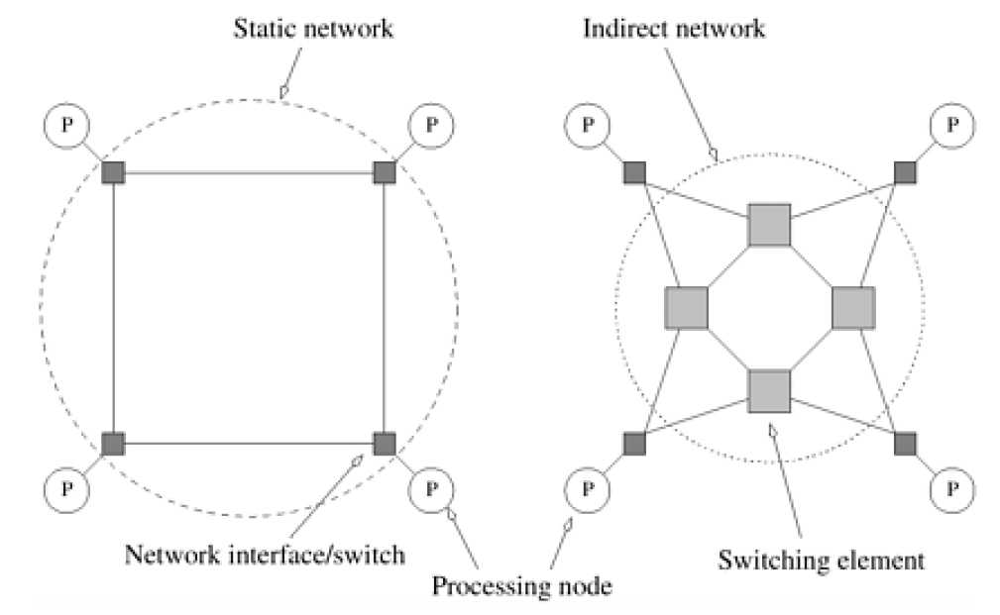
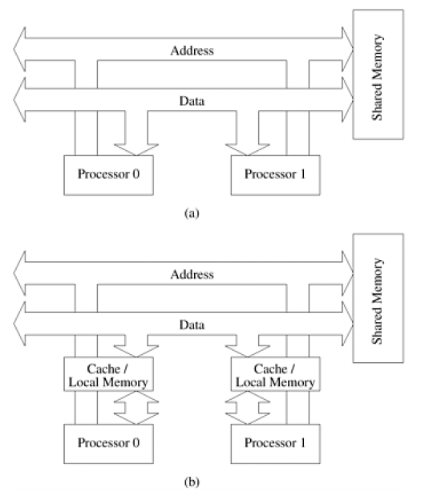
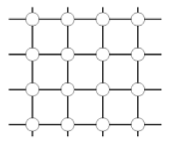
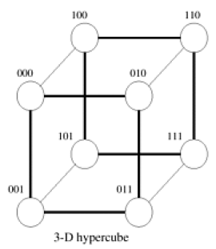
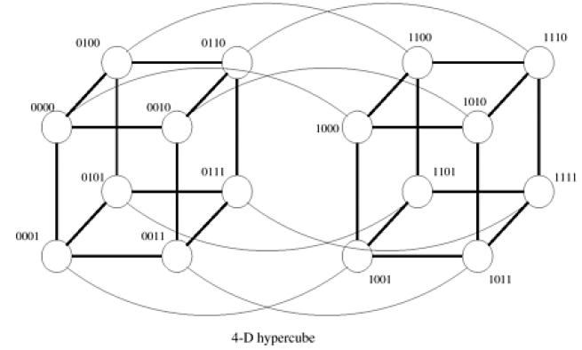
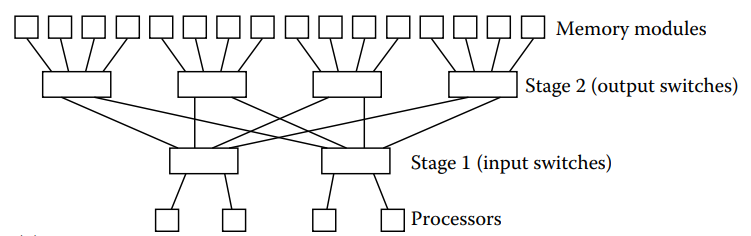
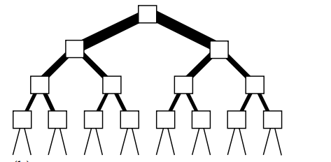

## Lecture Outline

- **Multiprocessor Models**: Local-memory, Modular-memory, and PRAM.
- **The PRAM Model**: Subclasses of PRAM (EREW, CREW, ERCW, CRCW) and Concurrent Write resolution schemes.
- **Complexity & Realizability**: Switch complexity of PRAM implementations ($\Theta(pm)$).
- **Interconnection Networks**: Direct (Static) vs. Indirect (Dynamic) networks.
- **Topologies**: 
  - **Bus**: Cache coherence and shared bus bandwidth reduction (**Example 2.12**).
  - **Mesh & Torus**: Multidimensional grids.
  - **Hypercube**: Logarithmic connectivity and Hamming distance routing.
  - **Multistage Networks (MINs)**: Omega and Butterfly networks.
  - **Fat Trees**: Varying bandwidth allocation and LCA routing.

---

## Multiprocessor Models

A multiprocessor model generalizes the sequential RAM (Random Access Machine) model to support multiple processing units. It is classified into three fundamental configurations based on memory access:

:::: {.columns}

::: {.column width="33%"}
### 1. Local-Memory
- Each of the $n$ processors has its own dedicated local memory.
- Communication is message-passing based.
:::

::: {.column width="33%"}
### 2. Modular-Memory
- Consists of $m$ distinct memory modules and $n$ processors.
- All attached via a common interconnection network.
:::

::: {.column width="33%"}
### 3. Shared-Memory (PRAM)
- $n$ processors connected directly to a common shared memory space.
- Uniform access time for all memory addresses.
:::

::::

---

## Architecture of an Ideal Parallel Computer: PRAM

The **Parallel Random-Access Machine (PRAM)** is the standard abstract model for designing parallel algorithms:

- **Structure**: Consists of $p$ processors and a single shared global memory of unbounded size.
- **Uniform Access**: Any processor can access any memory word in **unit time ($O(1)$)**.
- **Synchrony**: All processors share a common clock and execute instructions synchronously in lockstep, but can execute different instructions in each cycle (MIMD style execution on a shared clock).
- **Purpose**: PRAM is an algorithm design tool, not a physical machine. If an algorithm runs efficiently on PRAM, it can be compiled/translated to run efficiently on real platforms (Grama et al., *Introduction to Parallel Computing*).

---

## PRAM Memory Access Subclasses

Depending on how simultaneous read and write requests to the same memory location are resolved, PRAM is divided into four classes:

- **EREW (Exclusive Read, Exclusive Write)**:
  - Concurrent reads and concurrent writes to the same address are strictly forbidden.
  - Most restrictive model; easiest to implement in hardware.
- **CREW (Concurrent Read, Exclusive Write)**:
  - Multiple processors can read the same location simultaneously.
  - Only one processor can write to a location at any given cycle.
- **ERCW (Exclusive Read, Concurrent Write)**:
  - Reads must be exclusive; writes can be concurrent (rarely used in practice).
- **CRCW (Concurrent Read, Concurrent Write)**:
  - Both reads and writes can be simultaneous. Most powerful; requires conflict resolution.

---

## CRCW Write Conflict Resolution Schemes

When multiple processors write to the same memory cell simultaneously, the model must specify which value is stored:

- **Common**: Write succeeds only if all processors write the **exact same value**. Any discrepancy is treated as an error.
- **Arbitrary**: A single processor's write succeeds, selected randomly by the hardware. No guarantees on which one.
- **Priority**: Processors have a predefined priority order (e.g., based on processor ID). The one with the highest priority succeeds.
- **Sum (Reduction)**: The memory location receives the sum (or another associative reduction like min, max, or AND) of all written values.

---

## Architectural Complexity of PRAM

Why can't we build a true PRAM in physical hardware?

- In an EREW PRAM with $p$ processors and $m$ memory words, each processor must be able to reach any memory word.
- This requires a switching network (like a crossbar).
- A switch is required for every potential processor-to-word link.
- To ensure full concurrent connectivity without collisions, the total number of switches is **$\Theta(pm)$**.
- For $p = 10^3$ and $m = 10^9$ (typical gigabyte memory), this requires $10^{12}$ switches, which is physically impossible to route.
- **Conclusion**: A true PRAM is not physically realizable due to wiring and switch complexity limitations.

---

## Interconnection Networks

Since an all-to-all switch is impossible, physical parallel computers rely on structured **interconnection networks** to carry data between processors and memory.

:::: {.columns}

::: {.column width="60%"}
### Classification
1. **Static (Direct) Networks**:
   - Consist of point-to-point physical links directly among processing nodes.
   - Typically used in message-passing local-memory machines.
2. **Dynamic (Indirect) Networks**:
   - Built using external switches and communication links.
   - Processing nodes connect to switches, which route data to other switches or memory modules.
:::

::: {.column width="40%"}
{width="100%"}
:::

::::

---

## Switch Architecture & Interfaces

The characteristics of switches determine network cost and bandwidth:

- **Ports and Degree ($d$)**: A switch maps a fixed number of inputs to outputs. The total number of ports is its degree $d$.
- **Switch Cost**:
  - The internal logic cost of a switch grows quadratically as **$O(d^2)$** due to crossbar-like internal routing.
  - Peripheral buffer hardware grows linearly as $O(d)$.
  - Packaging costs and pin counts grow linearly with the number of wires/pins.
- **Network Interface**:
  - Processors interface with the network via an I/O bus or memory bus.
  - Memory-bus interfaces provide lower latency and higher bandwidth, distinguishing tightly-coupled systems from clusters.

---

## Network Topologies: The Shared Bus

The simplest dynamic network topology is a shared bus.

:::: {.columns}

::: {.column width="55%"}
- **Design**: All processors and memory modules connect to a single, shared bus.
- **Serialization**: In each step, at at most **one** piece of data can write onto the bus.
- **Scaling Limit**: Since the bus bandwidth is constant, adding more processors increases contention, causing average memory access time to grow linearly: $O(p)$.
- **Optimization**: Processors use local caches to reduce the frequency of main memory accesses over the bus.
:::

::: {.column width="45%"}
{width="100%"}
:::

::::

---

## Reducing Bus Bandwidth Using Caches: Example 2.12

Let's look at the mathematical impact of caching on bus bandwidth (Grama et al., *Introduction to Parallel Computing*):

### 1. Baseline (No Caches)
- $p$ processors share a single bus.
- Each processor performs $k$ memory accesses.
- Each access takes $t_{cycle}$ time.
- The total execution time is lower-bounded by:
$$T_{no\_cache} = t_{cycle} \times k \times p$$
- Main memory must provide a bandwidth of $p$ words per cycle.

### 2. With Caches
- Assume each processor has a local cache with a hit rate of $h = 0.5$ (50%).
- Only cache misses ($0.5k$ accesses) go to the bus.
- The total bus traffic is cut in half, reducing bus contention and scaling the system to double the processor count for the same latency.

---

## 2D Mesh Topologies

A 2D Mesh is a static direct network organized as a rectangular grid.

:::: {.columns}

::: {.column width="60%"}
- **Labeling**: Each switch has coordinates $(x,y)$, where $0 \leq x \leq X-1$ and $0 \leq y \leq Y-1$.
- **Total Nodes**: $N = XY$.
- **Connections**:
  - A node $(x,y)$ connects to its neighbors: $(x\pm 1, y)$ and $(x, y\pm 1)$.
  - Edge nodes have fewer neighbors unless wrapped around to form a **Torus**.
- **Routing**: Messages are routed step-by-step through intermediate nodes (typically using dimension-order $X-Y$ routing).
:::

::: {.column width="40%"}
{width="80%" fig-align="center"}
:::

::::

---

## Hypercube Topologies

A hypercube is an $n$-dimensional static network consisting of $N = 2^n$ nodes.

:::: {.columns}

::: {.column width="55%"}
- **Labeling**: Each node is labeled with a distinct $n$-bit binary string.
- **Connectivity**: Two nodes are connected by a link if and only if their binary labels differ in **exactly one bit position** (Hamming distance = 1).
- **Diameter**: The maximum distance between any two nodes is $n = \log_2 N$.
- **Routing**: Highly symmetrical; a packet can be routed by toggling the bits that differ between the source and destination addresses.
:::

::: {.column width="45%"}
::: {.r-stack}
{width="75%"}
:::
:::

::::

---

## 4D Hypercube Topology

An example of a 4-dimensional hypercube with $2^4 = 16$ nodes. Notice how each node is connected to exactly 4 neighbors, and the labels differ by precisely 1 bit.

{width="60%" fig-align="center"}

---

## Multistage Interconnection Networks (MINs)

Multistage networks connect inputs to outputs through multiple stages of smaller switches.

:::: {.columns}

::: {.column width="55%"}
- **Design**: Usually constructed using $a \times b$ switches (typically $2 \times 2$) arranged in stages.
- **Routing**: A message from any input node is routed to any output node by passing through one switch per stage.
- **Scalability**: A network with $N$ inputs and $N$ outputs requires $O(N \log N)$ switches, compared to $O(N^2)$ for crossbars.
- **Example**: Omega and Butterfly networks, commonly used in modular-memory multiprocessors to connect CPUs to RAM modules.
:::

::: {.column width="45%"}
{width="100%"}
:::

::::

---

## Fat Tree Topology

A Fat Tree is a dynamic tree-structured interconnect where link bandwidth increases as you move up the tree.

:::: {.columns}

::: {.column width="55%"}
- **Motivation**: In a standard tree, parent links near the root become severe traffic bottlenecks.
- **Design**: Fat Tree allocates more parallel channels (and more switches) to edges closer to the root.
- **Routing**:
  - A message from Leaf A to Leaf B travels up the tree to their **Least Common Ancestor (LCA)**, and then down.
  - The wider top channels prevent congestion.
- **Application**: Widely used in modern clusters and supercomputers (e.g. InfiniBand fabrics).
:::

::: {.column width="45%"}
{width="100%"}
:::

::::

---

## Lecture Summary

- **PRAM** is a uniform, unit-time shared-memory model. It has different write conflict options: Common, Arbitrary, Priority, and Sum.
- True PRAM is not physically realizable due to a switch complexity of **$\Theta(pm)$**.
- **Static networks** connect nodes directly (e.g., Mesh, Hypercube), whereas **dynamic networks** use external switches (e.g., Bus, MIN, Fat Tree).
- Shared buses scale poorly, but caches can mitigate bandwidth limits by satisfying requests locally (**Example 2.12**).
- **Hypercubes** offer low diameter ($O(\log N)$) using bit-wise connectivity.
- **Fat Trees** prevent root bottlenecks by expanding channel capacity near the root.
