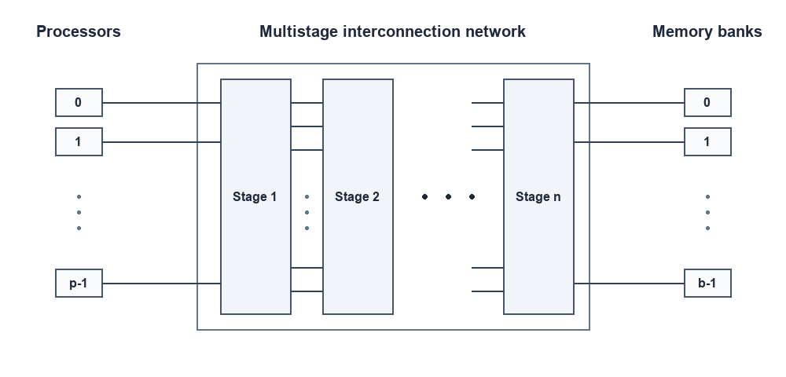
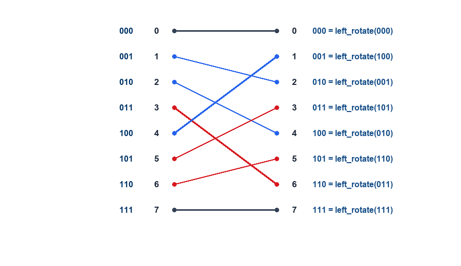
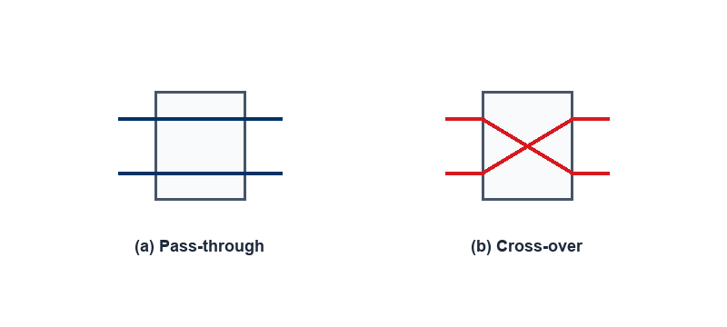
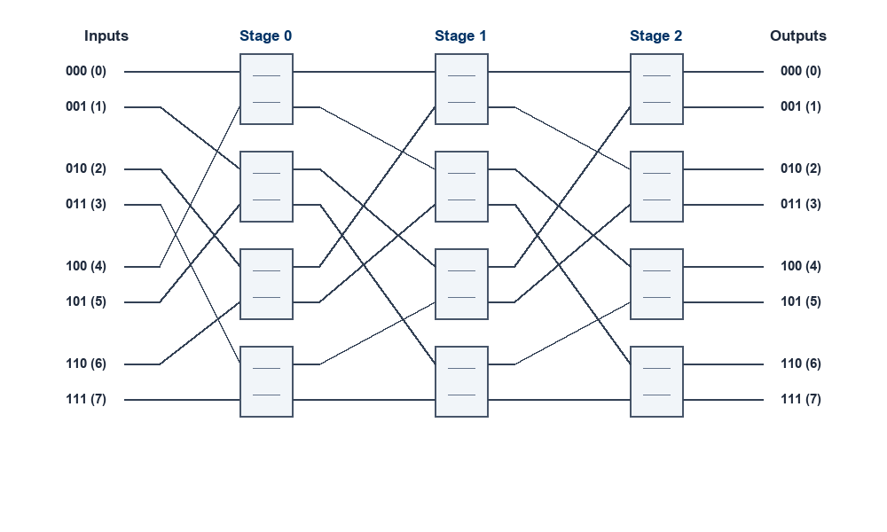
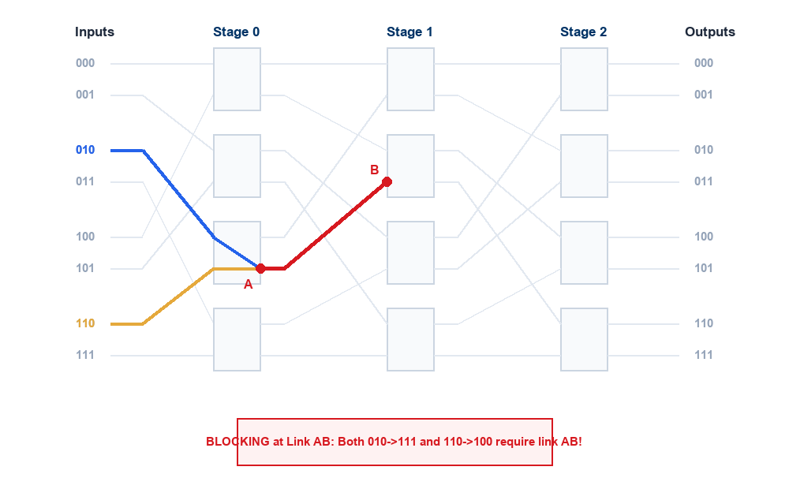
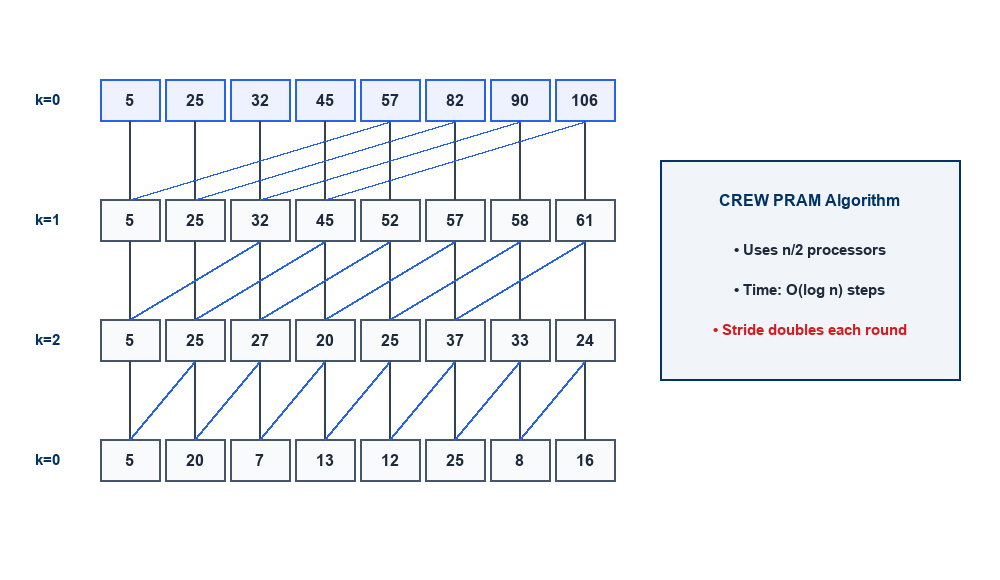
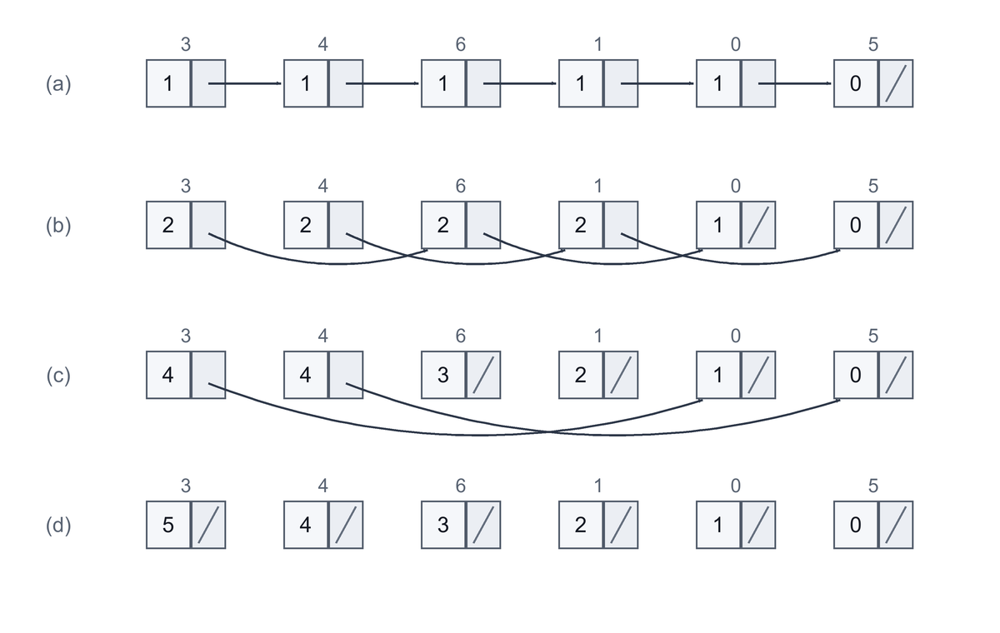

## Lecture Outline

- **Multistage Interconnection Networks (MINs)**: Connecting processors to memory banks via multi-tiered switching stages.
- **Multistage Omega Network**: 
  - Perfect Shuffle interconnection & bitwise left-rotation permutation.
  - $2 \times 2$ switch configurations (Pass-through and Cross-over).
  - Distributed self-routing using destination bit tags.
  - Sizing, cost ($O(p \log p)$), and internal **link blocking**.
- **Evaluating Interconnection Networks**:
  - Quantitative metrics: **Diameter**, **Arc/Node Connectivity**, **Bisection Width**, and **Cost**.
  - Comparative analysis of **Static Topologies** (Mesh, Torus, Hypercube, Tree, $k$-ary $d$-cube).
  - Comparative analysis of **Dynamic Topologies** (Crossbar, Omega, Dynamic Tree).
- **The PRAM Algorithmic Paradigm**:
  - Two-phase execution model and explicit concurrency.
- **Fundamental PRAM Algorithms**:
  - **Parallel Prefix Sum (Scan)**: Stride doubling in $O(\log n)$ time on CREW PRAM.
  - **Pointer Jumping**: Logarithmic traversal of pointer-based data structures.
  - **Parallel List Ranking**: Wyllie's algorithm for linked list distance ranking.

---

## Interconnection Networks: Multistage Networks

A **Multistage Interconnection Network (MIN)** provides an indirect, switch-based communication fabric connecting $p$ processing elements to $b$ memory banks through multiple cascaded switching stages.

:::: {.columns}

::: {.column width="55%"}
### Key Characteristics
- **Multi-Tiered Switching**: Arranged in $n = \log p$ intermediate switching stages.
- **Modular-Memory Architecture**: Processors do not connect point-to-point; instead, packets pass from stage to stage.
- **Balanced Trade-off**:
  - Eliminates the severe serialization bottleneck of a single **Shared Bus** ($O(p)$ access latency).
  - Avoids the astronomical hardware complexity of a full **Crossbar Switch** ($\Theta(p^2)$ crosspoints).
- **Latency & Cost**: Achieves $O(\log p)$ latency with only $\Theta(p \log p)$ total switches.
:::

::: {.column width="45%"}
{width="100%"}
:::

::::

---

## Multistage Omega Network: Definition & Architecture

One of the most foundational and widely deployed multistage interconnection topologies is the **Omega Network** (Lawrie, 1975).

:::: {.columns}

::: {.column width="60%"}
### Architectural Parameters
- **Number of Stages**: An Omega network connecting $p$ inputs to $p$ outputs ($p = 2^k$) has exactly:
  $$\text{Number of Stages} = \log_2 p$$
- **Switching Elements**: Each stage contains $p/2$ switches of size $2 \times 2$.
- **Total Switch Complexity**:
  $$\text{Total Switches} = \frac{p}{2} \log_2 p = \Theta(p \log p)$$
- **Stage Interconnection**: Each stage is interconnected to the next stage by a fixed **Perfect Shuffle** permutation.
:::

::: {.column width="40%"}
### Left Rotation Permutation
At each stage, input terminal $i$ connects to output terminal $j$ according to the **Left Rotation** function:

$$j = \begin{cases} 
2i, & 0 \le i \le \frac{p}{2} - 1 \\ 
2i + 1 - p, & \frac{p}{2} \le i \le p - 1 
\end{cases}$$

This is identical to a **1-bit cyclic left shift** of the binary index $i$.
:::

::::

---

## The Perfect Shuffle Permutation ($p=8$)

The **Perfect Shuffle** maps an $n$-bit binary representation $(b_{k-1} b_{k-2} \dots b_1 b_0)_2$ to its 1-bit left-rotated equivalent $(b_{k-2} \dots b_0 b_{k-1})_2$.

:::: {.columns}

::: {.column width="45%"}
| Input $i$ | Binary | Mapped Output $j$ | Left-Rotated Binary |
|:---:|:---:|:---:|:---:|
| **0** | `000` | **0** | `000` |
| **1** | `001` | **2** | `010` |
| **2** | `010` | **4** | `100` |
| **3** | `011` | **6** | `110` |
| **4** | `100` | **1** | `001` |
| **5** | `101` | **3** | `011` |
| **6** | `110` | **5** | `101` |
| **7** | `111` | **7** | `111` |

: Perfect shuffle mapping for $p=8$ inputs and outputs. {tbl-colwidths="[20,25,25,30]"}
:::

::: {.column width="55%"}
{width="100%"}
:::

::::

---

## $2 \times 2$ Switch Operation Modes

The fundamental building block of the Omega network is the $2 \times 2$ crossbar switch. It accepts two inputs and routes them to two outputs in one of two configurations:

:::: {.columns}

::: {.column width="50%"}
### 1. Pass-Through (Straight)
- Input port 0 connects directly to **Output port 0**.
- Input port 1 connects directly to **Output port 1**.
- Signals pass straight through without crossing.
:::

::: {.column width="50%"}
### 2. Cross-Over (Crossed)
- Input port 0 connects to **Output port 1**.
- Input port 1 connects to **Output port 0**.
- Signals swap positions across the switch.
:::

::::

{width="75%" fig-align="center"}

---

## Complete $8 \times 8$ Omega Network

An $8 \times 8$ Omega network consists of $\log_2 8 = 3$ stages. Each stage contains $8/2 = 4$ switches ($12$ switches total).

:::: {.columns}

::: {.column width="50%"}
- **Stage 0**: Receives inputs permuted by the first perfect shuffle.
- **Stage 1**: Connects outputs of Stage 0 to Stage 1 switches via shuffle.
- **Stage 2**: Connects outputs of Stage 1 to Stage 2 switches via shuffle.
- **Hardware Efficiency**:
  - Full crossbar requires $8 \times 8 = 64$ switches.
  - Omega network requires only $\frac{8}{2} \times 3 = 12$ switches!
  - Cost scales as $\Theta(p \log p)$.
:::

::: {.column width="50%"}
{width="100%"}
:::

::::

---

## Distributed Self-Routing in Omega Networks

Omega networks support **decentralized self-routing** (Delta routing) based entirely on the binary bits of the **destination address** $D = (d_{k-1} d_{k-2} \dots d_0)_2$:

:::: {.columns}

::: {.column width="60%"}
### Self-Routing Algorithm
- Let a packet be routed to destination $D = (d_{k-1} \dots d_0)_2$.
- At **Stage $s$** (where $s = 0, 1, \dots, k-1$):
  - The switch inspects bit $d_{k-1-s}$ (the $(s+1)$-th bit of the destination tag).
  - If **bit $= 0$**: The switch routes the packet out of its **Upper output port (0)**.
  - If **bit $= 1$**: The switch routes the packet out of its **Lower output port (1)**.
- **No Central Controller**: Each switch makes local routing decisions instantly in hardware, achieving $O(\log p)$ path setup time!
:::

::: {.column width="40%"}
### Routing Example ($010_2 \to 110_2$)
- Target destination: $D = 6 = 110_2$.
- **Stage 0**: Inspects MSB (`1`) $\to$ selects **lower port**.
- **Stage 1**: Inspects middle bit (`1`) $\to$ selects **lower port**.
- **Stage 2**: Inspects LSB (`0`) $\to$ selects **upper port**.
- The packet arrives precisely at output $110_2$!
:::

::::

---

## Blocking & Contention in Omega Networks

A network is **blocking** if certain permutation requests cannot be routed simultaneously because multiple paths require the **same internal link** at the same cycle.

:::: {.columns}

::: {.column width="50%"}
### Contention Analysis (Slide 7)
Consider two concurrent messages:
1. **Message 1**: Source $010_2$ (2) to Destination $111_2$ (7).
   - At Stage 0: Destination MSB is `1` $\to$ exits lower port of Switch 2 onto Link A.
2. **Message 2**: Source $110_2$ (6) to Destination $100_2$ (4).
   - At Stage 0: Destination MSB is `1` $\to$ exits lower port of Switch 2 onto Link A.
- **Link Contention**: Both paths require **Link AB** between Stage 0 and Stage 1 $\implies$ **one message is blocked!**
:::

::: {.column width="50%"}
{width="100%"}
:::

::::

---

## Evaluation Metrics for Interconnection Networks

To objectively compare static and dynamic network architectures, parallel architects evaluate four fundamental quantitative metrics (Grama et al., 2003):

:::: {.columns}

::: {.column width="50%"}
### 1. Network Diameter ($D$)
- The **maximum shortest-path distance** (measured in number of links or hops) between any pair of nodes in the network.
- Represents the **worst-case communication latency** for a packet traversing the network.
- Lower diameter is desirable ($O(1)$ or $O(\log p)$).

### 2. Connectivity
- **Arc Connectivity**: Minimum number of communication links that must be severed to disconnect the network into disjoint partitions.
- **Node Connectivity**: Minimum number of nodes that must fail to disconnect the network.
- High connectivity ensures **fault tolerance** and multiple alternate paths.
:::

::: {.column width="50%"}
### 3. Bisection Width ($B$)
- The **minimum number of physical wires/links** that must be cut to divide the network into two equal halves (each with $p/2$ nodes).
- Measures the **global communication bottleneck** and aggregate bisection bandwidth available for all-to-all communication.

### 4. Hardware Cost
- The total number of **physical links or switching nodes** required to build the network.
- Influenced by packaging complexity, layout constraints, and wire lengths.
:::

::::

---

## Evaluating Static Interconnection Networks

Static (direct) networks connect processing nodes directly via dedicated point-to-point physical channels.

| Network Topology | Diameter ($D$) | Bisection Width ($B$) | Arc Connectivity | Cost (No. of Links) |
|:---|:---:|:---:|:---:|:---:|
| **Completely-Connected** | $1$ | $p^2 / 4$ | $p - 1$ | $\frac{p(p-1)}{2} = \Theta(p^2)$ |
| **Star** | $2$ | $1$ | $1$ | $p - 1$ |
| **Complete Binary Tree** | $2 \log\left(\frac{p+1}{2}\right)$ | $1$ | $1$ | $p - 1$ |
| **Linear Array** | $p - 1$ | $1$ | $1$ | $p - 1$ |
| **2-D Mesh (no wraparound)** | $2(\sqrt{p} - 1)$ | $\sqrt{p}$ | $2$ | $2(p - \sqrt{p})$ |
| **2-D Wraparound Mesh (Torus)** | $2 \lfloor \sqrt{p}/2 \rfloor$ | $2\sqrt{p}$ | $4$ | $2p$ |
| **Hypercube** ($d$-cube, $p = 2^d$) | $\log p$ | $p / 2$ | $\log p$ | $\frac{p \log p}{2}$ |
| **Wraparound $k$-ary $d$-cube** ($p = k^d$) | $d \lfloor k/2 \rfloor$ | $2k^{d-1}$ | $2d$ | $d \cdot p$ |

: Comprehensive comparison of static interconnection network topologies. {tbl-colwidths="[32,18,18,14,18]"}

---

## Trade-off Analysis: Static Networks

:::: {.columns}

::: {.column width="33%"}
### Linear Array & Tree
- **Pros**: Minimal link cost ($O(p)$ links).
- **Cons**: Severe bottleneck ($B = 1$). High diameter ($O(p)$ for array).
- Tree roots suffer extreme traffic congestion.
:::

::: {.column width="33%"}
### 2D Mesh & Torus
- **Pros**: Constant node degree (4 for Torus), planar layout, easily routed on silicon/PCBs.
- **Cons**: Moderate diameter ($O(\sqrt{p})$) and bisection width ($O(\sqrt{p})$).
:::

::: {.column width="33%"}
### Hypercube ($d$-cube)
- **Pros**: Ultra-low diameter ($O(\log p)$), high bisection width ($O(p)$), high fault tolerance ($d = \log p$).
- **Cons**: Node degree grows with $p$, making high-dimensional physical wiring complex.
:::

::::

> [!TIP]
> **$k$-ary $d$-cube** unifies rings ($d=1$), 2D tori ($d=2, k=\sqrt{p}$), 3D tori ($d=3$), and hypercubes ($k=2, d=\log_2 p$) under a single mathematical framework!

---

## Evaluating Dynamic Interconnection Networks

Dynamic (indirect) networks use intermediate switching elements to dynamically establish communication paths between processors and memory banks.

| Dynamic Network Topology | Diameter ($D$) | Bisection Width ($B$) | Arc Connectivity | Cost (No. of Links / Switches) |
|:---|:---:|:---:|:---:|:---:|
| **Crossbar Switch** | $1$ | $p$ | $1$ | $p^2$ |
| **Omega Network** | $\log p$ | $p / 2$ | $2$ | $\frac{p}{2} \log p$ |
| **Dynamic Tree** | $2 \log p$ | $1$ | $2$ | $p - 1$ |

: Comparison of dynamic switched interconnection networks. {tbl-colwidths="[30,16,18,16,20]"}

### Key Insights
- **Crossbar**: Optimal latency ($D=1$) and maximum non-blocking bandwidth ($B=p$), but $O(p^2)$ cost limits scalability to small $p \le 64$.
- **Omega Network**: Scales efficiently with $O(p \log p)$ switches and $O(\log p)$ diameter; trade-off is susceptibility to internal blocking.
- **Dynamic Tree**: Low switch count ($p-1$), but vulnerable to root saturation unless converted to a **Fat Tree** with widening upper channels.

---

## PRAM Algorithms: The Algorithmic Paradigm

The **Parallel Random-Access Machine (PRAM)** serves as the canonical theoretical foundation for parallel algorithm design (Fortune & Wyllie, 1978; JáJá, 1992).

:::: {.columns}

::: {.column width="50%"}
### Two-Phase Execution Model
1. **Phase 1 (Activation)**:
   - A sufficient number of processors ($p$) are activated and assigned unique identifiers ($P_i$ for $0 \le i < p$).
2. **Phase 2 (Parallel Computation)**:
   - Activated processors execute operations synchronously in parallel lockstep on shared memory.

### Explicit Concurrency
- The algorithm explicitly specifies which operations are performed by which processor at each time step.
:::

::: {.column width="50%"}
### Theoretical Significance
- **Concurrency Focus**: Focuses exclusively on algorithmic concurrency; abstracts away physical network delays, wire contention, and synchronization overhead.
- **Robust Design Paradigm**: Algorithms developed for PRAM provide upper bounds on parallel speedup and can be translated to real architectures (MPI, OpenMP, CUDA) via **Brent's Theorem**:
  $$T_p \le \frac{W}{p} + T_\infty$$
:::

::::

---

## PRAM Algorithm Example: Prefix Sum (Scan)

### Problem Formulation
Given an input sequence of $n$ values $A = [a_1, a_2, \dots, a_n]$ and an associative binary operator $\oplus$ (e.g., $+$, $\times$, $\min$, $\max$), compute all $n$ running prefix reductions:

$$S_1 = a_1, \quad S_2 = a_1 \oplus a_2, \quad S_3 = a_1 \oplus a_2 \oplus a_3, \quad \dots, \quad S_n = \bigoplus_{i=1}^n a_i$$

:::: {.columns}

::: {.column width="50%"}
### Sequential vs. Parallel
- **Sequential Baseline**: Requires $n - 1$ operations executed sequentially $\implies \mathbf{\Theta(n)}$ time.
- **CREW PRAM Algorithm**: Uses $n/2$ processors and computes all prefix sums in **$\mathbf{O(\log n)}$ time** using recursive distance doubling!
:::

::: {.column width="50%"}
### Algorithmic Applications
- Stream compaction & filtering.
- Radix sort and parallel sorting algorithms.
- Parallel evaluation of polynomials and linear recurrences.
- Carry-lookahead adders in arithmetic hardware.
:::

::::

---

## Parallel Prefix Sum: CREW Algorithm Trace

In each iteration $k$ (for $k = 0, 1, \dots, \lceil \log_2 n \rceil - 1$), elements at distance **$2^k$** are summed in parallel:

:::: {.columns}

::: {.column width="50%"}
```python
# CREW PRAM Prefix Sum (Hillis-Steele Algorithm)
for k from 0 to ceil(log2(n)) - 1:
    for i from 2^k + 1 to n in parallel:
        A[i] = A[i] + A[i - 2^k]
```

### Execution Steps ($n=8$)
- **Initial Array**: `[5, 20, 7, 13, 12, 25, 8, 16]`
- **Step 1 ($k=0$, stride 1)**: `[5, 25, 27, 20, 25, 37, 33, 24]`
- **Step 2 ($k=1$, stride 2)**: `[5, 25, 32, 45, 52, 57, 58, 61]`
- **Step 3 ($k=2$, stride 4)**: `[5, 25, 32, 45, 57, 82, 90, 106]`
- **Result**: `[5, 25, 32, 45, 57, 82, 90, 106]` in **$3 = \log_2 8$ steps**!
:::

::: {.column width="50%"}
{width="100%"}
:::

::::

---

## The Pointer Jumping Technique

**Pointer Jumping** (or *pointer doubling*) is a fundamental algorithmic technique on PRAM for linked lists and directed trees (Wyllie, 1979; JáJá, 1992).

:::: {.columns}

::: {.column width="55%"}
### The Core Mechanism
- In parallel for every node $i$, replace its pointer $P[i]$ with the pointer of the node it points to:
  $$P[i] \leftarrow P[P[i]]$$
- **Exponential Contraction**: In each iteration, the distance spanned by each pointer doubles:
  $$1 \longrightarrow 2 \longrightarrow 4 \longrightarrow 8 \longrightarrow \dots \longrightarrow 2^k$$
- **Convergence in $O(\log n)$**:
  - For a linked list of length $n$, every node points to the end of the list (or root of a tree) in **$\lceil \log_2 n \rceil$ iterations**!
:::

::: {.column width="45%"}
### Key Applications
- **List Ranking**: Determining the distance of each node to the end of the list.
- **Root Finding**: Finding the root of every tree in a forest.
- **Tree Contraction**: Evaluating tree-structured arithmetic expressions in logarithmic time.
- **Euler Tour Techniques**: Computing depth, subtree sizes, and preorder numbering in parallel.
:::

::::

---

## Pointer Jumping Application: List Ranking

### The Problem
Given a singly linked list of $n$ elements stored in arbitrary memory locations, determine for each node its distance (rank) to the end (tail) of the list.

:::: {.columns}

::: {.column width="50%"}
### Sequential Algorithm ($O(n)$)
- Follows successor pointers from head to tail in **two passes**:
  - **Pass 1**: Traverse the list to count total elements $n$.
  - **Pass 2**: Traverse again to assign ranks from the tail ($0, 1, 2, \dots, n-1$).
- **Bottleneck**: Inherently sequential because memory locations are not contiguous; requires $O(n)$ time.
:::

::: {.column width="50%"}
### Parallel PRAM Approach ($O(\log n)$)
- Assign one processor to each list element.
- Jump pointers in parallel: $\text{next}[i] \leftarrow \text{next}[\text{next}[i]]$.
- Simultaneously accumulate distances:
  $$\text{position}[i] \leftarrow \text{position}[i] + \text{position}[\text{next}[i]]$$
- Achieves full list ranking in **$O(\log n)$ time**!
:::

::::

---

## Parallel List Ranking: PRAM Algorithm

```pascal
// PRAM List Ranking Algorithm (Wyllie's Algorithm)
for all i in parallel do
    if next[i] == NIL then
        position[i] := 0
    else
        position[i] := 1

for step := 1 to ceil(log2(n)) do
    for all i in parallel do
        if next[i] != NIL then
            position[i] := position[i] + position[next[i]]
            next[i] := next[next[i]]
```

### Complexity Breakdown
- **Processors**: $p = n$ processors (one per node).
- **Parallel Time**: $T(n) = O(\log n)$ synchronous steps.
- **Total Work**: $W(n) = p \times T(n) = O(n \log n)$ operations.
- **PRAM Model**: Operates under **EREW PRAM** (Exclusive Read, Exclusive Write) since each node accesses distinct successor pointers.

---

## Step-by-Step List Ranking Trace (Slide 17)

Consider 6 elements stored at arbitrary indices ordered as: $\mathbf{3 \to 4 \to 6 \to 1 \to 0 \to 5 \to \text{NIL}}$.

:::: {.columns}

::: {.column width="45%"}
### State Progression
- **(a) Initial State**:
  - Non-tails have distance `1`; tail (Node 5) has distance `0`.
  - Next pointers: $3\to 4, 4\to 6, 6\to 1, 1\to 0, 0\to 5, 5\to \text{NIL}$.
- **(b) Iteration 1 (stride 1)**:
  - Distances: $[2, 2, 2, 2, 1, 0]$.
  - Next: $3\to 6, 4\to 1, 6\to 0, 1\to 5, 0\to \text{NIL}$.
- **(c) Iteration 2 (stride 2)**:
  - Distances: $[4, 4, 3, 2, 1, 0]$.
  - Next: $3\to 0, 4\to 5, 6\to \text{NIL}, 1\to \text{NIL}$.
- **(d) Iteration 3 (stride 4, Final)**:
  - Distances: $[5, 4, 3, 2, 1, 0]$. All next pointers $\to \text{NIL}$!
:::

::: {.column width="55%"}
{width="100%"}
:::

::::

---

## Lecture Summary

- **Multistage Interconnection Networks (MINs)**:
  - Provide a scalable balance between shared buses ($O(p)$ bottleneck) and crossbars ($O(p^2)$ cost).
  - An **Omega Network** requires $\log_2 p$ stages of $2\times 2$ switches, costing $\Theta(p \log p)$ switches.
  - Inter-stage links implement a **Perfect Shuffle** (1-bit left rotation) with distributed self-routing, but are subject to **link blocking**.
- **Interconnection Network Evaluation**:
  - Topologies are compared across **Diameter**, **Arc Connectivity**, **Bisection Width**, and **Cost**.
  - Hypercubes achieve $O(\log p)$ diameter and $O(p)$ bisection width at $O(p \log p)$ link cost.
- **PRAM Algorithms & Techniques**:
  - **PRAM Model**: Explicit, synchronization-free abstraction for discovering maximum concurrency.
  - **Prefix Sum**: Computes all cumulative prefixes in $O(\log n)$ time using stride doubling.
  - **Pointer Jumping**: Replaces $P[i]$ with $P[P[i]]$ to traverse linked lists and trees in $O(\log n)$ time, powering algorithms like **List Ranking**.

---

## References & Further Reading

1. **Grama, A., Gupta, A., Karypis, G., & Kumar, V.** (2003). *Introduction to Parallel Computing* (2nd ed.). Addison-Wesley. Chapter 2: "Parallel Programming Platforms" & Chapter 9: "Sorting Networks".
2. **JáJá, J.** (1992). *An Introduction to Parallel Algorithms*. Addison-Wesley. Chapter 2: "PRAM Algorithms and Pointer Jumping".
3. **Lawrie, D. H.** (1975). "Access and Alignment of Data in an Array Processor". *IEEE Transactions on Computers*, C-24(12), pp. 1145–1155. *(Original Omega Network paper)*.
4. **Wyllie, J. C.** (1979). *The Complexity of Parallel Computations*. Ph.D. dissertation, Cornell University. *(Introduced Pointer Jumping & List Ranking)*.
5. **Leighton, F. T.** (1992). *Introduction to Parallel Algorithms and Architectures: Arrays, Trees, Hypercubes*. Morgan Kaufmann.
