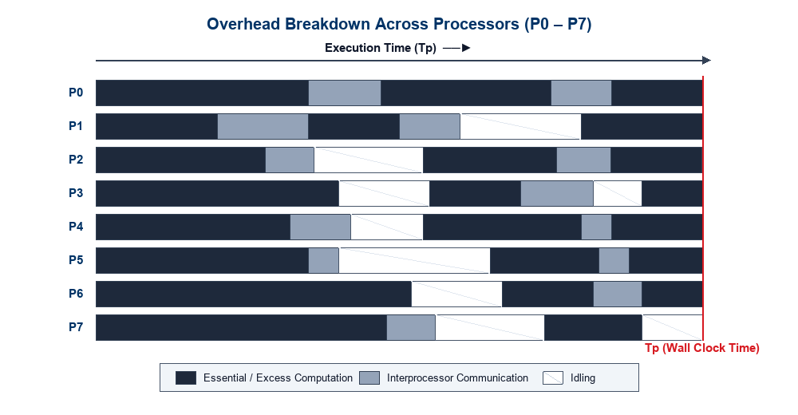
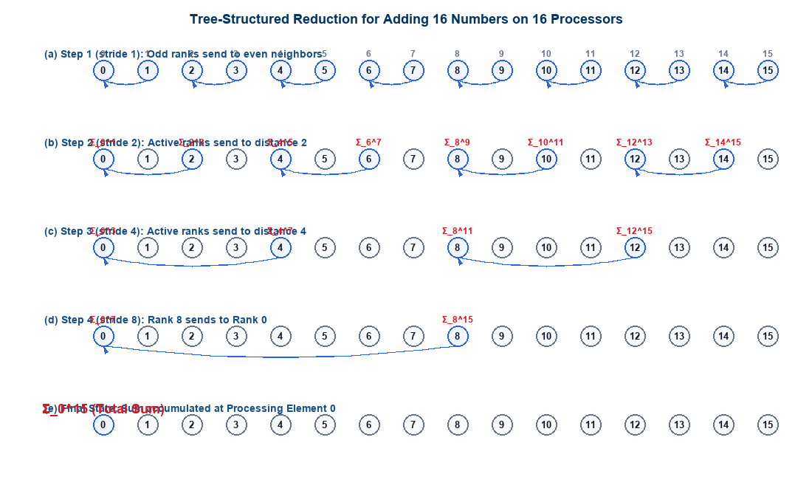
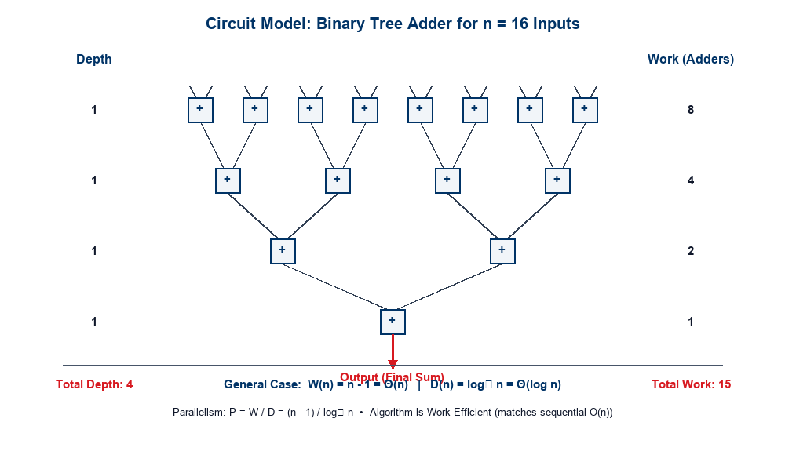
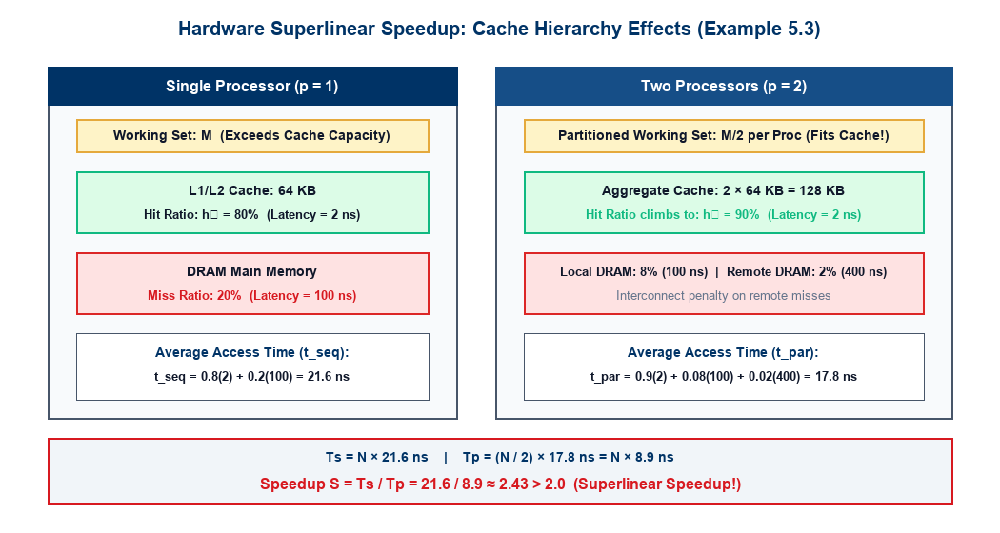

## Lecture Outline

- **Foundations of Analytical Modeling**:
  - Why sequential analysis (RAM model) fails for parallel computing.
  - The definition of a **Parallel System** (Algorithm + Architecture).
  - Wall-clock execution time and baseline selection.
- **Sources of Overhead in Parallel Execution**:
  - Interprocessor interaction and communication latency.
  - Processor idling (load imbalance, barriers, serialization).
  - Excess computation.
- **Fundamental Performance Metrics**:
  - Serial Runtime ($T_s$) vs. Parallel Runtime ($T_p$).
  - **Total Parallel Overhead** ($T_o = p T_p - T_s$).
  - **Parallel Speedup** ($S = T_s / T_p$) and Efficiency ($E = S / p$).
- **Case Study: Parallel Tree Reduction**:
  - Summing $n$ numbers across $n$ processors in $O(\log n)$ steps.
  - Derivation of speedup: $S = \Theta(n / \log n)$.
- **The Work-Depth Algorithmic Model**:
  - Abstracting away hardware details: **Work ($W$)** and **Depth ($D$)**.
  - Available parallelism: $P = W / D$.
  - Three classes: Circuit models, Vector machine models, and Language-based models.
- **The Circuit Model Abstraction**:
  - Directed Acyclic Graphs (DAGs), fan-in, fan-out, and the $NC$ class.
  - Work-efficiency criteria and binary tree adder analysis ($W = n-1, D = \log_2 n$).
- **Superlinear Speedup ($S > p$) & Hardware Resource Effects**:
  - Algorithmic vs. Resource-based superlinearity.
  - **In-Depth Walkthrough of Example 5.3**: Cache hit ratio shifts yielding $S = 2.43 > 2$.
  - Preview of **Brent's Theorem**.
- **Review Quizzes (Quizzes 1 & 2)**:
  - **Quiz-1 (Lectures 10 & 11)**: 4 conceptual multiple-choice questions assessing PRAM write schemes, hypercube topology metrics, Omega network blocking, and prefix sum work-efficiency.
  - **Quiz-2 (Lecture 9 &bull; GPU Architecture & CUDA)**: 4 conceptual multiple-choice questions assessing warp execution, branch divergence, shared memory latency hiding, and thread block scheduling constraints.

---

## The Need for Analytical Modeling

In sequential computing, algorithm analysis is standardized and machine-independent:

:::: {.columns}

::: {.column width="50%"}
### Sequential Model (RAM)
- Evaluated by asymptotic runtime $T(n)$ as a function of input size $n$.
- Built upon the **Random Access Machine (RAM)** model:
  - Unit-cost memory access for any address.
  - Unit-cost primitive arithmetic/logic operations.
- **Platform Invariance**: An $O(n \log n)$ sorting algorithm (e.g., MergeSort) outperforms an $O(n^2)$ algorithm (e.g., BubbleSort) across *virtually all* modern single-core processors for large $n$.
:::

::: {.column width="50%"}
### Parallel Model (System-Dependent)
- The parallel runtime of an algorithm depends intimately on:
  - Input problem size ($n$).
  - Number of processing elements ($p$).
  - Communication network topology, link bandwidth ($t_w$), and latency ($t_s$).
  - Memory organization (Shared memory vs. Distributed message passing).
- **Core Principle**: A parallel algorithm *cannot* be evaluated in isolation from the underlying hardware platform!
:::

::::

  <strong>Definition (Parallel System):</strong> A <em>parallel system</em> is the formal pairing of a <strong>parallel algorithm</strong> and the <strong>underlying parallel architecture</strong> upon which it executes. Analytical performance modeling always characterizes the behavior of this composite system.

---

## Basics of Analytical Modeling: Performance Measures

Evaluating parallel performance introduces subtle questions absent in serial algorithm analysis:

:::: {.columns}

::: {.column width="50%"}
### Wall-Clock Time
- **Definition**: The elapsed real time from the exact moment the first processor starts execution to the moment the *last processor terminates*:
  $$T_p = \max_{0 \le i < p} \left\{ t_{\text{stop}}^{(i)} \right\} - \min_{0 \le i < p} \left\{ t_{\text{start}}^{(i)} \right\}$$
- **Portability & Scaling Questions**:
  - How does wall-clock time behave when $p$ is increased for a fixed input size $n$?
  - What happens when ported to an interconnect with higher latency or lower bisection bandwidth?
:::

::: {.column width="50%"}
### Baseline Serial Algorithm ($T_s$)
- **How fast is the parallel version?**
  - Performance must be measured relative to the **fastest known sequential algorithm** on a single processor of equivalent capability.
  - *Common Pitfall*: Measuring speedup against the parallel algorithm executed on $p=1$ processor ($T_1$) overstates true performance if the parallel algorithm carries extra serial overhead!
- **Trade-off of Parallel Amenability**:
  - Sometimes a poorer serial algorithm (e.g., Bitonic Sort, $O(n \log^2 n)$) is preferred because it parallelizes with regular communication patterns, outperforming parallel QuickSort ($O(n \log n)$) on specific architectures.
:::

::::

---

## Sources of Overhead in Parallel Programs

  "If we deploy $p$ processors, shouldn't the application run $p$ times faster?"

In practice, **linear speedup ($S = p$) is rarely achieved** due to four fundamental sources of overhead:

:::: {.columns}

::: {.column width="52%"}
1. **Interprocessor Interaction & Communication**:
   - Transferring intermediate data between processors (network packet latency, bandwidth constraints).
   - Remote memory read/write requests over interconnection networks or shared buses.
   - Cache coherence invalidation traffic and bus arbitration.
2. **Processor Idling**:
   - **Load Imbalance**: Unequal distribution of computational work among processors.
   - **Synchronization Latency**: Waiting at barriers, mutexes, condition variables, or critical sections.
   - **Serial Bottlenecks**: Portions of the program that cannot be parallelized (Amdahl's Law).
3. **Excess Computation**:
   - Extra operations introduced specifically to organize parallelism (thread creation, task scheduling, redundant recomputations to save communication).
:::

::: {.column width="48%"}
{width="100%"}
:::

::::

---

## Sources of Overhead: Architectural Breakdown

To design scalable parallel algorithms, we must rigorously categorize every cycle spent by the $p$ processing elements:

:::: {.columns}

::: {.column width="33%"}
### 1. Interprocess Interaction
- Any non-trivial parallel problem requires processors to exchange boundary data, reduction values, or synchronizations.
- **Latency & Bandwidth**:
  $$T_{\text{comm}} = t_s + m \cdot t_w$$
- Incurs software protocol stack overhead, buffer management, routing hops, and physical link transmission delays.
:::

::: {.column width="33%"}
### 2. Processor Idling
- While one processor computes, others may sit idle waiting for dependencies.
- **Key Causes**:
  - Algorithmic serialization (e.g., sequential root phase in tree reductions).
  - Dynamic workload variation (e.g., adaptive mesh refinement, irregular sparse matrices).
  - Global barrier synchronization where fast threads wait for the slowest thread.
:::

::: {.column width="33%"}
### 3. Excess Computation
- Operations executed in the parallel version that do *not* exist in the best sequential algorithm:
  $$W_{\text{excess}} = W_{\text{parallel}} - W_{\text{best\_serial}}$$
- Examples: Recomputing state to avoid communication, calculating global indices, maintaining thread locks, and speculative executions.
:::

::::

  "Since different parallel algorithms for solving the same problem incur varying overheads, it is critical to quantify these overheads to establish a figure of merit for each algorithm." — Grama et al.

---

## Core Performance Metric: Execution Time ($T_s$ and $T_p$)

The two fundamental time quantities governing all analytical modeling are:

:::: {.columns}

::: {.column width="50%"}
### Serial Runtime ($T_s$)
- **Definition**: The time elapsed between the start and finish of the program executing on a **single processor**, using the **fastest known sequential algorithm**.
- **Important Constraint**:
  - $T_s$ must *not* be measured using the parallel algorithm forced to run on 1 processor ($T_1$), unless that algorithm is provably the fastest sequential method.
  - Expressed in seconds or as an asymptotic operation count: $T_s = \Theta(f(n))$.
:::

::: {.column width="50%"}
### Parallel Runtime ($T_p$)
- **Definition**: The total wall-clock time that elapses from the instant the parallel computation initiates to the moment the **last processing element terminates**:
  $$T_p = \max_{0 \le i < p} \left\{ T_i \right\}$$
- Captures:
  - Computation performed by the slowest processor.
  - All communication delays and synchronization wait states along the critical path.
:::

::::

---

## Total Parallel Overhead ($T_o$)

The **Total Overhead ($T_o$)** aggregates all lost time across all $p$ processing elements relative to the serial baseline:

:::: {.columns}

::: {.column width="60%"}
### Mathematical Formulation
- If $p$ processors each run for time $T_p$, the **total processor-time product** expended by the system is:
  $$\text{Total Processor Time} = p \cdot T_p$$
- The time required by the fastest sequential algorithm is $T_s$.
- The **Total Parallel Overhead** $T_o$ is defined as:
  $$\boxed{T_o = p T_p - T_s}$$
- **Components of Overhead**:
  $$T_o = T_{\text{comm}} + T_{\text{idle}} + T_{\text{excess}}$$
:::

::: {.column width="40%"}
### Physical Interpretation
- $T_o$ represents the collective wasted processor cycles across the entire ensemble.
- **Ideal System**:
  - If $T_o = 0$:
    $$p T_p - T_s = 0 \implies T_p = \frac{T_s}{p}$$
  - This corresponds to **perfect linear speedup**.
- In all real physical systems:
  $$T_o > 0 \implies T_p > \frac{T_s}{p}$$
:::

::::

---

## Parallel Speedup ($S$)

**Speedup** measures the relative performance advantage of solving a problem in parallel versus sequentially:

:::: {.columns}

::: {.column width="55%"}
### Definition
Speedup $S$ is the ratio of the serial runtime of the best sequential algorithm to the parallel runtime on $p$ identical processing elements:
$$\boxed{S = \frac{T_s}{T_p}}$$

### True vs. Relative Speedup
- **True (Absolute) Speedup**:
  $$S_{\text{true}} = \frac{T_s^{\text{best\_serial}}}{T_p}$$
  Measures genuine algorithmic progress.
- **Relative Speedup**:
  $$S_{\text{rel}} = \frac{T_{p=1}}{T_p}$$
  Measures internal scalability of a specific codebase, but can mask poor baseline coding.
:::

::: {.column width="45%"}
### Bounds on Speedup
- **Linear Speedup**: $S = p$.
  Execution time scales down in exact proportion to processor count.
- **Sublinear Speedup**: $S < p$.
  The standard behavior due to overheads ($T_o > 0$).
- **Parallel Efficiency ($E$)**:
  Fraction of processor time spent on useful work:
  $$E = \frac{S}{p} = \frac{T_s}{p T_p} = \frac{T_s}{T_s + T_o}$$
  $$0 \le E \le 1$$
:::

::::

---

## Case Study: Adding $n$ Numbers on $n$ Processors

Consider the canonical reduction problem: summing $n$ numbers using $p = n$ processing elements (where $n = 2^k$):

:::: {.columns}

::: {.column width="50%"}
### Problem Formulation
- **Input**: $n$ numbers $A = [a_0, a_1, \dots, a_{n-1}]$.
- **Initial State**: Each processing element $P_i$ stores exactly one value $a_i$.
- **Goal**: Accumulate the grand sum $\sum_{i=0}^{n-1} a_i$ into processor $P_0$.
- **Serial Baseline**:
  - Adding $n$ numbers sequentially requires $n - 1$ additions:
    $$T_s = \Theta(n)$$
:::

::: {.column width="50%"}
### Parallel Tree Reduction
- Instead of serial accumulation, processors communicate along a **logical binary tree**.
- At each step $k$ (where $k = 1, \dots, \log_2 n$):
  - Active processors at stride $2^k$ receive partial sums from neighbors at distance $2^{k-1}$.
  - The receiver adds the incoming value to its own partial sum.
  - The sender becomes idle for all subsequent steps.
- **Number of communication stages**:
  $$\text{Steps} = \log_2 n$$
:::

::::

---

## Step-by-Step Tree Reduction ($n = 16, p = 16$)

At each step, the stride doubles while the number of active processors halves:

{width="92%" fig-align="center"}

---

## Speedup & Overhead Analysis of Tree Addition

Let addition take constant unit time $t_{\text{add}} = O(1)$ and communication take constant time $t_{\text{comm}} = O(1)$:

:::: {.columns}

::: {.column width="50%"}
### Parallel Runtime ($T_p$)
- The reduction tree has depth $\log_2 n$.
- At each level, an active processor performs 1 message reception and 1 addition:
  $$T_p = \sum_{k=1}^{\log_2 n} (t_{\text{comm}} + t_{\text{add}}) = \Theta(\log n)$$

### Speedup ($S$)
- Comparing against the sequential time $T_s = \Theta(n)$:
  $$\boxed{S = \frac{T_s}{T_p} = \frac{\Theta(n)}{\Theta(\log n)} = \Theta\left(\frac{n}{\log n}\right)}$$
:::

::: {.column width="50%"}
### Parallel Overhead ($T_o$) & Efficiency ($E$)
- Total Overhead:
  $$T_o = p T_p - T_s = n \cdot \Theta(\log n) - \Theta(n) = \Theta(n \log n)$$
- Parallel Efficiency:
  $$E = \frac{S}{p} = \frac{\Theta(n / \log n)}{n} = \Theta\left(\frac{1}{\log n}\right)$$
- **Critical Takeaway**:
  As problem size $n$ grows, **efficiency drops toward zero** ($E \to 0$ as $n \to \infty$)!
  *Root cause*: Overwhelming idling overhead as half the active processors retire at every stage.
:::

::::

---

## The Work-Depth Algorithmic Model

Why do we need an abstract algorithmic model beyond concrete multiprocessor architectures?

:::: {.columns}

::: {.column width="50%"}
### The Architectural Dilemma
- Designing algorithms directly for specific multiprocessor models (Bus, Hypercube, Torus, Omega MIN) ties the algorithm to hardware-specific details:
  - Cache line sizes, network link topologies, routing protocols.
  - A change in hardware requires redesigning the algorithm.
- **The Alternative**: Focus on the **intrinsic algorithmic properties** independent of the machine!
:::

::: {.column width="50%"}
### Work-Depth Foundations
The **Work-Depth model** (Blelloch, JáJá) analyzes a parallel algorithm via two fundamental quantities:
1. **Work ($W$)**: The **total number of operations** performed by the algorithm across all parallel threads.
2. **Depth ($D$)**: The length of the **longest sequence of dependent operations** (critical path length or span).
:::

::::

  Parallelism of an Algorithm:
  $$\boxed{P = \frac{W}{D}}$$
  $P$ represents the <strong>average available parallelism</strong> (the average number of operations that can execute concurrently at each step along the critical path).

---

## Work-Depth Model: Key Observations

:::: {.columns}

::: {.column width="55%"}
### Core Advantages
- **Platform Independence**:
  - Algorithms are designed without worrying about number of physical processors, communication latency, or routing deadlocks.
  - Focuses solely on exposing maximum algorithmic concurrency.
- **Universal Translation**:
  - Efficient algorithms in the work-depth model can be systematically compiled and mapped onto concrete multiprocessor models (PRAM, shared memory, distributed clusters).
  - Physical execution time on $p$ processors is bounded by **Brent's Scheduling Theorem**:
    $$\frac{W}{p} \le T_p \le \frac{W}{p} + D$$
:::

::: {.column width="45%"}
### Three Classes of Work-Depth Models
1. **Circuit Models**:
   - Directed Acyclic Graphs (DAGs) of primitive functional gates/nodes.
2. **Vector Machine Models**:
   - Parallel collection-oriented operations (vector map, reduce, prefix scan).
   - Formulated by Guy Blelloch (NESL).
3. **Language-Based Models**:
   - Nested fork-join concurrency, dynamic multithreading DAGs (Cilk, OpenMP tasks, Intel TBB).
:::

::::

---

## Circuit Model: Abstraction of Work-Depth

A **circuit** is a formal computational model represented as a **Directed Acyclic Graph (DAG)**:

:::: {.columns}

::: {.column width="50%"}
### Circuit Elements
- **Nodes**: Represent basic operations (e.g., addition $+$, multiplication $\times$, comparison $<$, logic gates).
- **Directed Edges**: Represent data flow dependencies:
  - Input values arrive at a node along incoming edges.
  - The computed result leaves the node along outgoing edges to downstream nodes.
- **Fan-in & Fan-out**:
  - **Fan-in**: Number of incoming edges to a node (typically 2 for binary operations).
  - **Fan-out**: Number of outgoing edges from a node (degree of result replication).
:::

::: {.column width="50%"}
### Circuit Boundaries
- **Input Edges**: Edges that enter the circuit from the external environment (problem inputs). These edges do *not* originate at internal nodes.
- **Output Edges**: Edges carrying the final results out of the circuit. These edges do *not* terminate at internal nodes.
- **Work ($W$)**:
  $$\boxed{W = \text{Total number of nodes in the circuit}}$$
- **Depth ($D$)**:
  $$\boxed{D = \text{Number of nodes on the longest directed path from input to output}}$$
:::

::::

---

## Work-Efficiency & The "Gold Standard" of Parallel Algorithms

In the work-depth and circuit models, we assess algorithm optimality using two primary benchmarks:

:::: {.columns}

::: {.column width="50%"}
### Work-Efficiency
- An algorithm is **work-efficient** if its total work $W(n)$ asymptotically matches the runtime $T_s(n)$ of the fastest known sequential algorithm:
  $$\boxed{W(n) = \Theta(T_s(n))}$$
- *Significance*: A work-efficient parallel algorithm wastes no excess computational energy; when mapped to a single processor, it runs just as fast as the best serial code.
:::

::: {.column width="50%"}
### The "Gold Standard" (Nick's Class / $NC$)
A parallel algorithm is considered fundamentally optimal if it simultaneously satisfies two conditions:
1. **Work-Efficient**:
   $$W(n) = O(T_s(n))$$
2. **Polylogarithmic Depth**:
   $$D(n) = O(\log^k n) \quad \text{for some constant } k \ge 1$$
- Algorithms achieving polylogarithmic depth with polynomial work belong to the complexity class **$NC$** (Nick's Class).
:::

::::

---

## Circuit Model: Adding $n$ Numbers ($n = 16$)

Let us represent the summation of $n=16$ numbers as a combinational reduction circuit of binary adders:

{width="85%" fig-align="center"}

---

## Complexity Breakdown of Binary Tree Adder Circuit

For an arbitrary input size $n$ (assuming $n = 2^k$):

:::: {.columns}

::: {.column width="50%"}
### Work Analysis ($W$)
- Level 1 contains $n/2$ adders.
- Level 2 contains $n/4$ adders.
- Level $i$ contains $n/2^i$ adders.
- Level $\log_2 n$ contains 1 adder.
- Summing across all $\log_2 n$ levels:
  $$W(n) = \sum_{i=1}^{\log_2 n} \frac{n}{2^i} = n \left(1 - \frac{1}{2^{\log_2 n}}\right) = \mathbf{n - 1}$$
- **Asymptotic Work**: $W(n) = \Theta(n)$.
- Matches sequential addition ($n-1$ adds). Therefore, the algorithm is **strictly work-efficient**!
:::

::: {.column width="50%"}
### Depth Analysis ($D$)
- The longest directed path passes through exactly one adder at each tier of the balanced binary tree.
- Total levels from input wires to output wire:
  $$\mathbf{D(n) = \log_2 n}$$
- **Asymptotic Depth**: $D(n) = \Theta(\log n)$.
- **Average Parallelism ($P$)**:
  $$P = \frac{W}{D} = \frac{n - 1}{\log_2 n} = \Theta\left(\frac{n}{\log n}\right)$$
- Meets the **Gold Standard**: Work-efficient ($O(n)$) and logarithmic depth ($O(\log n)$)!
:::

::::

---

## The Phenomenon of Superlinear Speedup ($S > p$)

Can a parallel system with $p$ processors achieve a speedup strictly greater than $p$?

:::: {.columns}

::: {.column width="50%"}
### The Theoretical Dilemma
- Under standard theoretical assumptions, superlinear speedup ($S > p$) should be **impossible**:
  - If an algorithm runs in time $T_p$ on $p$ processors, a single processor could time-slice among the $p$ threads and finish in:
    $$T_1 \le p \cdot T_p \implies S = \frac{T_1}{T_p} \le p$$
- Yet in empirical benchmarks on real machines, $S > p$ is **repeatedly observed**!
:::

::: {.column width="50%"}
### Why Superlinear Speedup Occurs
1. **Algorithmic Anomalies**:
   - Sub-optimal serial baseline (using a slow sequential code instead of the fastest algorithm).
   - Non-deterministic / exploratory search (e.g., parallel depth-first search where one thread finds the target early and aborts other branches).
2. **Hardware / Resource-Based Effects**:
   - Dividing a large working set across $p$ processors expands the **aggregate cache memory**, radically reducing memory stall cycles!
:::

::::

---

## Hardware Resource-Based Superlinear Speedup

When a problem is partitioned across $p$ processors, each processor receives a fraction $1/p$ of the total dataset:

:::: {.columns}

::: {.column width="50%"}
### Single Processor Bottleneck
- The full working set size $M$ exceeds the capacity of the local processor cache ($M > C_{\text{cache}}$).
- The processor suffers heavy cache capacity misses.
- Memory access latency is dominated by slow off-chip DRAM accesses ($t_{\text{DRAM}} \gg t_{\text{cache}}$), creating severe memory stalls.
:::

::: {.column width="50%"}
### Multi-Processor Cache Expansion
- Across $p$ processors, the aggregate cache capacity is:
  $$C_{\text{aggregate}} = p \cdot C_{\text{cache}}$$
- The reduced per-processor working set ($M / p$) fits completely or predominantly inside the local fast cache!
- Cache hit ratio spikes dramatically, collapsing mean memory latency.
:::

::::

  <strong>Key Insight:</strong> The parallel computer is not merely providing $p$ times the CPU ALU cycles—it is providing <em>$p$ times the cache capacity</em> and <em>$p$ times the memory bus bandwidth</em>!

---

## Quantitative Walkthrough: Textbook Example 5.3

Let us rigorously analyze **Example 5.3** from Grama et al. (*Introduction to Parallel Computing*):

{width="88%" fig-align="center"}

---

## Numerical Derivation of Example 5.3

:::: {.columns}

::: {.column width="50%"}
### System Memory Latency Specifications
- **Cache Access Time**: $t_{\text{cache}} = 2\text{ ns}$
- **Local DRAM Access Time**: $t_{\text{DRAM}} = 100\text{ ns}$
- **Remote Memory Access Time**: $t_{\text{remote}} = 400\text{ ns}$

### Case 1: Single Processor ($p = 1$)
- Cache capacity: $64\text{ KB}$.
- Due to working set size, cache hit ratio is **$h_1 = 80\% = 0.80$**.
- Cache miss ratio is **$20\% = 0.20$** (served by DRAM).
- **Mean access latency per reference**:
  $$t_{\text{seq}} = h_1 \cdot t_{\text{cache}} + (1 - h_1) \cdot t_{\text{DRAM}}$$
  $$t_{\text{seq}} = 0.80(2\text{ ns}) + 0.20(100\text{ ns}) = 1.6 + 20 = \mathbf{21.6\text{ ns}}$$
- For $N$ total memory references, serial runtime is:
  $$T_s = N \cdot t_{\text{seq}} = \mathbf{21.6\, N\text{ ns}}$$
:::

::: {.column width="50%"}
### Case 2: Two Processors ($p = 2$)
- Working set halved $\to$ hit ratio increases to **$h_2 = 90\% = 0.90$**.
- Remaining $10\%$ misses:
  - **$8\%$** serviced by local DRAM ($100\text{ ns}$).
  - **$2\%$** serviced by remote memory over interconnect ($400\text{ ns}$).
- **Mean access latency per reference**:
  $$t_{\text{par}} = 0.90(2\text{ ns}) + 0.08(100\text{ ns}) + 0.02(400\text{ ns})$$
  $$t_{\text{par}} = 1.8 + 8.0 + 8.0 = \mathbf{17.8\text{ ns}}$$
- Each processor executes $N/2$ accesses in parallel:
  $$T_p = \frac{N}{2} \cdot t_{\text{par}} = \frac{17.8}{2} N = \mathbf{8.9\, N\text{ ns}}$$
- **Resulting Speedup ($S$)**:
  $$\boxed{S = \frac{T_s}{T_p} = \frac{21.6\, N}{8.9\, N} \approx \mathbf{2.43} > 2.0}$$
:::

::::

  Speedup $S = 2.43$ on 2 processors demonstrates legitimate hardware-driven superlinear speedup!

---

## Lecture Summary

- **Analytical Modeling Concept**:
  - A parallel system is the pairing of an algorithm with an architecture.
  - Baseline comparison must always be the *fastest known sequential algorithm* ($T_s$).
- **Overhead Decomposition**:
  - $T_o = p T_p - T_s = T_{\text{comm}} + T_{\text{idle}} + T_{\text{excess}}$.
  - Tree reduction on $n$ processors achieves $T_p = \Theta(\log n)$ and $S = \Theta(n / \log n)$, but efficiency degrades ($E \to 0$) due to idling overhead.
- **The Work-Depth Model**:
  - Quantifies intrinsic concurrency: Work ($W$) and Depth ($D$), with parallelism $P = W / D$.
  - Circuit DAGs evaluate work-efficiency ($W(n) = \Theta(T_s(n))$) and polylogarithmic depth ($D(n) = O(\log^k n)$).
  - Adder tree achieves $W = n - 1$ (work-efficient) and $D = \log_2 n$.
- **Superlinear Speedup**:
  - Cache size expansion increases hit rates from 80% to 90%, proving mathematically that $S = 2.43 > 2.0$ on two processors.

---

## Looking Ahead: Brent's Scheduling Theorem

In our next lecture, we bridge the gap between abstract DAGs and physical hardware:

:::: {.columns}

::: {.column width="60%"}
### The Scheduling Problem
- An abstract algorithm has work $W$ and depth $D$.
- In reality, we have a fixed number of physical processors $p \ll W$.
- How efficiently can the operations of the DAG be scheduled onto $p$ processors?

### Brent's Theorem (1974)
Any parallel algorithm with work $W$ and depth $D$ can be executed on $p$ processors in time:
$$\boxed{T_p \le \frac{W - D}{p} + D < \frac{W}{p} + D}$$
- Guarantees near-optimal speedup whenever $p \le W / D$!
:::

::: {.column width="40%"}

  Next Lecture
  

    <strong>Lecture 13:</strong> 
    Brent's Scheduling Principle, Cost-Optimality, &amp; The Isoefficiency Scalability Metric
  

:::

::::

---

## Review Quiz-1: Physical Organizations & PRAM (Lectures 10 & 11)

:::: {.columns}

::: {.column width="50%"}

  <strong style="color: #003366;">Q1 (Lecture 10 &bull; PRAM Models):</strong> Under the PRAM taxonomy, which statement is <strong>CORRECT</strong>? 
  <strong>(A)</strong> EREW PRAM is strictly more powerful than CRCW PRAM. 
  <strong>(B)</strong> In Priority CRCW, the processor with lowest ID succeeds on write conflicts. 
  <strong>(C)</strong> A shared-memory PRAM crossbar requires only $O(p + m)$ switches. 
  <strong>(D)</strong> Common CRCW allows differing values to be written concurrently at random.

  <strong style="color: #003366;">Q2 (Lecture 10 &bull; Hypercube Metrics):</strong> For a $d$-dimensional Hypercube with $p = 2^d$ nodes, what are its <strong>Diameter ($D$)</strong> and <strong>Bisection Width ($B$)</strong>? 
  <strong>(A)</strong> $D = 2^d, \quad B = d$ 
  <strong>(B)</strong> $D = \sqrt{p}, \quad B = \sqrt{p}$ 
  <strong>(C)</strong> $D = d = \log_2 p, \quad B = 2^{d-1} = p / 2$ 
  <strong>(D)</strong> $D = 2 \log_2 p, \quad B = 1$

:::

::: {.column width="50%"}

  <strong style="color: #d71920;">Q3 (Lecture 11 &bull; Omega Network):</strong> For an 8-input, 8-output ($p = 8$) Omega network using $2\times 2$ switches, which statement is <strong>CORRECT</strong>? 
  <strong>(A)</strong> It has $\log_2 8 = 3$ stages (12 switches total) and is subject to <strong>link blocking</strong>. 
  <strong>(B)</strong> Perfect Shuffle maps inputs via a 1-bit cyclic right shift of their binary index. 
  <strong>(C)</strong> It is completely non-blocking for all one-to-one communication permutations. 
  <strong>(D)</strong> Routing requires an external centralized controller inspecting all destination tags.

  <strong style="color: #d71920;">Q4 (Lecture 11 &bull; Prefix Sum / Scan):</strong> Why is <strong>Upsweep-Downsweep (Blelloch)</strong> preferred over <strong>Hillis-Steele</strong> for large inputs? 
  <strong>(A)</strong> Hillis-Steele has $O(n)$ span, whereas Blelloch achieves $O(\log n)$ span. 
  <strong>(B)</strong> Hillis-Steele requires $O(n^2)$ work, whereas Blelloch requires $O(n \log n)$ work. 
  <strong>(C)</strong> Both have $O(\log n)$ span, but Hillis-Steele is <strong>work-inefficient</strong> ($\Theta(n \log n)$ work) while Blelloch is <strong>work-efficient</strong> ($\Theta(n)$ work). 
  <strong>(D)</strong> Blelloch requires only a single pass without storing any tree sums.

:::

::::

  <em>Take a moment to record your answers before proceeding to the answer keys on the next slide!</em>

---

## Review Quiz-1: Answer Keys & Detailed Explanations

:::: {.columns}

::: {.column width="50%"}

  <strong style="color: #166534; font-size: 1.08em;">Q1 Key: (B) Priority CRCW Resolution</strong> 
  &bull; <strong>Why (B) is True:</strong> Priority CRCW resolves write conflicts deterministically by granting the write to the processor with the lowest ID (highest priority). 
  &bull; <em>Why others are false:</em> EREW is the weakest PRAM class (A); a crossbar requires $\Theta(pm)$ switches (C); Common CRCW strictly permits writes only if values are identical (D).

  <strong style="color: #166534; font-size: 1.08em;">Q2 Key: (C) $D = \log_2 p, \quad B = p / 2$</strong> 
  &bull; <strong>Why (C) is True:</strong> Maximum Hamming distance between any two $d$-bit nodes is $d = \log_2 p$. Severing all parallel links across one dimension bisects the cube with $2^{d-1} = p/2$ links. 
  &bull; <em>Why others are false:</em> $2^d = p$ is node count (A); $\sqrt{p}$ describes 2D mesh/torus (B); $B = 1$ is a standard tree network bottleneck (D).

:::

::: {.column width="50%"}

  <strong style="color: #166534; font-size: 1.08em;">Q3 Key: (A) 3 Stages, 12 Switches, Blocking Network</strong> 
  &bull; <strong>Why (A) is True:</strong> An 8-node Omega network has $\log_2 8 = 3$ stages of $p/2 = 4$ switches (12 total). Shared intermediate links cause internal path blocking collisions. 
  &bull; <em>Why others are false:</em> Perfect Shuffle is a 1-bit cyclic <strong>left</strong> rotation (B); only full crossbars are non-blocking (C); switches use distributed self-routing via destination tag bits (D).

  <strong style="color: #166534; font-size: 1.08em;">Q4 Key: (C) Blelloch achieves Optimal $\Theta(n)$ Work</strong> 
  &bull; <strong>Why (C) is True:</strong> Both have span $S = O(\log n)$. Hillis-Steele performs $\sum (n - 2^k) = \Theta(n \log n)$ work (work-inefficient); Blelloch performs $W_{\text{up}} + W_{\text{down}} = \Theta(n)$ work (work-optimal). 
  &bull; <em>Why others are false:</em> Hillis-Steele span is $O(\log n)$ (A); Hillis-Steele work is $\Theta(n \log n)$ (B); Blelloch strictly requires both Upsweep (reduction) and Downsweep (distribution) (D).

:::

::::

  <strong>Key Takeaway:</strong> Algorithmic work-efficiency ($W = O(T_s)$) and interconnection bisection width ($B$) directly dictate how parallel systems scale under Brent's Theorem!

---

## Review Quiz-2: GPU Architecture & CUDA (Lecture 9)

:::: {.columns}

::: {.column width="50%"}

  <strong style="color: #003366;">Q1 (Lecture 9 &bull; Warp Execution &amp; SIMD):</strong> Which statement regarding <strong>warps</strong> and SIMD execution on GPUs is <strong>CORRECT</strong>? 
  <strong>(A)</strong> A warp (32 threads) is an explicit programmer-defined construct declared in kernel launch syntax. 
  <strong>(B)</strong> A warp is a hardware implementation detail; divergent branches serialize execution via thread masking. 
  <strong>(C)</strong> Branch divergence between threads of different blocks on the same SM stalls all active warps. 
  <strong>(D)</strong> Warps eliminate SIMD execution by granting each thread an independent instruction fetch/decode unit.

  <strong style="color: #003366;">Q2 (Lecture 9 &bull; GPU Latency Hiding):</strong> In contrast to CPUs that rely on large caches, how do GPUs primarily achieve <strong>latency hiding</strong> for memory stalls (400–800 cycles)? 
  <strong>(A)</strong> By flushing stalled pipelines and re-executing thread blocks from the start upon cache miss. 
  <strong>(B)</strong> By using hardware warp schedulers to switch to other ready warps with zero overhead. 
  <strong>(C)</strong> By dynamically doubling the clock frequency of the SM whenever DRAM accesses are in flight. 
  <strong>(D)</strong> By converting all off-chip DRAM accesses into speculative prefetch operations offloaded to the host CPU.

:::

::: {.column width="50%"}

  <strong style="color: #d71920;">Q3 (Lecture 9 &bull; Shared Memory &amp; Cooperative Load):</strong> In a 1D stencil convolution, why is <strong>cooperative loading into `__shared__` memory</strong> superior to direct global memory reads? 
  <strong>(A)</strong> Shared memory is physically off-chip, offering higher storage capacity than global memory DRAM. 
  <strong>(B)</strong> It allows threads in different thread blocks across different SMs to communicate without kernel termination. 
  <strong>(C)</strong> Neighboring threads stage overlapping elements once into on-chip scratchpad, cutting global fetches from $\approx 3N$ to $\approx N$. 
  <strong>(D)</strong> It completely eliminates the requirement to call `__syncthreads()` before reading the stencil window.

  <strong style="color: #d71920;">Q4 (Lecture 9 &bull; Block Scheduling &amp; Deadlock):</strong> Why does the GPU block scheduler require <strong>all threads of an active block</strong> to be scheduled onto the SM concurrently? 
  <strong>(A)</strong> Threads within a block share a single scalar ALU and must time-share the arithmetic pipeline. 
  <strong>(B)</strong> If partial blocks ran sequentially, a `__syncthreads()` barrier would wait indefinitely for unlaunched threads, causing a deadlock. 
  <strong>(C)</strong> CUDA strictly prohibits thread blocks from having more threads than physical warp schedulers. 
  <strong>(D)</strong> Global memory cannot be accessed unless all threads across the entire grid are executing simultaneously.

:::

::::

  <em>Take a moment to record your answers before proceeding to the answer keys on the next slide!</em>

---

## Review Quiz-2: Answer Keys & Detailed Explanations

:::: {.columns}

::: {.column width="50%"}

  <strong style="color: #166534; font-size: 1.08em;">Q1 Key: (B) Warp Implementation &amp; Divergence</strong> 
  &bull; <strong>Why (B) is True:</strong> A warp (32 threads in SIMD lockstep) is an SM hardware execution detail, not part of CUDA's programming abstractions. On branch divergence (`if/else`), the SM serializes both paths, masking inactive threads. 
  &bull; <em>Why others are false:</em> Kernel launch syntax defines grids and blocks, not warps (A); divergence is strictly intra-warp and never stalls independent warps (C); warp threads share an instruction fetch unit (D).

  <strong style="color: #166534; font-size: 1.08em;">Q2 Key: (B) Zero-Overhead Hardware Warp Context Switching</strong> 
  &bull; <strong>Why (B) is True:</strong> GPUs maintain register state for dozens of active warps directly in large on-chip register files. When a warp stalls on a 400–800 cycle DRAM read, the scheduler switches to another ready warp with zero cycle overhead. 
  &bull; <em>Why others are false:</em> Stalled warps preserve their context rather than flushing pipelines (A); SM clock rates do not dynamically double for memory stalls (C); DRAM requests are handled by on-chip memory controllers without host CPU intervention (D).

:::

::: {.column width="50%"}

  <strong style="color: #166534; font-size: 1.08em;">Q3 Key: (C) Cooperative Staging Cuts Redundant DRAM Traffic</strong> 
  &bull; <strong>Why (C) is True:</strong> Direct global memory convolution causes redundant overlapping loads ($3N$ total fetches). Staging data cooperatively into fast on-chip `__shared__` memory cuts global DRAM traffic to $\approx N$ fetches. 
  &bull; <em>Why others are false:</em> Shared memory is fast on-chip SRAM, not off-chip DRAM (A); shared memory is strictly local to a single block and cannot be accessed across SMs (B); `__syncthreads()` is mandatory to prevent read-before-write race conditions (D).

  <strong style="color: #166534; font-size: 1.08em;">Q4 Key: (B) Barrier Synchronization Deadlock Avoidance</strong> 
  &bull; <strong>Why (B) is True:</strong> Threads in a block can communicate and synchronize via `__syncthreads()`. If an SM scheduled threads in fractional stages, the first stage would block at `__syncthreads()` waiting for unlaunched threads, causing a deadlock. 
  &bull; <em>Why others are false:</em> SM cores contain numerous parallel SIMD ALUs across multiple sub-cores (A); blocks can hold up to 1024 threads regardless of warp scheduler count (C); grid blocks execute independently in any arbitrary order (D).

:::

::::

  <strong>Key Takeaway:</strong> GPU throughput computing succeeds by trading single-thread latency optimization for massive hardware multithreading, zero-overhead warp scheduling, and programmer-managed on-chip memory hierarchies!

---

## References & Further Reading

1. **Grama, A., Gupta, A., Karypis, G., & Kumar, V.** (2003). *Introduction to Parallel Computing* (2nd ed.). Addison-Wesley.
   - **Chapter 5**: "Analytical Modeling of Parallel Programs" (Sections 5.1: Sources of Overhead, 5.2: Performance Metrics, Example 5.3: Cache Effects).
2. **JáJá, J.** (1992). *An Introduction to Parallel Algorithms*. Addison-Wesley.
   - **Chapter 1**: "Basic Techniques & The Work-Depth Paradigm".
3. **Blelloch, G. E.** (1996). "Programming Parallel Algorithms". *Communications of the ACM*, 39(3), pp. 85–97.
4. **Brent, R. P.** (1974). "The Parallel Evaluation of General Arithmetic Expressions". *Journal of the ACM*, 21(2), pp. 201–206.
5. **Cormen, T. H., Leiserson, C. E., Rivest, R. L., & Stein, C.** (2009). *Introduction to Algorithms* (3rd ed.). MIT Press.
   - **Chapter 27**: "Multithreaded Algorithms" (Work, Span, and Greedy Schedulers).
