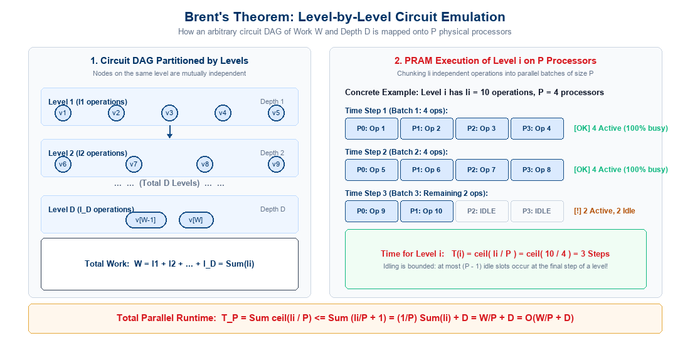
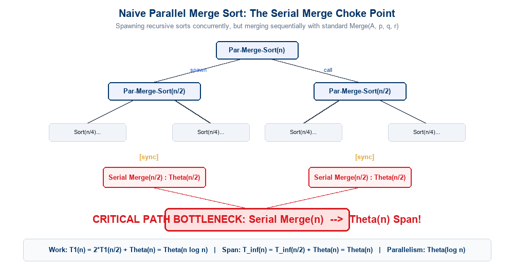
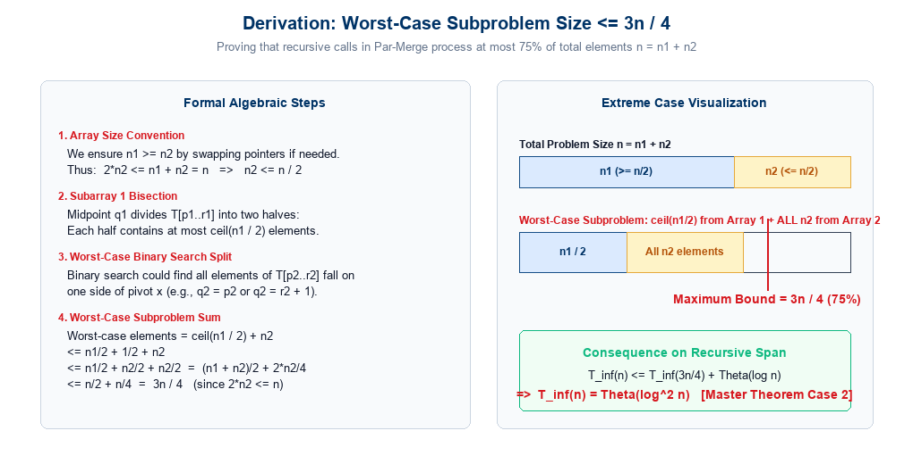
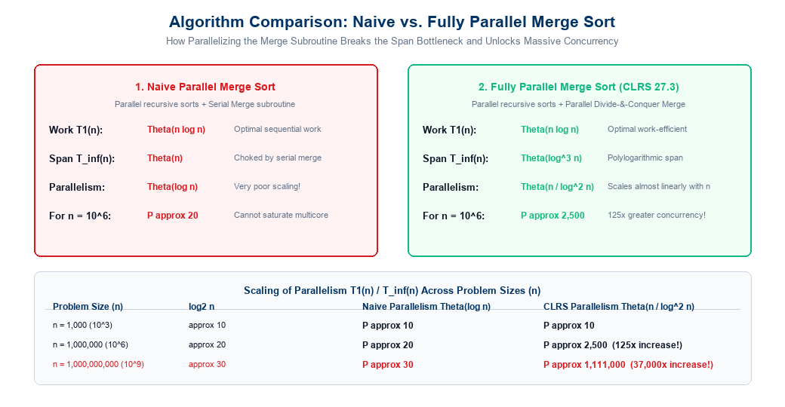

## Lecture Outline

- **Foundations: Bridging Abstract Circuits to Physical Machines**:
  - The Circuit Model abstraction: Directed Acyclic Graphs (DAGs), Work ($W$), and Depth ($D$).
  - Constant fan-in constraints and topological leveling.
- **Brent's Theorem (Scheduling Principle)**:
  - Statement of the theorem: Simulating arbitrary circuits of size $W$ and depth $D$ on $P$ processors in $O(W/P + D)$ steps.
  - Formal proof: Level-by-level PRAM emulation, processor allocation $\lceil l_i / P \rceil$, and summation over $D$ levels.
  - Why **CREW PRAM** is required (handling node fan-out $> 1$).
  - Theoretical bounds: The **work-optimality threshold** ($P \le W/D$) and processor allocation.
- **Parallel Merge Sort: The Naive Bottleneck**:
  - Review of serial Merge Sort ($O(n \log n)$).
  - First parallelization attempt: Spawning recursive sorts with standard serial merge.
  - Work-span analysis: $T_1(n) = \Theta(n \log n)$, $T_\infty(n) = \Theta(n)$, Parallelism $= \Theta(\log n)$.
  - Diagnosing the Amdahl choke point: Why serial merge cripples large-scale scalability.
- **Parallel Merge Algorithm (CLRS Chapter 27.3)**:
  - The core insight: Parallelizing the merge subroutine itself via divide-and-conquer.
  - Step 1: Median pivot selection ($x = T[q_1]$) in the larger subarray.
  - Step 2: Binary search partitioning in the second subarray ($q_2$).
  - Step 3: Exact output destination rank computation ($q_3 = p_3 + (q_1 - p_1) + (q_2 - p_2)$) and direct placement.
  - Step 4: Spawning concurrent recursive merges on the lower and upper subarrays.
- **Rigorous Complexity Derivation**:
  - Mathematical proof of the worst-case recursive subproblem size ($\le \frac{3}{4} n$).
  - Span recurrence: $T_\infty(n) = T_\infty(3n/4) + \Theta(\log n) \implies \Theta(\log^2 n)$.
  - Work recurrence: $T_1(n) = T_1(\alpha n) + T_1((1-\alpha)n) + \Theta(\log n) \implies \Theta(n)$ [Work-Efficient!].
- **Fully Parallel Merge Sort Complexity**:
  - Overall sorting Work: $T_1(n) = \Theta(n \log n)$.
  - Overall sorting Span: $T_\infty(n) = T_\infty(n/2) + \Theta(\log^2 n) \implies \Theta(\log^3 n)$.
  - Parallelism scaling: $P = \Theta(n / \log^2 n)$ — unlocking orders-of-magnitude concurrency.

---

## The Circuit Model: Recap of Work and Depth

Before executing an algorithm on physical processors, we model its intrinsic concurrency using the **Circuit Model**:

:::: {.columns}

::: {.column width="50%"}
### DAG Representation
- An algorithm is modeled as a **Directed Acyclic Graph (DAG)** $\mathcal{G} = (V, E)$:
  - **Input Nodes**: External inputs fed into the circuit.
  - **Internal Nodes**: Primitive operations (e.g., $+$, $\times$, $\land$, comparisons).
  - **Directed Edges**: Data dependencies directing output operands to consumer operations.
- **Constant Fan-in**: Each internal node has at most $k = O(1)$ inputs (typically 2 for binary operations).
- **Arbitrary Fan-out**: The output of a node can be consumed by multiple subsequent operations simultaneously.
:::

::: {.column width="50%"}
### Fundamental Circuit Metrics
- **Size / Work ($W$)**:
  - The total number of internal operation nodes in the circuit DAG:
    $$W = |V_{\text{internal}}|$$
  - Represents the total computational effort executed by a single processor ($T_1$).
- **Depth ($D$)**:
  - The length of the **longest directed path** from any input node to any output node:
    $$D = \text{Critical Path Length} = T_\infty$$
  - Represents the minimum time required even with an infinite number of processors ($P = \infty$).
:::

::::

<div style="margin-top: 15px; padding: 12px 20px; background-color: #f1f5f9; border-left: 5px solid #003366; border-radius: 4px; font-size: 0.95em;">
  <strong>Fundamental Lower Bound:</strong> Any physical execution on $P$ processors requires at least:
  $$T_P \ge \max\left( \frac{W}{P}, D \right)$$
  The term $W/P$ is the <em>work limit</em> (capacity bound), and $D$ is the <em>depth limit</em> (dependency bound).
</div>

---

## Brent's Theorem: Formal Statement

Brent's Theorem (Richard P. Brent, 1974) provides the fundamental mathematical bridge connecting **abstract DAG circuit complexity** to **concrete physical machine scheduling**:

<div style="margin: 20px 0; padding: 18px 24px; background: #eff6ff; border: 2px solid #2563eb; border-radius: 8px; font-size: 1.05em; line-height: 1.6;">
  <strong style="color: #003366; font-size: 1.15em;">Brent's Scheduling Theorem:</strong><br>
  Any algorithm that can be represented as a circuit DAG of size (work) $W$ and depth (critical path) $D$ with constant fan-in nodes ($k = O(1)$) can be executed in:
  $$\boxed{T_P \le \frac{W - D}{P} + D < \frac{W}{P} + D = O\left( \frac{W}{P} + D \right)}$$
  steps on a <strong>CREW PRAM</strong> model with $P$ processors.
</div>

:::: {.columns}

::: {.column width="50%"}
### Deconstructing the Bound
- **Work Term $\frac{W}{P}$**:
  - The ideal linear speedup component.
  - Distributes total computational work evenly across all $P$ physical processors.
:::

::: {.column width="50%"}
### The Depth Limit $D$
- **Latency Term $D$**:
  - Inherent critical-path dependency bound.
  - Represents the irreducible sequential steps that no amount of parallelism can compress.
:::

::::

<div style="margin-top: 15px; padding: 10px 18px; background-color: #f1f5f9; border-left: 5px solid #003366; border-radius: 4px; font-size: 0.9em;">
  <strong>Model Assumption:</strong> Bounded fan-in ($k = O(1)$ per node) and Concurrent Read, Exclusive Write (CREW) shared memory.
</div>

---

## Brent's Theorem: Algorithmic Significance

Why is Brent's Theorem considered one of the most celebrated results in parallel algorithm design?

:::: {.columns}

::: {.column width="50%"}
### 1. Hardware-Agnostic Design
- **Idealized Concurrency**:
  - Algorithm designers develop algorithms for abstract DAGs with unbounded concurrency ($W, D$) without worrying about physical core counts.
- **Automatic Scalability**:
  - Brent's Theorem guarantees the computation scales automatically to *any* physical processor count $P$ without needing a bespoke scheduler for each architecture.
:::

::: {.column width="50%"}
### 2. Work-Depth Characterization
- **Universal Metrics**:
  - An algorithm's parallel capability is completely characterized by its total operations ($W$) and span ($D$).
- **Direct Emulation Bridge**:
  - Yields a constructive, level-by-level methodology to schedule DAG operations onto synchronous shared-memory machines.
:::

::::

<div style="margin-top: 20px; padding: 14px 22px; background: #fff7ed; border-left: 5px solid #ea580c; border-radius: 6px; font-size: 0.92em; color: #7c2d12;">
  <strong style="color: #9a3412; font-size: 1.05em;">Near-Optimal Scheduling Guarantee:</strong><br>
  Since any physical execution requires $T_P \ge \max\left( \frac{W}{P}, D \right)$, Brent's upper bound $T_P \le \frac{W}{P} + D \le 2 \max\left( \frac{W}{P}, D \right)$ is within a <strong>factor of 2 of the absolute theoretical optimum</strong>!
</div>

---

## Brent's Theorem: Proof Strategy & Leveling

We prove the theorem by constructing an explicit **level-by-level emulation** of the circuit DAG on a PRAM:

:::: {.columns}

::: {.column width="50%"}
### 1. Topological Level Assignment
- Decompose the DAG vertices into discrete topological levels $i \in \{1, 2, \dots, D\}$:
  - **Base Case (Level 1)**: A node $v$ is on Level 1 if all of its inputs are external circuit inputs.
  - **Inductive Step**: For any other node $u$, its level is defined as:
    $$\text{level}(u) = 1 + \max_{v \in \text{Pred}(u)} \{ \text{level}(v) \}$$
- **Independence Property**:
  - All nodes on the *same level* $i$ depend **only** on outputs computed in earlier levels ($< i$).
  - Therefore, all nodes on level $i$ are mutually independent and can be evaluated in **any order or in parallel**!
:::

::: {.column width="50%"}
### 2. Node Counts per Level ($l_i$)
- Let $l_i$ denote the number of internal operation nodes situated on level $i$.
- **Sum of Operations**:
  - Every operation node in the circuit belongs to exactly one level $i \in \{1, \dots, D\}$.
  - Summing the node counts across all levels yields the total work $W$:
    $$\sum_{i=1}^D l_i = W$$
- **Depth Equality**:
  - The number of levels is precisely equal to the depth $D$ of the circuit DAG.
:::

::::

<div style="margin-top: 15px; padding: 10px 18px; background: #fff7ed; border-left: 5px solid #e5a93c; border-radius: 4px; font-size: 0.9em; color: #7c2d12;">
  <strong>Observation:</strong> The levels define a strict topological sequence of barriers: Level 1 must finish before Level 2 can complete, which must finish before Level 3, and so on.
</div>

---

## Brent's Theorem: PRAM Emulation & Concurrent Reads

How does a PRAM with $P$ processors execute the $l_i$ nodes of level $i$?

:::: {.columns}

::: {.column width="55%"}
### Processor Allocation per Level
- On level $i$, there are $l_i$ independent tasks to execute.
- We partition the $l_i$ tasks evenly among the $P$ processors:
  - Each processor executes at most $\lceil l_i / P \rceil$ operations sequentially.
- **Execution Time for Level $i$**:
  $$T(i) = \left\lceil \frac{l_i}{P} \right\rceil \text{ steps}$$
- If $l_i \ge P$, all $P$ processors are fully utilized for $\lfloor l_i / P \rfloor$ steps, and a subset of processors executes the remaining $l_i \bmod P$ operations.
- If $l_i < P$, only $l_i$ processors are active for 1 step, while $P - l_i$ processors remain idle.
:::

::: {.column width="45%"}
### Why CREW PRAM is Essential
- Consider a node $v$ on level $i - 1$ whose output value is required by $k$ distinct nodes on level $i$:
  $$\text{fan-out}(v) = k > 1$$
- In the PRAM shared memory:
  - The result of node $v$ resides in a single shared memory cell.
  - The $k$ operations on level $i$ are assigned to different processors.
  - These processors must read the contents of that cell **simultaneously**!
- Hence, **Concurrent Reads (CR)** are mandatory!
- Writes are always **Exclusive (EW)** because each node writes its output to a unique memory location.
:::

::::

---

## Brent's Theorem: Level-by-Level Emulation

{width="88%" fig-align="center"}

---

## Brent's Theorem: Formal Summation Proof

We compute the total PRAM execution time by summing the steps required across all $D$ levels:

$$T_{\text{PRAM}}(W, D, P) = \sum_{i=1}^D \left\lceil \frac{l_i}{P} \right\rceil$$

:::: {.columns}

::: {.column width="60%"}
### Algebraic Derivation
- Using the standard ceiling property $\lceil x \rceil < x + 1$, or $\lceil \frac{a}{b} \rceil \le \frac{a}{b} + \frac{b-1}{b} < \frac{a}{b} + 1$:
  $$\left\lceil \frac{l_i}{P} \right\rceil \le \frac{l_i}{P} + \frac{P-1}{P} < \frac{l_i}{P} + 1$$
- Substituting this into the level summation:
  $$T_{\text{PRAM}}(W, D, P) \le \sum_{i=1}^D \left( \frac{l_i}{P} + 1 \right)$$
  $$= \frac{1}{P} \left( \sum_{i=1}^D l_i \right) + \sum_{i=1}^D 1$$
- Since $\sum_{i=1}^D l_i = W$ and $\sum_{i=1}^D 1 = D$:
  $$T_{\text{PRAM}}(W, D, P) \le \frac{W}{P} + D$$
:::

::: {.column width="40%"}
### Formal Conclusion
- In asymptotic notation:
  $$\boxed{T_{\text{PRAM}}(W, D, P) = O\left( \frac{W}{P} + D \right)}$$
- **Total Work Performed**:
  The total processor-time product expended by the PRAM is:
  $$P \cdot T_P \le W + P \cdot D$$
- The extra work $(P \cdot D)$ accounts for all processor idling during sparse levels where $l_i < P$.
:::

::::

---

## Implications of Brent's Theorem: Work-Optimality

When does an algorithm achieve **optimal linear speedup** under Brent's Theorem?

:::: {.columns}

::: {.column width="50%"}
### Work-Optimality Condition
- An algorithm is **work-optimal** if its parallel running time satisfies:
  $$T_P = O\left( \frac{W}{P} \right) = O\left( \frac{T_s}{P} \right)$$
- From Brent's bound $T_P \le \frac{W}{P} + D$, the term $\frac{W}{P}$ dominates $D$ whenever:
  $$\frac{W}{P} \ge D \iff \boxed{P \le \frac{W}{D}}$$
- **Significance**:
  - The ratio $P_{\text{crit}} = W / D$ is the **average available parallelism** of the algorithm.
  - As long as the number of physical processors $P$ does not exceed $W / D$, Brent's scheduling guarantees **linear speedup** ($S = \Theta(P)$) and **constant efficiency** ($E = \Theta(1)$)!
:::

::: {.column width="50%"}
### Concrete Example: Binary Tree Addition
- Recall summing $n$ numbers via a balanced binary reduction tree:
  - Total additions (Work): $W = n - 1 = \Theta(n)$.
  - Tree levels (Depth): $D = \log_2 n = \Theta(\log n)$.
- By Brent's Theorem, on $P$ processors:
  $$T_P \le \frac{n-1}{P} + \log_2 n = O\left( \frac{n}{P} + \log n \right)$$
- To achieve work-optimality:
  $$P \le \frac{n}{\log n}$$
- If we choose $P = n / \log n$, the running time is:
  $$T_P = O\left( \frac{n}{n/\log n} + \log n \right) = O(\log n)$$
  Expending $P \cdot T_P = (n / \log n) \cdot \log n = O(n)$ total work — **strictly optimal**!
:::

::::

---

## The Sorting Problem in Parallel Computing

We now transition from general scheduling to a core algorithmic problem: **Sorting**.

:::: {.columns}

::: {.column width="50%"}
### The Benchmark Challenge
- **Sequential Baseline**:
  - Comparison-based sorting requires $\Omega(n \log n)$ operations in the worst case.
  - Standard Merge Sort achieves this bound:
    $$T_s(n) = \Theta(n \log n)$$
- **The Parallel Goal**:
  - Can we sort $n$ elements in $O(\log n)$ or $O(\log^2 n)$ parallel time?
  - Can we do so **work-efficiently**, performing no more than $O(n \log n)$ total operations?
- **Sorting Networks & PRAM**:
  - Batcher's Bitonic Sort: $O(\log^2 n)$ depth, but $O(n \log^2 n)$ work (work-inefficient).
  - Can Divide-and-Conquer (Merge Sort) achieve work-efficiency in parallel?
:::

::: {.column width="50%"}
### Recall Sequential Merge-Sort
```default
Merge-Sort(A, p, r)
1. if p < r then
2.     q ← ⌊(p + r) / 2⌋
3.     Merge-Sort(A, p, q)
4.     Merge-Sort(A, q + 1, r)
5.     Merge(A, p, q, r)
```

- Lines 3 and 4 sort the two halves independently.
- Line 5 merges the two sorted subarrays sequentially in $\Theta(n)$ time using two pointers.
- Serial Recurrence:
  $$T(n) = 2 T(n/2) + \Theta(n) = \Theta(n \log n)$$
:::

::::

---

## Naive Parallel Merge Sort

The most obvious way to parallelize Merge Sort is to execute the two recursive calls concurrently using fork-join parallelism (`spawn` / `sync`):

:::: {.columns}

::: {.column width="55%"}
### Algorithm: Par-Merge-Sort (Naive)
```default
Par-Merge-Sort(A, p, r)
1. if p < r then
2.     q ← ⌊(p + r) / 2⌋
3.     spawn Par-Merge-Sort(A, p, q)      // Sort left half in parallel
4.     Par-Merge-Sort(A, q + 1, r)        // Sort right half concurrently
5.     sync                               // Wait for both halves to finish
6.     Merge(A, p, q, r)                  // Standard serial merge (Θ(n))
```

- Line 3 spawns a new parallel task for the left subarray.
- Line 4 executes the right subarray concurrently on the current thread.
- Line 5 synchronizes both recursive subproblems.
- Line 6 invokes the standard **sequential merge** routine.
:::

::: {.column width="45%"}
### Architectural Reality
- Spawning recursive subtasks creates an exponential number of parallel threads ($2^k$ at depth $k$).
- However, every recursive level terminates at a global `sync` barrier followed by a **strictly sequential merge**!
- Let us formally analyze the work, span, and parallelism of this naive approach.
:::

::::

---

## Complexity Analysis: Naive Parallel Merge Sort

We analyze the theoretical performance of naive parallel merge sort using the **Work-Span Model**:

:::: {.columns}

::: {.column width="50%"}
### 1. Work Recurrence ($T_1$)
- On a single processor ($P = 1$), `spawn` and `sync` behave like standard serial calls:
  $$T_1(n) = 2 T_1(n/2) + \Theta(n)$$
- **Solving via Master Theorem**:
  - Here $a = 2$, $b = 2$, and $f(n) = \Theta(n)$.
  - Critical exponent: $n^{\log_b a} = n^{\log_2 2} = n^1 = n$.
  - Since $f(n) = \Theta(n^{\log_b a})$, Case 2 applies:
    $$\boxed{T_1(n) = \Theta(n \log n)}$$
- **Work-Optimal**: Total operations match the optimal sequential merge sort.
:::

::: {.column width="50%"}
### 2. Span Recurrence ($T_\infty$)
- On infinite processors ($P = \infty$), the two recursive calls execute in parallel:
  $$\max(T_\infty(n/2), T_\infty(n/2)) = T_\infty(n/2)$$
- However, the subsequent sequential `Merge` requires $\Theta(n)$ time on the critical path:
  $$T_\infty(n) = T_\infty(n/2) + \Theta(n)$$
- **Solving via Master Theorem**:
  - Here $a = 1$, $b = 2$, and $f(n) = \Theta(n)$.
  - Critical exponent: $n^{\log_2 1} = n^0 = 1$.
  - Since $f(n) = \Omega(n^{0 + \epsilon})$ for $\epsilon = 1$, Case 3 applies:
    $$\boxed{T_\infty(n) = \Theta(n)}$$
:::

::::

---

## Naive Parallel Merge Sort: Parallelism Choke Point

Why does the naive parallel merge sort catastrophically fail to scale on modern multi-core systems?

<div style="margin: 15px 0; padding: 16px 24px; background-color: #fef2f2; border: 2px solid #ef4444; border-radius: 8px; font-size: 1.05em; line-height: 1.6;">
  <strong style="color: #b91c1c; font-size: 1.15em;">The Parallelism Upper Bound:</strong><br>
  $$\text{Parallelism} = \frac{T_1(n)}{T_\infty(n)} = \frac{\Theta(n \log n)}{\Theta(n)} = \boxed{\Theta(\log n)}$$
</div>

:::: {.columns}

::: {.column width="50%"}
### Concrete Scalability Collapse
- Suppose we sort an array of $n = 10^6$ elements:
  $$\text{Max Theoretical Speedup} \approx \log_2(10^6) \approx 20\times$$
- **Hardware Waste**:
  - On a 64-core machine: At most $20\times$ speedup (utilization $\le 31\%$).
  - On a 1,024-core cluster: Still at most $20\times$ speedup (utilization $< 2\%$)!
:::

::: {.column width="50%"}
### The Architectural Diagnosis
- **The Amdahl Bottleneck**:
  - The top-level merge alone does $\Theta(n)$ sequential work on one thread while all other processors sit idle.
- **The Imperative**:
  - Spawning recursive calls is *not enough*.
  - To achieve polylogarithmic span, **the merge subroutine itself must be parallelized**!
:::

::::

---

## Visualizing the Naive Merge Bottleneck

{width="88%" fig-align="center"}

---

## Parallel Merge: The Core CLRS Breakthrough

To overcome the $\Theta(n)$ span bottleneck, we must **parallelize the merge subroutine itself**!

<div style="margin: 15px 0; padding: 12px 20px; background: #f0fdf4; border-left: 5px solid #16a34a; border-radius: 4px; font-size: 0.95em;">
  <strong>Goal (CLRS 3rd Edition Section 27.3):</strong> Merge two sorted subarrays $T[p_1..r_1]$ (size $n_1$) and $T[p_2..r_2]$ (size $n_2$) into a merged output array $A[p_3..r_3]$ with <strong>polylogarithmic span</strong> while preserving $\Theta(n)$ work efficiency!
</div>

:::: {.columns}

::: {.column width="50%"}
### The Divide-and-Conquer Strategy
1. **Assume $n_1 \ge n_2$** without loss of generality (if $n_1 < n_2$, simply swap pointers).
2. **Find Median of Subarray 1**:
   - Compute midpoint $q_1 = \lfloor (p_1 + r_1) / 2 \rfloor$.
   - Let the pivot value be $x = T[q_1]$.
3. **Partition Subarray 2 using Binary Search**:
   - Search for pivot $x$ in sorted subarray $T[p_2..r_2]$.
   - Finds split index $q_2$ such that all elements in $T[p_2..q_2-1] < x$ and all elements in $T[q_2..r_2] \ge x$.
:::

::: {.column width="50%"}
### Concurrency Decomposition
4. **Compute Exact Destination Rank ($q_3$)**:
   - Count how many elements in both subarrays are strictly or weakly smaller than $x$:
     $$k = (q_1 - p_1) + (q_2 - p_2)$$
   - Place pivot $x$ directly into output array at index $q_3 = p_3 + k$.
5. **Recursively Merge Subproblems in Parallel**:
   - **Left Subproblem**: Merge $T[p_1..q_1-1]$ and $T[p_2..q_2-1]$ into $A[p_3..q_3-1]$.
   - **Right Subproblem**: Merge $T[q_1+1..r_1]$ and $T[q_2..r_2]$ into $A[q_3+1..r_3]$.
   - Execute both subproblems **simultaneously via `spawn`**!
:::

::::

---

## Parallel Merge: Steps 1 & 2 (Pivot & Binary Search)

Let us trace how `Par-Merge(T, p1, r1, p2, r2, A, p3)` partitions the two input subarrays:

:::: {.columns}

::: {.column width="50%"}
### Step 1: Bisect Subarray 1 (Find Pivot)
- Subarray 1 has length $n_1 = r_1 - p_1 + 1$ (where $n_1 \ge n_2$).
- Select the exact midpoint index:
  $$q_1 = \left\lfloor \frac{p_1 + r_1}{2} \right\rfloor$$
- Designate the pivot value as:
  $$x = T[q_1]$$
- **Sorted Property Guarantee**:
  - Left segment $T[p_1..q_1-1] \le x$.
  - Right segment $T[q_1+1..r_1] \ge x$.
- **Cost**: Performed in $O(1)$ time.
:::

::: {.column width="50%"}
### Step 2: Binary Search in Subarray 2
- Search for pivot $x$ in sorted subarray $T[p_2..r_2]$:
  $$q_2 = \text{Binary-Search}(x, T, p_2, r_2)$$
- Subarray 2 is cleanly partitioned into:
  $$T[p_2..q_2-1] < x \quad \text{and} \quad T[q_2..r_2] \ge x$$
- **Index Property**:
  - $q_2$ is the smallest index such that $T[q_2] \ge x$.
- **Cost**: Performed in $O(\log n_2) \le O(\log n)$ time.
:::

::::

<div style="margin-top: 15px; padding: 12px 20px; background: #eff6ff; border-left: 5px solid #2563eb; border-radius: 4px; font-size: 0.93em; color: #1e3a8a;">
  <strong>Key Partition Invariant:</strong> All elements in $T[p_1..q_1-1] \cup T[p_2..q_2-1]$ are $\le x$, and all elements in $T[q_1+1..r_1] \cup T[q_2..r_2]$ are $\ge x$.
</div>

---

## Parallel Merge: Steps 3 & 4 (Rank Placement & Parallel Spawns)

Once partitioned around pivot $x$, the algorithm routes elements directly to their final destinations:

:::: {.columns}

::: {.column width="50%"}
### Step 3: Exact Output Rank ($q_3$)
- How many elements are strictly ahead of $x$ in the merged output?
  - From Subarray 1: $(q_1 - p_1)$ elements.
  - From Subarray 2: $(q_2 - p_2)$ elements.
- The exact destination rank of $x$ in output array $A$ is:
  $$\boxed{q_3 = p_3 + (q_1 - p_1) + (q_2 - p_2)}$$
- **Direct Output Write**:
  - $A[q_3] \leftarrow x$ in $O(1)$ time.
  - **Zero Write Conflicts**: Rank calculation guarantees unique disjoint write destinations!
:::

::: {.column width="50%"}
### Step 4: Concurrent Recursive Merges
- Divide into two completely independent subproblems:
  - **Lower Subarray Merge (`spawn`)**:
    `Par-Merge(T, p1, q1-1, p2, q2-1, A, p3)`
  - **Upper Subarray Merge (concurrent)**:
    `Par-Merge(T, q1+1, r1, q2, r2, A, q3+1)`
  - **Join Barrier (`sync`)**:
    Wait for both subproblems to finish.
- Both subproblems write to non-overlapping partitions of $A$!
:::

::::

<div style="margin-top: 15px; padding: 12px 20px; background: #f0fdf4; border-left: 5px solid #16a34a; border-radius: 4px; font-size: 0.93em; color: #14532d;">
  <strong>Divide-and-Conquer Power:</strong> Both recursive calls execute simultaneously with no data sharing or synchronization hazards, reducing the merge span to polylogarithmic time!
</div>

---

## CLRS Figure 27.3: Parallel Merge Partitioning

![CLRS Figure 27.3 reproduction: Subarrays $T[p_1..r_1]$ and $T[p_2..r_2]$ partitioned around pivot $x=T[q_1]$ via binary search, routed into output array $A[p_3..r_3]$](extracted_images/lec13_parallel_merge_split.png){width="92%" fig-align="center"}

---

## Full Pseudocode: Parallel Merge (`Par-Merge`)

Here is the complete algorithm as specified in CLRS 3rd Edition Section 27.3:

```default
Par-Merge(T, p1, r1, p2, r2, A, p3)
 1. n1 ← r1 - p1 + 1
 2. n2 ← r2 - p2 + 1
 3. if n1 < n2 then
 4.     p1 ↔ p2;  r1 ↔ r2;  n1 ↔ n2        // Ensure T[p1..r1] is the larger subarray
 5. if n1 == 0 then
 6.     return                             // Base case: both subarrays are empty
 7. else
 8.     q1 ← ⌊(p1 + r1) / 2⌋               // Step 1: Find midpoint of T[p1..r1]
 9.     q2 ← Binary-Search(T[q1], T, p2, r2)// Step 2: Binary search in T[p2..r2]
10.     q3 ← p3 + (q1 - p1) + (q2 - p2)    // Step 3: Compute destination rank
11.     A[q3] ← T[q1]                      // Copy pivot x directly into A[q3]
12.     spawn Par-Merge(T, p1, q1 - 1, p2, q2 - 1, A, p3)     // Step 4(a): Lower half
13.     Par-Merge(T, q1 + 1, r1, q2, r2, A, q3 + 1)           // Step 4(b): Upper half
14.     sync
```

<div style="margin-top: 15px; padding: 8px 16px; background: #f8fafc; border-left: 4px solid #003366; border-radius: 4px; font-size: 0.88em;">
  <strong>Binary-Search Specification:</strong> Returns index $q_2$ such that if $x$ were inserted between $T[q_2-1]$ and $T[q_2]$, $T[p_2..r_2]$ remains sorted. If $x < T[p_2]$, $q_2 = p_2$. If $x > T[r_2]$, $q_2 = r_2 + 1$.
</div>

---

## Derivation: Worst-Case Subproblem Size $\le \frac{3}{4} n$

To analyze span and work, we must bound the maximum number of elements in any recursive call:

:::: {.columns}

::: {.column width="55%"}
### Mathematical Derivation
- Let total elements be $n = n_1 + n_2$.
- Because lines 3–4 guarantee $n_1 \ge n_2$:
  $$n_2 \le n_1 \implies 2n_2 \le n_1 + n_2 = n \implies \boxed{n_2 \le \frac{n}{2}}$$
- Midpoint $q_1$ divides $T[p_1..r_1]$ into two halves:
  $$\text{Elements in each half} \le \left\lceil \frac{n_1}{2} \right\rceil$$
- **Worst-Case Binary Search Split**:
  - In the worst case, binary search finds that **all $n_2$ elements** of Subarray 2 fall on *one side* of the pivot $x$ (e.g., $q_2 = p_2$ or $q_2 = r_2 + 1$).
- Total elements in the larger recursive subproblem:
  $$\text{Worst-Case Size} \le \left\lceil \frac{n_1}{2} \right\rceil + n_2 \le \frac{n_1}{2} + \frac{1}{2} + n_2$$
  $$\le \frac{n_1}{2} + \frac{n_2}{2} + \frac{n_2}{2} = \frac{n_1 + n_2}{2} + \frac{2n_2}{4} \le \frac{n}{2} + \frac{n}{4} = \boxed{\frac{3}{4} n}$$
:::

::: {.column width="45%"}
### Why is this Bound Crucial?
- Even in the absolute worst-case data distribution, **neither recursive subproblem can contain more than $75\%$ of the total elements $n$**!
- This strictly bounds the recursion depth:
  $$\text{Depth} \le \log_{4/3} n = \Theta(\log n)$$
- Guarantees geometric shrinkage at every level of the recursive call tree.
:::

::::

---

## Visualizing the $\frac{3}{4} n$ Worst-Case Bound

{width="88%" fig-align="center"}

---

## Parallel Merge: Span Analysis ($T_\infty$)

We now solve the span recurrence for `Par-Merge`:

:::: {.columns}

::: {.column width="55%"}
### Span Recurrence Formulation
- Along the critical path ($P = \infty$), the two spawned recursive calls run simultaneously:
  $$\text{Span of calls} = \max(T_\infty(\text{Left}), T_\infty(\text{Right})) \le T_\infty(3n/4)$$
- The non-recursive overhead on each level is dominated by the binary search:
  $$\text{Overhead} = O(\log n_2) = \Theta(\log n)$$
- Thus, the span recurrence is:
  $$T_\infty(n) = \begin{cases} \Theta(1) & \text{if } n = 1 \\ T_\infty(3n/4) + \Theta(\log n) & \text{if } n > 1 \end{cases}$$
:::

::: {.column width="45%"}
### Solving via Master Theorem
- Form: $T(n) = a T(n/b) + f(n)$ with:
  $$a = 1, \quad b = 4/3, \quad f(n) = \Theta(\log n)$$
- Critical exponent:
  $$n^{\log_b a} = n^{\log_{4/3} 1} = n^0 = 1$$
- Since $f(n) = \Theta(n^{\log_b a} \lg^k n)$ with $k = 1$:
  - By **Master Theorem (Case 2)**:
    $$T_\infty(n) = \Theta(n^{\log_b a} \lg^{k+1} n) = \Theta(1 \cdot \log^2 n)$$
  $$\boxed{T_\infty(n) = \Theta(\log^2 n)}$$
:::

::::

<div style="margin-top: 15px; padding: 10px 18px; background: #eff6ff; border-left: 5px solid #2563eb; border-radius: 4px; font-size: 0.9em; color: #1e3a8a;">
  <strong>Dramatic Improvement:</strong> The span of merging two arrays drops from linear $\Theta(n)$ to polylogarithmic $\Theta(\log^2 n)$!
</div>

---

## Parallel Merge: Work Analysis ($T_1$)

Does this polylogarithmic span come at the price of excess work? We prove that `Par-Merge` is **strictly work-efficient**:

:::: {.columns}

::: {.column width="50%"}
### Work Recurrence
- Every element must be inspected and written to output, so clearly:
  $$T_1(n) = \Omega(n)$$
- At each recursive step, $n$ elements are partitioned into:
  - Left subproblem: $\alpha n$ elements.
  - Right subproblem: $(1 - \alpha) n - 1$ elements.
  - Pivot element: 1 element copied in $O(1)$ time.
- Because each subproblem has at most $3n/4$ elements:
  $$\alpha \in [1/4, 3/4]$$
- Work recurrence:
  $$T_1(n) = T_1(\alpha n) + T_1((1 - \alpha)n) + \Theta(\log n)$$
:::

::: {.column width="50%"}
### Substitution Proof ($T_1(n) = O(n)$)
- **Inductive Hypothesis**: $T_1(n) \le c_1 n - c_2 \log n$ for positive constants $c_1, c_2$.
- Substitute into recurrence:
  $$T_1(n) \le c_1 \alpha n - c_2 \log(\alpha n) + c_1(1-\alpha)n - c_2 \log((1-\alpha)n) + c_3 \log n$$
  $$= c_1 n - c_2 [\log(\alpha n) + \log((1-\alpha)n)] + c_3 \log n$$
  $$= c_1 n - c_2 [\log(\alpha(1-\alpha)) + 2 \log n] + c_3 \log n$$
- Since $\alpha(1-\alpha) \ge \frac{1}{4} \cdot \frac{3}{4} = \frac{3}{16}$:
  $$\le c_1 n - 2c_2 \log n + c_2 \log(16/3) + c_3 \log n$$
- By choosing $c_2 \ge c_3$ and $c_1$ sufficiently large:
  $$\le c_1 n - c_2 \log n = O(n)$$
  $$\boxed{T_1(n) = \Theta(n)}$$
:::

::::

---

## Parallel Merge Sort with Parallel Merge

We now integrate our polylogarithmic `Par-Merge` into the main sorting routine:

```default
Par-Merge-Sort(A, p, r, B, s)
 1. n ← r - p + 1
 2. if n == 1 then
 3.     B[s] ← A[p]
 4. else
 5.     let T[1..n] be a new auxiliary array
 6.     q ← ⌊(p + r) / 2⌋
 7.     q' ← q - p + 1
 8.     spawn Par-Merge-Sort(A, p, q, T, 1)          // Sort left half into T[1..q']
 9.     Par-Merge-Sort(A, q + 1, r, T, q' + 1)       // Sort right half into T[q'+1..n]
10.     sync                                         // Wait for both halves to finish
11.     Par-Merge(T, 1, q', q' + 1, n, B, s)         // Parallel merge T into destination B[s]
```

- **Array B and Auxiliary Buffer T**: Avoids destructive in-place overwrites while threads merge concurrently.
- **Recursive Spawning**: Left and right subarrays are sorted concurrently via `spawn` (lines 8–9).
- **Parallel Merging**: Instead of serial merge, Line 11 invokes our parallel merge routine `Par-Merge`!

---

## Fully Parallel Merge Sort: Complexity Analysis

Let us evaluate the resulting overall performance metrics:

:::: {.columns}

::: {.column width="50%"}
### 1. Total Work ($T_1$)
- The work recurrence combines the two recursive sorts and the work of `Par-Merge`:
  $$T_1(n) = 2 T_1(n/2) + \text{Work}(\text{Par-Merge}(n))$$
  $$T_1(n) = 2 T_1(n/2) + \Theta(n)$$
- By Master Theorem (Case 2: $a=2, b=2, f(n)=\Theta(n)$):
  $$\boxed{T_1(n) = \Theta(n \log n)}$$
- **Work-Optimal**: Exactly matches the asymptotic complexity of sequential Merge Sort! No computational work is wasted.
:::

::: {.column width="50%"}
### 2. Total Span ($T_\infty$)
- The critical path includes one branch of the recursive sort plus the span of `Par-Merge`:
  $$T_\infty(n) = T_\infty(n/2) + \text{Span}(\text{Par-Merge}(n))$$
  $$T_\infty(n) = T_\infty(n/2) + \Theta(\log^2 n)$$
- Form: $a=1, b=2, f(n)=\Theta(\log^2 n)$.
  $$n^{\log_2 1} = n^0 = 1$$
- By Master Theorem (Case 2 with $k=2$):
  $$\boxed{T_\infty(n) = \Theta(\log^3 n)}$$
:::

::::

<div style="margin-top: 15px; padding: 12px 20px; background-color: #f0fdf4; border: 2px solid #16a34a; border-radius: 6px; font-size: 0.95em;">
  <strong style="color: #15803d; font-size: 1.05em;">Unlocking Massive Parallelism:</strong><br>
  $$\text{Parallelism} = \frac{T_1(n)}{T_\infty(n)} = \frac{\Theta(n \log n)}{\Theta(\log^3 n)} = \boxed{\Theta\left( \frac{n}{\log^2 n} \right)}$$
</div>

---

## Scaling Comparison: Naive vs. Fully Parallel Merge Sort

{width="88%" fig-align="center"}

---

## Algorithmic Landscape: Parallel Sorting Algorithms

Where does Parallel Merge Sort stand in the broader taxonomy of parallel sorting?

| Algorithm | Model | Work ($T_1$) | Span ($T_\infty$) | Parallelism ($T_1 / T_\infty$) | Work Optimal? |
| :--- | :--- | :--- | :--- | :--- | :--- |
| **Serial Merge Sort** | RAM (1 CPU) | $\Theta(n \log n)$ | $\Theta(n \log n)$ | $1$ | Yes (Sequential) |
| **Naive Par-Merge-Sort** | Multithreaded | $\Theta(n \log n)$ | $\Theta(n)$ | $\Theta(\log n)$ | Yes (Low Concurrency) |
| **CLRS Par-Merge-Sort** | Multithreaded | $\Theta(n \log n)$ | $\Theta(\log^3 n)$ | $\Theta(n / \log^2 n)$ | **Yes (Highly Scalable)** |
| **Batcher's Bitonic Sort** | Sorting Network | $\Theta(n \log^2 n)$ | $\Theta(\log^2 n)$ | $\Theta(n)$ | No (Excess Work) |
| **Cole's Pipelined Sort** | CREW PRAM | $\Theta(n \log n)$ | $\Theta(\log n)$ | $\Theta(n)$ | **Yes (Theoretical Peak)** |

<div style="margin-top: 15px; padding: 10px 18px; background: #fff7ed; border-left: 5px solid #e5a93c; border-radius: 4px; font-size: 0.88em; color: #7c2d12;">
  <strong>Cole's Pipelined Merge Sort (1988):</strong> By cascading fractional elements between levels without waiting for subtrees to complete merging, Richard Cole achieved $O(\log n)$ depth with $O(n \log n)$ work on CREW PRAM! However, its constant factors make the CLRS algorithm far superior in practical multithreaded systems.
</div>

---

## References & Further Reading

1. **Cormen, T. H., Leiserson, C. E., Rivest, R. L., & Stein, C.** (2009). *Introduction to Algorithms* (3rd ed.). MIT Press.
   - **Chapter 27**: "Multithreaded Algorithms" (Section 27.3: Multithreaded Merge Sort, pp. 797–805).
2. **Brent, R. P.** (1974). "The Parallel Evaluation of General Arithmetic Expressions". *Journal of the ACM*, 21(2), pp. 201–206.
3. **JáJá, J.** (1992). *An Introduction to Parallel Algorithms*. Addison-Wesley.
   - **Chapter 1**: "Basic Techniques & The Work-Depth Paradigm".
   - **Chapter 4**: "Parallel Sorting Networks and Algorithms".
4. **Cole, R.** (1988). "Parallel Merge Sort". *SIAM Journal on Computing*, 17(4), pp. 770–785.
5. **Grama, A., Gupta, A., Karypis, G., & Kumar, V.** (2003). *Introduction to Parallel Computing* (2nd ed.). Addison-Wesley.
   - **Chapter 5**: "Analytical Modeling of Parallel Programs".
   - **Chapter 9**: "Sorting Networks and Parallel Sorting Algorithms".
