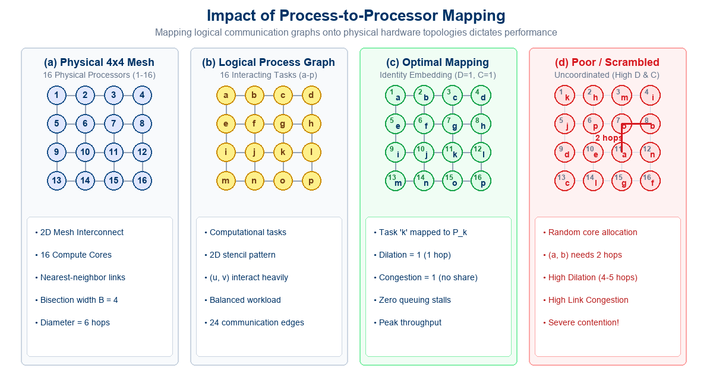
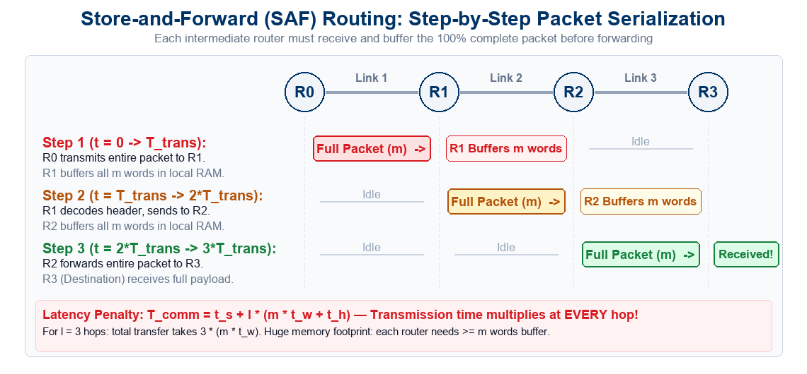
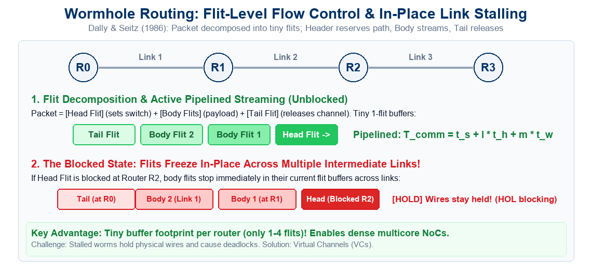
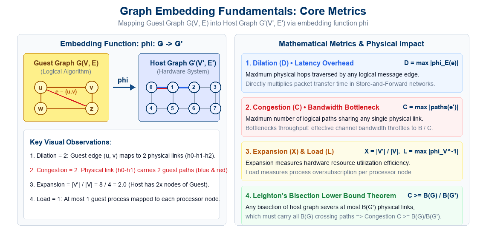
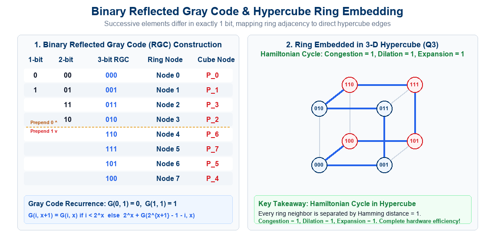
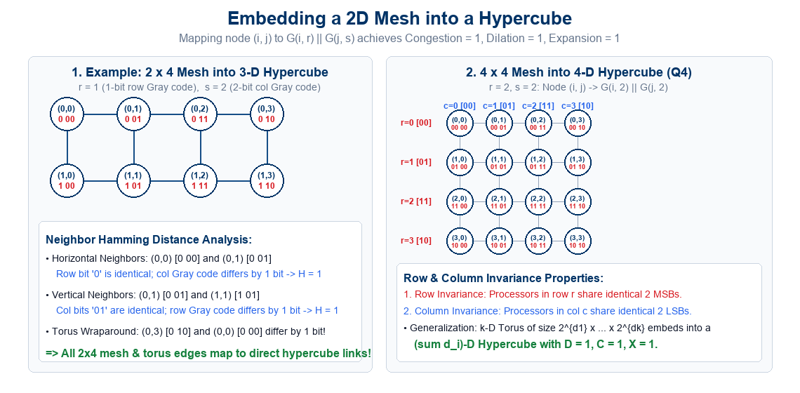
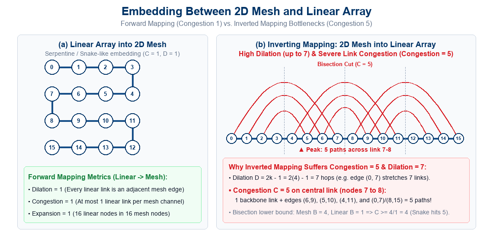
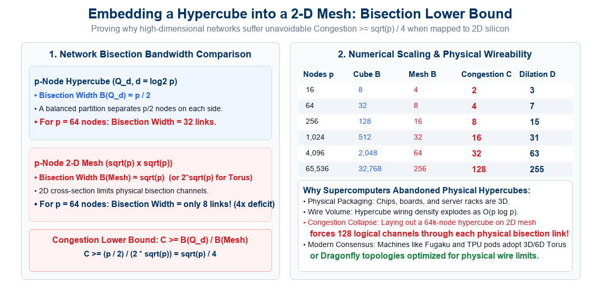

## Lecture Outline

:::: {.columns}

::: {.column width="50%"}
- **The Process Mapping Challenge**:
  - The gap between algorithmic patterns and hardware topologies.
  - Impact on Clusters, MPPs, NUMA, and Networks-on-Chip.
- **Impact of Process Mapping (Case Study)**:
  - Mapping a $4 \times 4$ process grid onto a $4 \times 4$ processor mesh.
  - Identity mapping vs. Arbitrary / Scrambled allocation.
  - Routing mechanisms: Store-and-Forward, Cut-Through & Wormhole.
  - Latency degradation: Distance vs. Link Congestion.
- **Graph Embedding Formalism & Core Metrics**:
  - Guest Graph $G(V, E)$ vs. Host Graph $G'(V', E')$.
  - **Dilation ($D$)**, **Congestion ($C$)**, **Expansion ($X$)**, and **Load ($L$)**.
  - **Leighton's Bisection Theorem**: $C \ge B(G) / B(G')$.
- **Embedding a Linear Array / Ring into a Hypercube**:
  - Binary Reflected Gray Code (RGC): Recurrence & $i \oplus (i \gg 1)$.
  - Hamiltonian cycle proof: Congestion = 1, Dilation = 1, Expansion = 1.
:::

::: {.column width="50%"}
- **Embedding Meshes into Hypercubes**:
  - Gray code concatenation: $\phi(i, j) = G(i, r) \mathbin{\Vert} G(j, s)$.
  - Row & column invariance properties; $2 \times 4$ and $4 \times 4$ case studies.
  - Generalization to $k$-dimensional tori.
- **Embedding Between 2D Meshes and Linear Arrays**:
  - Forward: Linear Array to 2D Mesh via serpentine snake ($D=1, C=1$).
  - Inverse: 2D Mesh to Linear Array ($D = 2k-1 = 7$).
  - The **Congestion = 5** phenomenon: Overlapping intervals & cuts.
- **Architectural Extension: Hypercube into 2D Mesh**:
  - Bisection mismatch ($p/2$ vs. $2\sqrt{p}$) and bound $C \ge \sqrt{p}/4$.
  - VLSI Rent's rule and why supercomputers moved to 3D tori.
- **Interactive Review Quizzes (Quizzes 1 & 2)**:
  - **Quiz-1 (Topology Mapping & Graph Embedding - Lec 14)**: 4 conceptual MCQs + answer keys.
  - **Quiz-2 (Brent's Theorem & Parallel Merge - Lec 13 Review)**: 4 conceptual MCQs + answer keys.
:::

::::

---

## The Process-to-Processor Mapping Problem

When designing parallel algorithms, programmers conceptualize tasks and communication as an idealized **logical communication graph**:

:::: {.columns}

::: {.column width="50%"}
### The Logical Domain (Algorithm)
- An algorithm consists of concurrent tasks/processes $\{p_0, p_1, \dots\}$.
- Inter-task interactions define **logical communication edges**:
  - Nearest-neighbor grid stencils (PDEs, climate models).
  - Pipelined 1D arrays (systolic filters, stream processing).
  - Tree-structured reductions and prefix trees.
  - Multidimensional FFT hypercube exchange patterns.
- Designed assuming direct, zero-delay communication between interacting tasks.
:::

::: {.column width="50%"}
### The Physical Domain (Hardware)
- Physical supercomputers and multi-core chips have a **fixed interconnection topology**:
  - 2D/3D Meshes and Tori (Intel Knights Landing, Google TPU pods).
  - Multistage Interconnection Networks (Omega, Clos, Fat-Trees).
  - Dragonfly networks (Cray XC50, HPE Slingshot).
  - Hypercubes (early SGI, CM-2, nCUBE).
- Physical links have finite bandwidth ($t_w$), fixed router hops ($t_h$), and finite buffer queues.
:::

::::

  <strong>Fundamental Objective:</strong> How do we assign logical processes to physical processors such that communication latency, link contention, and hardware idle time are simultaneously minimized?

---

## Impact of Process Mapping: A Concrete Scenario

Consider a parallel application with 16 interacting processes structured as a $4 \times 4$ grid, executing on a physical $4 \times 4$ 2D mesh of 16 processing nodes:

:::: {.columns}

::: {.column width="50%"}
### Topology-Preserving (Identity) Mapping
- Process $a$ is assigned to Node 1, $b$ to Node 2, ..., $p$ to Node 16.
- **Direct Link Traversal**:
  - Every pair of communicating processes resides on **physically adjacent nodes**.
  - Path length is exactly **1 physical hop**.
- **Zero Channel Contention**:
  - Each physical wire carries traffic from at most **1 logical communication pair**.
  - Routers perform zero multi-hop store-and-forward switching.
  - Network throughput reaches hardware peak!
:::

::: {.column width="50%"}
### Arbitrary / Scrambled Mapping
- The operating system scheduler or user allocates processes randomly (e.g., $a \to 11$, $b \to 8$).
- **Multi-Hop Path Latency**:
  - Interacting processes are separated by 2, 3, or even 5 physical hops!
  - Packets traverse multiple intermediate routers.
- **Severe Link Contention & Hotspots**:
  - Multiple logical messages compete for the same physical links simultaneously.
  - Router buffers overflow, triggering head-of-line blocking and catastrophic throughput collapse.
:::

::::

  <strong>Key Insight:</strong> On distributed-memory platforms and large-scale NoCs, poor process mapping can degrade overall application performance by <strong>an order of magnitude ($5\times$ to $10\times$)</strong>, even when computational load is perfectly balanced!

---

## Visualizing the Impact of Process Mapping

{width="96%" fig-align="center"}

---

## Routing Mechanism 1: Store-and-Forward (SAF)

The traditional packet-switched routing baseline used in conventional computer networks:

:::: {.columns}

::: {.column width="50%"}
### Operational Principles
- **Hop-by-Hop Buffering**:
  - An intermediate router must **completely receive and buffer** the entire packet of size $m$ words before decoding the header.
  - Forwarding to the next node only starts after the last bit of the packet has been validated.
- **Buffer Requirements**:
  - Requires large memory capacity at every input port to hold at least one full packet ($m$ words).
:::

::: {.column width="50%"}
### Latency Model & Bottleneck
- **Communication Latency**:
  $$T_{\text{comm}} = t_s + l \cdot (m \cdot t_w + t_h)$$
- **The Distance Multiplier**:
  - Transmission time $m \cdot t_w$ is incurred **independently at every single hop**!
  - For $l$ hops, transmission latency scales additively as $l \cdot m \cdot t_w$.
- **Architectural Bottleneck**:
  - In large supercomputers with high diameter, SAF makes multi-hop communication prohibitively slow!
:::

::::

---

## Visualizing Store-and-Forward (SAF) Routing

{width="96%" fig-align="center"}

---

## Routing Mechanism 2: Virtual Cut-Through (VCT)

Proposed by Kermani & Kleinrock (1979) to eliminate the hop-by-hop packet serialization bottleneck:

:::: {.columns}

::: {.column width="50%"}
### Operational Principles
- **Immediate Cut-Through**:
  - As soon as the packet header arrives at a router and the outgoing link is free, the router **immediately forwards flits**.
  - Flits stream concurrently across successive physical links in a pipeline without waiting for the full packet to arrive.
- **Pipelined Latency (Uncongested)**:
  $$T_{\text{comm}} = t_s + l \cdot t_h + m \cdot t_w$$
  - Hop distance $l$ only multiplies the small router delay $t_h$!
  - Payload transmission $m \cdot t_w$ is paid only **once**.
:::

::: {.column width="50%"}
### The Blocking Catch
- **Full Packet Absorption**:
  - If the outgoing channel is busy or blocked, the router **buffers the entire packet locally** in queue memory.
  - Once buffered, downstream links are freed, preventing physical wire holding.
- **Buffer Scalability Limit**:
  - Still requires **full-packet buffers ($m$ words)** per port!
  - High memory footprint limits scalability in dense on-chip network routers (NoCs).
:::

::::

---

## Visualizing Virtual Cut-Through (VCT) Routing

{width="96%" fig-align="center"}

---

## Routing Mechanism 3: Wormhole Routing

Introduced by Dally & Seitz (1986), the dominant routing mechanism in modern supercomputers and on-chip NoCs:

:::: {.columns}

::: {.column width="50%"}
### Flit-Level Flow Control
- **Packets Divided into Tiny Flits**:
  - **Header Flit**: Allocates router paths and registers switch state.
  - **Body Flits**: Carry payload; stream through established paths.
  - **Tail Flit**: Closes the connection and releases link channels.
- **Minimal Buffer Footprint**:
  - Routers only buffer **1 to 4 flits** (a few words) per port!
  - Enables compact, ultra-fast on-chip router silicon.
:::

::: {.column width="50%"}
### In-Place Stalling & Contention
- **The "Frozen Worm"**:
  - If the header flit is blocked at a downstream router, body flits stop in place across links, **holding physical wires**!
  - Causes head-of-line blocking across multiple physical links.
- **Virtual Channels (VCs)**:
  - Multiplex multiple logical FIFO queues over a single physical wire.
  - Allows other flits to bypass stalled worms and eliminates deadlocks!
:::

::::

---

## Visualizing Wormhole Routing: Pipelined Streaming & Stalls

{width="96%" fig-align="center"}

---

## Routing Comparison: SAF vs. Cut-Through vs. Wormhole

A side-by-side architectural comparison of the three primary message-passing routing paradigms:

| Feature / Metric | Store-and-Forward (SAF) | Virtual Cut-Through (VCT) | Wormhole Routing (WHR) |
|:---|:---|:---|:---|
| **Switching Unit** | Full Packet | Full Packet (flit-streamed) | **Flit** (Flow Control Digit) |
| **Buffer per Port** | Large: $\ge 1$ Packet ($m$ words) | Large: $\ge 1$ Packet ($m$ words) | **Tiny: $1 \dots 4$ Flits (words)** |
| **Uncongested Latency** | $t_s + l \cdot (m \cdot t_w + t_h)$ | $t_s + l \cdot t_h + m \cdot t_w$ | $t_s + l \cdot t_h + m \cdot t_w$ |
| **Hop Distance Impact** | **Severe**: Multiplies $m \cdot t_w$ | **Minimal**: Adds small $l \cdot t_h$ | **Minimal**: Adds small $l \cdot t_h$ |
| **When Blocked** | Waits at upstream router | **Absorbed into local buffer** | **Stalls in-flight across links** |
| **Link Contention** | Minimal wire holding | Minimal wire holding | **High** (requires Virtual Channels) |
| **Hardware Silicon Cost** | High memory cost | High memory cost | **Extremely Low & Compact** |
| **Primary Deployment** | WANs, Classical Ethernet | High-speed InfiniBand switches | **On-Chip NoCs, Supercomputers, GPUs** |

  <strong>Direct Link to Process Mapping:</strong> Because modern machines use Wormhole routing, communication time is <strong>insensitive to distance in quiet networks</strong>, but <strong>extremely vulnerable to link congestion ($C$)</strong> when multiple worms compete for the same physical links!

---

## Mathematical Impact on Communication Latency

Having examined how packets and flits propagate through routers, let us quantitatively analyze communication time ($T_{\text{comm}}$):

:::: {.columns}

::: {.column width="50%"}
### 1. Store-and-Forward Routing
- A message of size $m$ words traverses $l$ physical hops:
  $$T_{\text{comm}} = t_s + l \cdot (m \cdot t_w + t_h)$$
- In this model, **packet transmission time multiplies directly with hop count $l$**:
  - Optimal mapping ($l = 1$):
    $$T_{\text{opt}} = t_s + m \cdot t_w + t_h$$
  - Scrambled mapping ($l = 4$):
    $$T_{\text{bad}} \approx t_s + 4 \cdot (m \cdot t_w + t_h) \approx 4 \times T_{\text{opt}}$$
- Hop distance directly throttles message delivery.
:::

::: {.column width="50%"}
### 2. Cut-Through & Wormhole Routing
- Flits are pipelined across the network:
  $$T_{\text{comm}} = t_s + l \cdot t_h + m \cdot t_w$$
- While pipelining masks distance for large $m$ in an *uncongested* network, poor mapping creates **link congestion ($C$)**:
  - If $C$ messages share a link of bandwidth $B = 1/t_w$, the effective bandwidth drops to $B / C$.
  - The actual transmission time inflates to:
    $$T_{\text{comm}} \approx t_s + l \cdot t_h + C \cdot (m \cdot t_w)$$
  - High congestion causes buffer queue stalls ($t_{\text{wait}} \gg t_s$).
:::

::::

  <strong>Takeaway:</strong> Minimizing hop distance (**Dilation**) reduces per-message latency, while minimizing physical link sharing (**Congestion**) prevents link serialization and buffer saturation!

---

## Mapping Techniques for Graphs: Motivation

Why do we study formal graph mapping in parallel algorithm design?

  <strong style="color: #003366; font-size: 1.15em;">The Core Objectives of Graph Embedding:</strong> 
  1. <strong>Algorithm Portability:</strong> We often have an efficient parallel algorithm designed for an idealized architecture (e.g., a hypercube or ring), but must run it on a distinct physical topology (e.g., a 2D mesh, torus, or fat-tree). 
  2. <strong>Communication Pattern Realization:</strong> Many numerical algorithms exhibit fixed regular communication patterns (e.g., nearest-neighbor grid exchanges in PDEs). Embedding maps this pattern onto hardware. 
  3. <strong>Predicting Performance Degradation:</strong> Graph embedding theory provides strict mathematical bounds on how much slower an algorithm will run when ported across topologies!

:::: {.columns}

::: {.column width="50%"}
### Classic Design Examples
- Running a 2D mesh stencil algorithm on a hypercube supercomputer.
- Running a hypercube-based bitonic sort or FFT on a 2D mesh processor.
- Running a 1D systolic pipeline on a multi-dimensional torus.
:::

::: {.column width="50%"}
### Modern Relevance
- **NUMA & Socket Affinity**: Pinning MPI processes or OpenMP threads to specific NUMA domains to maximize cache sharing.
- **NoC Routing**: Mapping deep learning tensor cores on a wafer-scale engine (Cerebras) or GPU chiplet NoC.
:::

::::

---

## Formal Graph Embedding Formulation

Formally, graph embedding models the mapping of an algorithmic communication structure onto an architectural interconnection network:

  <strong>Definition (Graph Embedding):</strong> Let $G(V, E)$ be the <strong>Guest Graph</strong> (representing the algorithm's tasks and logical communication edges), and let $G'(V', E')$ be the <strong>Host Graph</strong> (representing physical processors and physical communication links). An <em>embedding</em> of $G$ into $G'$ is a pair of functions $\phi = (\phi_V, \phi_E)$:
  $$\phi_V: V \to V' \quad \text{(Vertex Mapping)}$$
  $$\phi_E: E \to \mathcal{P}(G') \quad \text{(Edge Routing)}$$
  where $\mathcal{P}(G')$ is the set of all simple paths in $G'$. For every edge $e = (u, v) \in E$, the path $\phi_E(e)$ in $G'$ connects host vertex $\phi_V(u)$ to host vertex $\phi_V(v)$.

:::: {.columns}

::: {.column width="50%"}
### The Guest Graph $G(V, E)$
- $V$: Set of concurrent processes or computational tasks ($|V|$ processes).
- $E$: Set of logical communication dependencies. An edge $(u, v) \in E$ indicates that process $u$ must send messages to process $v$.
:::

::: {.column width="50%"}
### The Host Graph $G'(V', E')$
- $V'$: Set of physical processors or nodes ($|V'|$ cores/processors).
- $E'$: Set of physical point-to-point bidirectional interconnect wires or channels.
:::

::::

---

## Fundamental Embedding Metrics: Congestion, Dilation, Expansion

To evaluate the quality and performance degradation of an embedding $\phi: G \to G'$, we measure three fundamental metrics:

:::: {.columns}

::: {.column width="32%"}
### 1. Congestion ($C$)

  $$C = \max_{e' \in E'} \left| \{ e \in E \mid e' \in \phi_E(e) \} \right|$$
  <strong>Definition:</strong> Maximum number of logical edges in $E$ whose routed paths traverse any single physical edge $e' \in E'$.  
  <strong>Physical Impact:</strong> Limits <em>network throughput</em>. If $C$ paths share an edge, available bandwidth per flow drops to $1/C$, causing router queueing and serialization bottlenecks.

:::

::: {.column width="32%"}
### 2. Dilation ($D$)

  $$D = \max_{e \in E} \left| \phi_E(e) \right|$$
  <strong>Definition:</strong> Maximum length (number of physical hops) in $G'$ that any single logical edge in $E$ is mapped onto.  
  <strong>Physical Impact:</strong> Directly determines <em>communication latency</em>. In store-and-forward networks, latency scales as $D \times t_w$. In wormhole networks, router hop delay adds $(D - 1) \times t_h$.

:::

::: {.column width="32%"}
### 3. Expansion ($X$)

  $$X = \frac{|V'|}{|V|}$$
  <strong>Definition:</strong> Ratio of host nodes in $G'$ to guest nodes in $G$.  
  <strong>Physical Impact:</strong> Measures <em>hardware resource efficiency</em>. $X = 1$ is a 1-to-1 bijection. If $X > 1$, $|V'| - |V|$ physical processors sit unutilized (overprovisioning).

:::

::::

  <strong>Processor Load ($L$):</strong> When $|V| > |V'|$ (oversubscription), the <em>load</em> is the maximum number of guest tasks mapped to any single host processor: $L = \max_{v' \in V'} |\phi_V^{-1}(v')|$. Ideal load balancing requires $L = \lceil |V| / |V'| \rceil$.

---

## Visualizing Graph Embedding Metrics

{width="96%" fig-align="center"}

---

## Embedding a Linear Array into a Hypercube

A fundamental problem in parallel computing is mapping a **1D linear array or ring** onto a **hypercube**:

:::: {.columns}

::: {.column width="50%"}
### Algorithmic Motivation
- Many numerical and signal-processing pipelines are naturally 1-dimensional:
  - 1D finite-difference stencil updates ($u_i^{t+1} = f(u_{i-1}^t, u_i^t, u_{i+1}^t)$).
  - Pipelined matrix-vector multiplications.
  - Systolic arrays and linear prefix scans.
- Question: How can an $N = 2^d$ node ring be mapped onto a $d$-dimensional hypercube ($Q_d$)?
:::

::: {.column width="50%"}
### The Hypercube Topology ($Q_d$)
- A $d$-dimensional hypercube has $2^d$ nodes.
- Each node is addressed by a $d$-bit binary string $(b_{d-1} b_{d-2} \dots b_0)$.
- **Physical Link Rule**: An edge exists between node $u$ and node $v$ if and only if their binary representations differ in **exactly one bit position**:
  $$\text{Hamming Distance } H(u, v) = 1$$
- Total nodes: $2^d$, Node degree: $d$, Diameter: $d$.
:::

::::

  <strong>The Embedding Challenge:</strong> To achieve Dilation = 1 and Congestion = 1, we must find a sequence of $2^d$ binary addresses such that consecutive addresses (including wraparound from last to first) differ in exactly one bit!

---

## Binary Reflected Gray Code (RGC)

The mathematical tool that achieves an optimal ring-to-hypercube embedding is the **Binary Reflected Gray Code (RGC)**:

  <strong>Formal Recursive Definition:</strong> Let $G(i, x)$ denote the $i$-th codeword in an $x$-bit Binary Reflected Gray Code ($0 \le i < 2^x$). The function $G(i, x)$ is defined inductively as:
  $$G(0, 1) = 0, \quad G(1, 1) = 1$$
  $$G(i, x+1) = \begin{cases} 
  G(i, x), & \text{if } 0 \le i < 2^x \\ 
  2^x + G(2^{x+1} - 1 - i, x), & \text{if } 2^x \le i < 2^{x+1} 
  \end{cases}$$

:::: {.columns}

::: {.column width="50%"}
### Why is it Called "Reflected"?
- The lower half of the sequence ($i \ge 2^x$) is formed by taking the upper half ($i < 2^x$), **reflecting it backwards** (mirror image), and adding $2^x$ (setting the most significant bit to `1`).
- The reflection ensures that the boundary between the two halves ($i = 2^x - 1$ and $i = 2^x$) differs only in the MSB!
:::

::: {.column width="50%"}
### Closed-Form Bitwise Conversion
- An integer $i$ can be converted directly to its Gray code in $O(1)$ CPU operations:
  $$\boxed{\text{Gray}(i) = i \oplus \lfloor i / 2 \rfloor = i \oplus (i \gg 1)}$$
- The inverse operation (Gray to binary) is computed via cumulative XOR parity:
  $$b_k = \bigoplus_{j=k}^{d-1} g_j$$
:::

::::

---

## Step-by-Step Construction of Gray Codes

Let us construct the 1-bit, 2-bit, and 3-bit Reflected Gray Codes systematically:

:::: {.columns}

::: {.column width="45%"}
### Recursive Reflection Steps
1. **1-bit Gray Code ($x = 1$)**:
   $$\mathcal{G}_1 = [0, 1]$$
2. **2-bit Gray Code ($x = 2$)**:
   - Reflect $\mathcal{G}_1$: $[1, 0]$
   - Prepend `0` to original: $[00, 01]$
   - Prepend `1` to reflected: $[11, 10]$
   $$\mathcal{G}_2 = [00, 01, 11, 10]$$
3. **3-bit Gray Code ($x = 3$)**:
   - Reflect $\mathcal{G}_2$: $[10, 11, 01, 00]$
   - Prepend `0` to original: $[000, 001, 011, 010]$
   - Prepend `1` to reflected: $[110, 111, 101, 100]$
   $$\mathcal{G}_3 = [000, 001, 011, 010, 110, 111, 101, 100]$$
:::

::: {.column width="55%"}
### Codeword & Hypercube Node Table

| Ring Node $i$ | Binary Index | 3-bit RGC $G(i, 3)$ | Hypercube Node |
|:---:|:---:|:---:|:---:|
| **0** | `000` | `000` | Processor 0 |
| **1** | `001` | `001` | Processor 1 |
| **2** | `010` | `011` | Processor 3 |
| **3** | `011` | `010` | Processor 2 |
| **4** | `100` | `110` | Processor 6 |
| **5** | `101` | `111` | Processor 7 |
| **6** | `110` | `101` | Processor 5 |
| **7** | `111` | `100` | Processor 4 |

  <strong>Notice:</strong> Adjacent entries differ in exactly 1 bit. Furthermore, Node 7 (`100`) and Node 0 (`000`) differ in exactly 1 bit (the MSB), closing the ring into a Hamiltonian cycle!

:::

::::

---

## Gray Code Ring Embedding: Hamiltonian Cycle

{width="96%" fig-align="center"}

---

## Proof of Optimality for Ring-to-Hypercube Embedding

Why are all three embedding metrics strictly equal to 1?

  <strong style="color: #15803d; font-size: 1.15em;">Optimality Theorem:</strong> 
  Mapping node $i$ of a $2^d$-node ring to node $G(i, d)$ of a $d$-dimensional hypercube yields:
  $$\boxed{\text{Congestion} = 1, \quad \text{Dilation} = 1, \quad \text{Expansion} = 1}$$

:::: {.columns}

::: {.column width="50%"}
### 1. Dilation = 1 Proof
- For any edge $(i, i+1)$ in the linear array:
  - By definition of RGC, $G(i, d)$ and $G(i+1, d)$ differ in exactly one bit position.
  - In a hypercube, any two nodes differing by 1 bit share a **direct physical edge**.
  - Path length is exactly $|\phi_E(i, i+1)| = 1$ hop.
- For the ring wraparound edge $(2^d - 1, 0)$:
  - $G(2^d - 1, d) = 100\dots0_2$ and $G(0, d) = 000\dots0_2$.
  - They differ only in bit position $d-1$ (MSB).
  - Hence, $|\phi_E(2^d - 1, 0)| = 1$ hop $\implies \mathbf{D = 1}$.
:::

::: {.column width="50%"}
### 2. Congestion = 1 & Expansion = 1 Proof
- **Congestion = 1**:
  - The ring has $2^d$ edges.
  - The hypercube has $d \cdot 2^{d-1}$ edges.
  - The $2^d$ ring edges map to $2^d$ distinct hypercube edges that form a simple closed loop (a **Hamiltonian Cycle**).
  - No physical edge carries more than one logical ring edge $\implies \mathbf{C = 1}$.
- **Expansion = 1**:
  - The host has $|V'| = 2^d$ processors and the guest has $|V| = 2^d$ tasks:
  - $\text{Expansion} = |V'| / |V| = 2^d / 2^d = \mathbf{1}$.
:::

::::

---

## Embedding a Mesh into a Hypercube

Can we extend this technique to embed multi-dimensional grids into hypercubes? **Yes!**

:::: {.columns}

::: {.column width="50%"}
### Algorithmic Motivation
- 2D grid computations are ubiquitous in science and engineering:
  - Partial Differential Equation (PDE) solvers (Navier-Stokes, Laplace, Poisson).
  - Image processing and convolutional operators.
  - Cellular automata (Conway's Game of Life, Ising model).
- A 2D wraparound mesh (2D Torus) of size $2^r \times 2^s$ contains $2^{r+s}$ processing elements.
- Question: How can we embed this $2^r \times 2^s$ torus into a $d$-dimensional hypercube where $d = r + s$?
:::

::: {.column width="50%"}
### The Cartesian Product Principle
- A fundamental algebraic property of hypercubes is that a high-dimensional hypercube is the **Cartesian graph product** of lower-dimensional hypercubes:
  $$Q_{r+s} = Q_r \times Q_s$$
- A node in $Q_{r+s}$ can be addressed by splitting its $(r+s)$-bit label into an $r$-bit prefix and an $s$-bit suffix:
  $$\text{Address} = \text{Prefix}_r \mathbin{\Vert} \text{Suffix}_s$$
- We can embed a 1D ring along the rows using $Q_r$ and another 1D ring along the columns using $Q_s$!
:::

::::

  <strong>Mapping Function:</strong> Map node $(i, j)$ of the $2^r \times 2^s$ mesh onto node $\mathbf{G(i, r) \mathbin{\Vert} G(j, s)}$ of the $(r+s)$-cube, where $\Vert$ denotes bitstring concatenation.

---

## Proof: Mesh Embedding Achieves Unit Metrics

Let us prove that the Gray code concatenation mapping achieves **Dilation = 1, Congestion = 1, Expansion = 1**:

:::: {.columns}

::: {.column width="50%"}
### 1. Horizontal (Row) Neighbors
- Consider two adjacent nodes in the same row $i$:
  $$\text{Node } (i, j) \quad \text{and} \quad \text{Node } (i, j+1 \bmod 2^s)$$
- Their mapped hypercube addresses are:
  $$\phi(i, j) = G(i, r) \mathbin{\Vert} G(j, s)$$
  $$\phi(i, j+1) = G(i, r) \mathbin{\Vert} G(j+1 \bmod 2^s, s)$$
- **Bit Comparison**:
  - The first $r$ bits are identical ($G(i, r)$).
  - The last $s$ bits are consecutive Gray codes ($G(j, s)$ and $G(j+1, s)$), which differ in **exactly 1 bit**.
  - Total Hamming distance $= 0 + 1 = \mathbf{1}$.
:::

::: {.column width="50%"}
### 2. Vertical (Column) Neighbors
- Consider two adjacent nodes in the same column $j$:
  $$\text{Node } (i, j) \quad \text{and} \quad \text{Node } (i+1 \bmod 2^r, j)$$
- Their mapped hypercube addresses are:
  $$\phi(i, j) = G(i, r) \mathbin{\Vert} G(j, s)$$
  $$\phi(i+1, j) = G(i+1 \bmod 2^r, r) \mathbin{\Vert} G(j, s)$$
- **Bit Comparison**:
  - The first $r$ bits are consecutive Gray codes, differing in **exactly 1 bit**.
  - The last $s$ bits are identical ($G(j, s)$).
  - Total Hamming distance $= 1 + 0 = \mathbf{1}$.
:::

::::

  <strong>Conclusion:</strong> Every horizontal and vertical mesh edge maps to a single physical hypercube link. Because all mapped paths are disjoint, we have <strong>Dilation = 1, Congestion = 1, Expansion = 1</strong>!

---

## Example 1: Embedding a $2 \times 4$ Mesh into a 3D Hypercube

Let $r = 1$ (2 rows) and $s = 2$ (4 columns). Total nodes $= 2 \times 4 = 8 = 2^3 \implies$ 3D Hypercube ($Q_3$).

:::: {.columns}

::: {.column width="45%"}
### Coordinate Gray Code Assignment
- 1-bit Row Gray Codes:
  - Row 0 $\implies G(0, 1) = \mathbf{0}$
  - Row 1 $\implies G(1, 1) = \mathbf{1}$
- 2-bit Column Gray Codes:
  - Col 0 $\implies G(0, 2) = \mathbf{00}$
  - Col 1 $\implies G(1, 2) = \mathbf{01}$
  - Col 2 $\implies G(2, 2) = \mathbf{11}$
  - Col 3 $\implies G(3, 2) = \mathbf{10}$
- Label for $(i, j)$: $G(i, 1) \mathbin{\Vert} G(j, 2)$
:::

::: {.column width="55%"}
### Node Coordinate & Binary Address Mapping

| Mesh Node $(i, j)$ | Row Gray | Col Gray | Hypercube Binary | Processor |
|:---:|:---:|:---:|:---:|:---:|
| **$(0, 0)$** | `0` | `00` | `0 00` | $P_0$ |
| **$(0, 1)$** | `0` | `01` | `0 01` | $P_1$ |
| **$(0, 2)$** | `0` | `11` | `0 11` | $P_3$ |
| **$(0, 3)$** | `0` | `10` | `0 10` | $P_2$ |
| **$(1, 0)$** | `1` | `00` | `1 00` | $P_4$ |
| **$(1, 1)$** | `1` | `01` | `1 01` | $P_5$ |
| **$(1, 2)$** | `1` | `11` | `1 11` | $P_7$ |
| **$(1, 3)$** | `1` | `10` | `1 10` | $P_6$ |

:::

::::

  <strong>Wraparound Verification:</strong> Col 3 (`0 10`) wraps to Col 0 (`0 00`) &mdash; Hamming distance is 1! Row 1 wraps to Row 0 &mdash; Hamming distance is 1! The torus is perfectly preserved.

---

## Example 2: Embedding a $4 \times 4$ Mesh into a 4D Hypercube

For a $4 \times 4$ mesh ($r = 2, s = 2, 16\text{ nodes}$), the host is a 4-dimensional hypercube ($Q_4$):

:::: {.columns}

::: {.column width="50%"}
### Row Invariance Property
- Each row $i$ is assigned a 2-bit Gray code $G(i, 2)$ as its **two most significant bits**:
  - Row 0: `00 xx`
  - Row 1: `01 xx`
  - Row 2: `11 xx`
  - Row 3: `10 xx`
- **Theorem (Row Invariance):** All processors in the same row of the mesh have **identical two most-significant bits**!
- Within each row, moving across columns toggles only the 2 least significant bits in Gray sequence (`00` $\to$ `01` $\to$ `11` $\to$ `10`).
:::

::: {.column width="50%"}
### Column Invariance Property
- Each column $j$ is assigned a 2-bit Gray code $G(j, 2)$ as its **two least significant bits**:
  - Col 0: `xx 00`
  - Col 1: `xx 01`
  - Col 2: `xx 11`
  - Col 3: `xx 10`
- **Theorem (Column Invariance):** All processors in the same column of the mesh have **identical two least-significant bits**!
- Within each column, moving across rows toggles only the 2 most significant bits in Gray sequence (`00` $\to$ `01` $\to$ `11` $\to$ `10`).
:::

::::

  <strong>Architectural Significance:</strong> Each row of the mesh forms an independent 2D subcube ($Q_2$), and each column forms an orthogonal 2D subcube ($Q_2$). Communications within rows and within columns never interfere!

---

## Visualizing Mesh-to-Hypercube Embeddings

{width="96%" fig-align="center"}

---

## Generalization to Multi-Dimensional Meshes & Tori

Can we embed higher-dimensional grids (e.g., 3D climate models or 4D lattice QCD)? **Yes!**

  <strong style="color: #003366; font-size: 1.15em;">General Multi-Dimensional Mesh Embedding Theorem:</strong> 
  A $k$-dimensional wraparound mesh (torus) of dimensions $2^{d_1} \times 2^{d_2} \times \cdots \times 2^{d_k}$ can be embedded into a $D$-dimensional hypercube, where $D = \sum_{m=1}^k d_m$, by the mapping:
  $$\boxed{\phi(i_1, i_2, \dots, i_k) = G(i_1, d_1) \mathbin{\Vert} G(i_2, d_2) \mathbin{\Vert} \cdots \mathbin{\Vert} G(i_k, d_k)}$$
  This embedding achieves:
  $$\text{Congestion} = 1, \quad \text{Dilation} = 1, \quad \text{Expansion} = 1$$

:::: {.columns}

::: {.column width="50%"}
### Dimensional Orthogonality
- Any movement along dimension $m$ changes only the bits corresponding to subvector $G(i_m, d_m)$.
- All other $D - d_m$ bits remain strictly constant.
- Hamming distance between any adjacent grid neighbors along any axis is identically **1**!
:::

::: {.column width="50%"}
### Hardware Subcube Isolation
- The hypercube edges partitioned along dimension $m$ form independent parallel channels.
- Multi-dimensional matrix operations (e.g., Cannon's 2D/3D matrix multiply) execute with zero cross-dimensional link contention.
:::

::::

---

## Embedding a Linear Array into a 2D Mesh

Now consider mapping a 1D linear array of $k^2$ nodes into a $k \times k$ 2D mesh:

:::: {.columns}

::: {.column width="50%"}
### Why Row-Major Ordering Fails
- Suppose we map nodes in simple row-major order:
  - Row 0: $0, 1, \dots, k-1$ (left to right)
  - Row 1: $k, k+1, \dots, 2k-1$ (left to right)
- **The End-of-Row Jump**:
  - Node $k-1$ is at $(0, k-1)$ (top right).
  - Node $k$ is at $(1, 0)$ (next row, far left).
  - Physical distance between node $k-1$ and $k$ is:
    $$\Delta x + \Delta y = (k - 1) + 1 = k \text{ hops!}$$
  - Dilation jumps to $k$ ($D = 4$ for a $4 \times 4$ mesh).
:::

::: {.column width="50%"}
### The Solution: Snake-like (Serpentine) Mapping
- We route the linear array in a serpentine path:
  - Even rows ($r = 0, 2, \dots$): Left to right ($c = 0 \to k-1$).
  - Odd rows ($r = 1, 3, \dots$): Right to left ($c = k-1 \to 0$).
- **Unit Dilation Guarantee**:
  - Within a row: Adjacent linear nodes map to adjacent horizontal mesh nodes ($D = 1$).
  - At row transitions: Node $(r, k-1)$ connects directly to node $(r+1, k-1)$ below it ($D = 1$).
  - Overall metrics: $\mathbf{D = 1, C = 1, X = 1}$!
:::

::::

  <strong>Observation:</strong> Embedding a sparser graph (1D array) into a denser graph (2D mesh) is easy and achieves unit metrics because the host has surplus edges.

---

## Inverting the Mapping: 2D Mesh into a Linear Array

What happens when we reverse the roles: embedding a denser **2D mesh** into a sparser **linear array**?

:::: {.columns}

::: {.column width="50%"}
### The Architectural Dilemma
- Guest: $k \times k$ 2D mesh ($2k(k-1)$ edges).
- Host: $k^2$-node 1D linear array ($k^2 - 1$ edges).
- Under the same snake-like mapping, what happens to the mesh's **vertical edges**?
  - A vertical mesh edge connects $(r, c)$ to $(r+1, c)$.
  - In the linear array, these two nodes are separated by an entire row of nodes that were traversed in reverse direction!
  - **Severe Dilation ($D$)**:
    $$D = 2k - 1$$
    For a $4 \times 4$ mesh ($k = 4$):
    $$D = 2(4) - 1 = \mathbf{7 \text{ hops!}}$$
:::

::: {.column width="50%"}
### The Congestion Explosion ($C = 5$)
- Vertical edges stretch as overlapping arcs across the linear backbone.
- Multiple vertical paths share the central physical links.
- For a $4 \times 4$ mesh, peak link congestion reaches:
  $$\mathbf{\text{Congestion} = 5}$$
- **Bisection Lower Bound**:
  - $B(\text{Mesh}) = 4$, $B(\text{Linear Array}) = 1$.
  - By Leighton's theorem: $C \ge 4 / 1 = 4$.
  - Serpentine turnarounds push peak congestion to **5**!
:::

::::

---

## Visualizing Mesh & Linear Array Embeddings

{width="96%" fig-align="center"}

---

## Inverted Mapping: Mathematical Trace of Congestion = 5

Let us explicitly trace the overlapping communication paths that create **Congestion = 5** in the $4 \times 4$ mesh-to-array embedding:

:::: {.columns}

::: {.column width="50%"}
### Node Ordering in Snake Layout
- Row 0: `0 (0,0)  1 (0,1)  2 (0,2)  3 (0,3)`
- Row 1: `4 (1,3)  5 (1,2)  6 (1,1)  7 (1,0)`
- Row 2: `8 (2,0)  9 (2,1)  10 (2,2) 11 (2,3)`
- Row 3: `12 (3,3) 13 (3,2) 14 (3,1) 15 (3,0)`

### Vertical Mesh Edges to Route:
- Col 0: $(0, 7), (7, 8), (8, 15)$
- Col 1: $(1, 6), (6, 9), (9, 14)$
- Col 2: $(2, 5), (5, 10), (10, 13)$
- Col 3: $(3, 4), (4, 11), (11, 12)$
:::

::: {.column width="50%"}
### Active Paths Across Link $(7 \to 8)$
Consider the central physical link connecting **Node 7 to Node 8**:
1. **Backbone link**: Edge $(7, 8)$ itself traverses this link.
2. **Col 1 Edge $(6, 9)$**: Spans from 6 to 9, crossing link $(7, 8)$.
3. **Col 2 Edge $(5, 10)$**: Spans from 5 to 10, crossing link $(7, 8)$.
4. **Col 3 Edge $(4, 11)$**: Spans from 4 to 11, crossing link $(7, 8)$.
5. **Overlapped Corner Traffic**: Edge $(0, 7)$ or $(8, 15)$ endpoint routing contention.

$$\text{Total Concurrent Paths on Link }(7, 8) = \mathbf{5}$$
:::

::::

  <strong>Physical Consequence:</strong> That single central link must serialize $5\times$ as much data traffic as the computational throughput demands. If an algorithm issues simultaneous nearest-neighbor exchanges, this link becomes a <strong>catastrophic communication bottleneck</strong>!

---

## Architectural Extension: Embedding Hypercube into 2D Mesh

A critical problem in supercomputing architecture is mapping a high-dimensional graph (e.g., a hypercube) onto physical 2D silicon:

:::: {.columns}

::: {.column width="55%"}
### The Physical Packaging Dilemma
- Hypercubes offer magnificent theoretical properties:
  - Diameter $= \log_2 p$.
  - Bisection width $= p / 2$.
  - Excellent routing flexibility.
- **The Physical Reality**:
  - Silicon chips are **strictly 2-dimensional** (or 2.5D with interposers).
  - Printed circuit boards (PCBs) and backplanes are 2D surfaces.
  - System racks are physically situated in 3D Euclidean space.
- Question: What happens when we embed a $p$-node hypercube $Q_d$ into a physical $p$-node 2D mesh ($\sqrt{p} \times \sqrt{p}$)?
:::

::: {.column width="45%"}
### Bisection Bandwidth Mismatch
- Bisection width of $p$-node Hypercube:
  $$B(Q_d) = \frac{p}{2}$$
- Bisection width of $p$-node 2D Mesh:
  $$B(\text{Mesh}_{2\text{D}}) = 2\sqrt{p} \quad (\text{Torus})$$
- By Leighton's Theorem:
  $$\text{Congestion } C \ge \frac{B(Q_d)}{B(\text{Mesh})} = \frac{p / 2}{2\sqrt{p}} = \boxed{\frac{\sqrt{p}}{4}}$$
  (Or $C \ge \sqrt{p} / 2$ for an open mesh).
:::

::::

---

## Hypercube-to-Mesh Scaling: Congestion Collapse

As the number of processors $p$ scales, the congestion of embedding a hypercube into a 2D mesh explodes:

{width="96%" fig-align="center"}

---

## Architectural Implications: Why Hypercubes Were Abandoned

Why did commercial supercomputers (Intel Paragon, Cray T3E, Blue Gene, Fugaku, HPE Slingshot) abandon physical hypercubes?

:::: {.columns}

::: {.column width="50%"}
### 1. Wire Volume & Rent's Rule
- To lay out a hypercube on a 2D plane:
  - Total wire length grows as $\Omega(p^2)$!
  - Bisection area requires cutting $p/2$ physical wires.
  - On a chip or backplane with limited wiring tracks, routing tracks become exhausted long before transistors are consumed.
- **Physical Wire Limit**: Most of the chip volume becomes solid copper wiring rather than compute logic!
:::

::: {.column width="50%"}
### 2. Latency Equalization (Wormhole Routing)
- In the 1980s (store-and-forward), minimizing hop count ($\log_2 p$) was critical because latency multiplied per hop.
- With modern **cut-through / wormhole routers**:
  - Per-hop latency is sub-nanosecond ($t_h \ll m \cdot t_w$).
  - Once a pipelined packet header establishes a circuit, distance matters far less than **channel bandwidth**.
  - A 2D/3D torus with wide, thick physical copper links beats a hypercube with thin, congested wires!
:::

::::

  <strong>Historical Transition:</strong> The Connection Machine (CM-2) and nCUBE built physical hypercubes up to $d=16$. Today, modern supercomputers and AI clusters use <strong>low-dimensional tori (Google TPU v4/v5p 3D Torus)</strong> or <strong>high-radix hierarchical direct networks (Dragonfly in Frontier and Aurora)</strong>.

---

## Summary of Embedding Metrics Across Topologies

The following table summarizes the fundamental graph embeddings studied in parallel computing literature:

| Guest Graph $G$ | Host Graph $G'$ | Congestion ($C$) | Dilation ($D$) | Expansion ($X$) | Optimal Mapping Technique |
|:---|:---|:---:|:---:|:---:|:---|
| **Linear Array / Ring ($2^d$)** | **Hypercube ($Q_d$)** | **1** | **1** | **1** | Binary Reflected Gray Code (RGC) |
| **2D Mesh ($2^r \times 2^s$)** | **Hypercube ($Q_{r+s}$)** | **1** | **1** | **1** | Gray Code Concatenation ($G(i,r) \mathbin{\Vert} G(j,s)$) |
| **$k$-D Mesh ($\prod 2^{d_m}$)** | **Hypercube ($Q_{\sum d_m}$)** | **1** | **1** | **1** | Multi-dimensional Cartesian RGC Product |
| **Linear Array ($k^2$)** | **2D Mesh ($k \times k$)** | **1** | **1** | **1** | Snake-like (Serpentine) Curve |
| **2D Mesh ($k \times k$)** | **Linear Array ($k^2$)** | $\mathbf{\Theta(k)}$ (5 for $4\times 4$) | $\mathbf{2k-1}$ (7 for $4\times 4$) | **1** | Inverted Serpentine (Bisection Bound) |
| **Hypercube ($Q_d$)** | **2D Mesh ($p$ nodes)** | $\mathbf{\Omega(\sqrt{p})}$ | $\mathbf{\Omega(\sqrt{p} / \log p)}$ | **1** | Subcube Row-Striping (Bisection Bound) |
| **Complete Binary Tree** | **Hypercube ($Q_d$)** | **1** | **1** | **$\approx 2$** | In-order / Post-order Embedding |

  <strong>Design Rule of Thumb:</strong> Embedding a sparse topology into a denser topology can frequently achieve ideal $D=1, C=1$. Embedding a dense topology into a sparser topology <em>inevitably</em> incurs severe dilation or congestion bottlenecks.

---

## Review Quiz-1: Topology Mapping & Graph Embedding

:::: {.columns}

::: {.column width="50%"}

  <strong style="color: #003366;">Q1 (Physical Latency vs. Throughput):</strong> In graph embedding metrics, which metric directly determines the <strong>effective bandwidth reduction</strong> caused by multiple communication paths sharing a physical link? 
  <strong>(A)</strong> Dilation ($D$) 
  <strong>(B)</strong> Expansion ($X$) 
  <strong>(C)</strong> Congestion ($C$) 
  <strong>(D)</strong> Bisection Width ($B$)

  <strong style="color: #003366;">Q2 (Reflected Gray Code Property):</strong> When embedding a 16-node ring into a 4-dimensional hypercube ($Q_4$), which mathematical property of the Binary Reflected Gray Code ensures that Dilation = 1? 
  <strong>(A)</strong> Every codeword contains an odd number of `1` bits. 
  <strong>(B)</strong> Any two consecutive codewords have a Hamming distance of exactly 1. 
  <strong>(C)</strong> The sum of all bits across the sequence equals $2^d$. 
  <strong>(D)</strong> The code forms an orthogonal Latin square.

:::

::: {.column width="50%"}

  <strong style="color: #d71920;">Q3 (Mesh-to-Hypercube Invariance):</strong> When embedding a $4 \times 4$ mesh into a 4-cube via $\phi(i, j) = G(i, 2) \mathbin{\Vert} G(j, 2)$, what can be said about all processors in <strong>Column 1</strong>? 
  <strong>(A)</strong> They all share the identical two most-significant bits. 
  <strong>(B)</strong> They all share the identical two least-significant bits (`01`). 
  <strong>(C)</strong> They have zero communication links to Column 2. 
  <strong>(D)</strong> Their addresses are bitwise inversions of Row 1.

  <strong style="color: #d71920;">Q4 (Bisection Congestion Bound):</strong> A 256-node hypercube ($B = 128$) is embedded into a 256-node 2D torus mesh ($B = 32$). What is the <strong>absolute theoretical lower bound</strong> on congestion ($C$)? 
  <strong>(A)</strong> $C \ge 1$ 
  <strong>(B)</strong> $C \ge 2$ 
  <strong>(C)</strong> $C \ge 4$ 
  <strong>(D)</strong> $C \ge 16$

:::

::::

  <em>Take a moment to record your answers before proceeding to the answer keys on the next slide!</em>

---

## Review Quiz-1: Answer Keys & Detailed Explanations

:::: {.columns}

::: {.column width="50%"}

  <strong style="color: #166534; font-size: 1.08em;">Q1 Key: (C) Congestion ($C$)</strong> 
  &bull; <strong>Why (C) is True:</strong> Congestion is defined as the maximum number of logical communication edges mapped onto any single physical host link. If $C$ paths share a physical wire of capacity $B$, the effective bandwidth available to each communication stream is reduced to $B / C$, creating packet serialization queues. 
  &bull; <em>Why others are false:</em> Dilation (A) affects hop latency; Expansion (B) measures node ratio; Bisection Width (D) is a topological graph property, not an embedding metric.

  <strong style="color: #166534; font-size: 1.08em;">Q2 Key: (B) Hamming Distance of Exactly 1</strong> 
  &bull; <strong>Why (B) is True:</strong> In a hypercube, an edge exists between two nodes if and only if their binary labels differ in exactly one bit position (Hamming distance = 1). Because RGC guarantees $H(G(i, d), G(i+1, d)) = 1$ for all consecutive indices (and cyclic closure), every ring edge maps to a single physical link (Dilation = 1). 
  &bull; <em>Why others are false:</em> Parity of 1 bits alternates, it is not always odd (A); sum of bits is unrelated (C); Latin squares belong to combinatorics of design, not Gray codes (D).

:::

::: {.column width="50%"}

  <strong style="color: #166534; font-size: 1.08em;">Q3 Key: (B) Identical Two Least-Significant Bits (`01`)</strong> 
  &bull; <strong>Why (B) is True:</strong> Under the mapping $\phi(i, j) = G(i, 2) \mathbin{\Vert} G(j, 2)$, the column index $j$ determines the two least-significant bits. For Column 1, $G(1, 2) = 01$. Therefore, every processor in Column 1 has address ending in `01` (e.g., `0001, 0101, 1101, 1001`). 
  &bull; <em>Why others are false:</em> Sharing two MSBs is the property of rows, not columns (A); column 1 connects directly to column 2 (C); addresses are not bitwise inversions (D).

  <strong style="color: #166534; font-size: 1.08em;">Q4 Key: (C) $C \ge 4$</strong> 
  &bull; <strong>Why (C) is True:</strong> By Leighton's Bisection Lower Bound Theorem, any 1-to-1 embedding must satisfy $C \ge B(G) / B(G')$. Here $B(Q_8) = 256 / 2 = 128$, and $B(\text{Torus}) = 2\sqrt{256} = 32$. Therefore, $C \ge 128 / 32 = 4$. No mapping algorithm can achieve congestion less than 4. 
  &bull; <em>Why others are false:</em> $C=1$ or $2$ (A, B) violate the bisection cut capacity; $C=16$ (D) is higher than the minimum bound.

:::

::::

  <strong>Key Takeaway:</strong> Gray codes enable perfect unit dilation and congestion for meshes and rings on hypercubes, but reverse mappings into lower-dimensional networks are strictly constrained by bisection bottlenecks!

---

## Review Quiz-2: Review of Lecture 13 (Brent's Theorem & Merge Sort)

:::: {.columns}

::: {.column width="50%"}

  <strong style="color: #003366;">Q1 (Brent's Theorem Bound):</strong> For a circuit DAG with Work $W$ and Depth $D$, what is the upper bound on parallel execution time $T_P$ on $P$ processors guaranteed by Brent's Theorem? 
  <strong>(A)</strong> $T_P \le W / D$ 
  <strong>(B)</strong> $T_P \le \frac{W - D}{P} + D < \frac{W}{P} + D$ 
  <strong>(C)</strong> $T_P \le \frac{W \cdot D}{P}$ 
  <strong>(D)</strong> $T_P \le P \cdot D + W$

  <strong style="color: #003366;">Q2 (PRAM Read Scheme in Brent's Proof):</strong> Why does the constructive proof of Brent's Theorem strictly require a <strong>CREW PRAM</strong> rather than an EREW PRAM? 
  <strong>(A)</strong> Processors write their final outputs to the exact same memory location. 
  <strong>(B)</strong> A node on level $i$ may have fan-out $> 1$, requiring multiple processors on level $i+1$ to read its value simultaneously. 
  <strong>(C)</strong> EREW PRAMs cannot execute division operations. 
  <strong>(D)</strong> Exclusive reading introduces deadlocks during topological sorting.

:::

::: {.column width="50%"}

  <strong style="color: #d71920;">Q3 (Worst-Case Subproblem in Parallel Merge):</strong> In CLRS Section 27.3, when merging two subarrays of total size $n$, what is the maximum number of elements in any single recursive subproblem? 
  <strong>(A)</strong> At most $n / 2$ 
  <strong>(B)</strong> At most $2n / 3$ 
  <strong>(C)</strong> At most $3n / 4$ 
  <strong>(D)</strong> Exactly $n - 1$

  <strong style="color: #d71920;">Q4 (Span Improvement in Parallel Merge Sort):</strong> Why does fully parallel merge sort achieve a span of $T_\infty(n) = \Theta(\log^3 n)$ compared to the naive version's span of $\Theta(n)$? 
  <strong>(A)</strong> It replaces merge sort with quicksort at deep recursion levels. 
  <strong>(B)</strong> It parallelizes the inner merge subroutine using divide-and-conquer and binary search, reducing merge span from $\Theta(n)$ to $\Theta(\log^2 n)$. 
  <strong>(C)</strong> It allocates an exponential number of physical cores ($P = 2^n$). 
  <strong>(D)</strong> It uses an atomic fetch-and-add instruction to sort in $O(1)$ time.

:::

::::

  <em>Take a moment to record your answers before proceeding to the answer keys on the next slide!</em>

---

## Review Quiz-2: Answer Keys & Detailed Explanations

:::: {.columns}

::: {.column width="50%"}

  <strong style="color: #166534; font-size: 1.08em;">Q1 Key: (B) $T_P \le \frac{W - D}{P} + D < \frac{W}{P} + D$</strong> 
  &bull; <strong>Why (B) is True:</strong> Scheduling $l_i$ operations on level $i$ takes $\lceil l_i / P \rceil \le \lfloor (l_i - 1)/P \rfloor + 1$ steps. Summing across all $D$ levels yields $\sum \lfloor (l_i - 1)/P \rfloor + D \le \frac{W - D}{P} + D$. This bound is within a factor of 2 of the theoretical optimum $\max(W/P, D)$. 
  &bull; <em>Why others are false:</em> (A) is the average parallelism; (C) multiplies work and depth; (D) is not dimensionally correct.

  <strong style="color: #166534; font-size: 1.08em;">Q2 Key: (B) Fan-out $> 1$ Requires Concurrent Reads</strong> 
  &bull; <strong>Why (B) is True:</strong> If a circuit node $v$ produces an intermediate result consumed by $k > 1$ successor operations on the next level, those $k$ operations may be scheduled concurrently on $k$ distinct processors. All $k$ processors must read from node $v$'s shared memory address in the same step. 
  &bull; <em>Why others are false:</em> Writes are always exclusive because each node writes to a unique memory location (A); EREW can perform arithmetic (C); deadlocks do not occur on DAGs (D).

:::

::: {.column width="50%"}

  <strong style="color: #166534; font-size: 1.08em;">Q3 Key: (C) At Most $3n / 4$ Elements</strong> 
  &bull; <strong>Why (C) is True:</strong> The algorithm bisects the larger subarray of size $n_1 \ge n/2$, taking at most $n_1 / 2$ elements into a subproblem. In the worst case, the binary search splits the smaller subarray of size $n_2 \le n_1$ such that all $n_2$ elements fall into one recursive branch. The maximum subproblem size is $n_1/2 + n_2 \le n_1/2 + n_1 = 3n_1/2 \le 3n/4$. 
  &bull; <em>Why others are false:</em> $n/2$ is the median split of one array (A); $2n/3$ is incorrect arithmetic (B); $n-1$ represents sequential merge degradation (D).

  <strong style="color: #166534; font-size: 1.08em;">Q4 Key: (B) Parallelizing the Merge Subroutine</strong> 
  &bull; <strong>Why (B) is True:</strong> In naive parallel merge sort, merging is done sequentially in $\Theta(n)$ time along the critical path ($T_\infty(n) = T_\infty(n/2) + \Theta(n) = \Theta(n)$). By parallelizing the merge itself via recursive median bisection and binary search, merge span drops to $\Theta(\log^2 n)$, making overall sorting span $T_\infty(n) = T_\infty(n/2) + \Theta(\log^2 n) = \Theta(\log^3 n)$. 
  &bull; <em>Why others are false:</em> It retains merge sort (A); hardware cores are not exponentially allocated (C); comparison sorting cannot sort in $O(1)$ (D).

:::

::::

  <strong>Key Takeaway:</strong> Polylogarithmic parallel execution requires eliminating all polynomial-span bottlenecks, while Brent's Theorem guarantees that physical execution scales efficiently whenever $P \le W/D$!

<!--
---

## Review Quiz-3: Analytical Modeling & Overhead (Lecture 12 Review)

:::: {.columns}

::: {.column width="50%"}

  <strong style="color: #003366;">Q1 (Total Parallel Overhead):</strong> For an algorithm with serial runtime $T_s$ and parallel runtime $T_p$ on $p$ processors, how is the <strong>Total Overhead $T_o$</strong> formally defined? 
  <strong>(A)</strong> $T_o = T_p - T_s / p$ 
  <strong>(B)</strong> $T_o = p \cdot T_p - T_s$ 
  <strong>(C)</strong> $T_o = T_s / T_p$ 
  <strong>(D)</strong> $T_o = p \cdot (T_s - T_p)$

  <strong style="color: #003366;">Q2 (Sources of Overhead):</strong> Which of the following is an example of <strong>excess computation</strong> ($W_{\text{excess}}$) incurred by parallel execution? 
  <strong>(A)</strong> Processors stalling at a global barrier while waiting for the slowest thread. 
  <strong>(B)</strong> Physical packet propagation delay over an optical fiber interconnect. 
  <strong>(C)</strong> Recomputing boundary values locally to avoid communicating across the network. 
  <strong>(D)</strong> A processor idling because the input size cannot be divided evenly by $p$.

:::

::: {.column width="50%"}

  <strong style="color: #d71920;">Q3 (Superlinear Speedup Mechanism):</strong> In Example 5.3 (Grama et al.), why did a 2-processor parallel system exhibit <strong>superlinear speedup ($S = 2.43 > 2$)</strong>? 
  <strong>(A)</strong> The clock frequency of both processors dynamically doubled under parallel load. 
  <strong>(B)</strong> Partitioning the working set across 2 processors allowed each half to fit entirely within L1/L2 cache, eliminating DRAM stalls. 
  <strong>(C)</strong> The algorithm bypassed Amdahl's Law by eliminating all critical paths. 
  <strong>(D)</strong> Floating-point rounding errors caused the parallel version to terminate early.

  <strong style="color: #d71920;">Q4 (Tree Reduction Speedup):</strong> When summing $n$ numbers across $n$ processors via a balanced binary tree, the speedup is $S = \Theta(n / \log n)$. Why is the efficiency $E \to 0$ as $n \to \infty$? 
  <strong>(A)</strong> Communication overhead grows exponentially with tree depth. 
  <strong>(B)</strong> Half the processors sit idle after step 1, 3/4 idle after step 2, causing massive idle overhead ($T_{\text{idle}} = \Theta(n \log n)$). 
  <strong>(C)</strong> The root processor experiences catastrophic thermal throttling. 
  <strong>(D)</strong> Binary tree reduction violates Brent's Theorem.

:::

::::

  <em>Take a moment to record your answers before proceeding to the answer keys on the next slide!</em>

---

## Review Quiz-3: Answer Keys & Detailed Explanations

:::: {.columns}

::: {.column width="50%"}

  <strong style="color: #166534; font-size: 1.08em;">Q1 Key: (B) $T_o = p \cdot T_p - T_s$</strong> 
  &bull; <strong>Why (B) is True:</strong> The total processor-time product expended by the parallel ensemble is $p \cdot T_p$. Subtracting the serial work $T_s$ isolates all wasted cycles spent on communication, idling, and redundant work. 
  &bull; <em>Why others are false:</em> (A) is per-processor overhead; (C) is the definition of speedup $S$; (D) reverses the sign.

  <strong style="color: #166534; font-size: 1.08em;">Q2 Key: (C) Recomputing Boundary Values</strong> 
  &bull; <strong>Why (C) is True:</strong> Excess computation represents arithmetic or logic operations executed in the parallel version that do not exist in the best sequential algorithm (e.g., redundant math to trade computation for communication). 
  &bull; <em>Why others are false:</em> Barrier stalls (A) and uneven division (D) are processor idling ($T_{\text{idle}}$); transmission delay (B) is communication latency ($T_{\text{comm}}$).

:::

::: {.column width="50%"}

  <strong style="color: #166534; font-size: 1.08em;">Q3 Key: (B) Aggregated Cache Capacity Effects</strong> 
  &bull; <strong>Why (B) is True:</strong> In sequential execution, the entire dataset exceeded the single core's cache capacity, suffering frequent 100-cycle DRAM miss penalties. On 2 cores, the data was halved, fitting into local caches ($h \approx 1.0$), slashing average memory access time. 
  &bull; <em>Why others are false:</em> Hardware frequencies do not double (A); Amdahl's Law is never violated (C); floating-point error does not produce valid superlinear speedup (D).

  <strong style="color: #166534; font-size: 1.08em;">Q4 Key: (B) Exponential Processor Idling</strong> 
  &bull; <strong>Why (B) is True:</strong> The tree performs $n-1$ total additions across $\log_2 n$ steps with $p = n$ processors. Total processor-time is $n \log_2 n$. Since work is only $n-1$, idle time is $n \log n - n = \Theta(n \log n)$, driving efficiency $E = S / p = \Theta(1 / \log n) \to 0$. 
  &bull; <em>Why others are false:</em> Communication steps are $O(\log n)$, not exponential (A); thermal throttling is not an algorithmic property (C); tree reduction conforms strictly to Brent's Theorem (D).

:::

::::

  <strong>Key Takeaway:</strong> True scalability requires minimizing total overhead $T_o$; over-allocating processors to subproblems with shallow work invariably leads to catastrophic idling!

-->

---

## Key Takeaways: Lecture 14 Summary

:::: {.columns}

::: {.column width="50%"}
### Core Principles of Graph Embedding
- **Process-to-Processor Mapping**:
  - The physical placement of logical tasks directly dictates network communication overhead.
  - Poor mapping causes multi-hop routing, router queueing stalls, and severe link congestion.
- **The Three Pillars of Embedding Quality**:
  - **Dilation ($D$)**: Controls end-to-end communication latency.
  - **Congestion ($C$)**: Controls bandwidth sharing and throughput bottlenecking.
  - **Expansion ($X$)**: Measures hardware resource utilization efficiency.
:::

::: {.column width="50%"}
### Topology Insights & Architectural Lessons
- **Binary Reflected Gray Code (RGC)**:
  - Establishes a Hamiltonian cycle in hypercubes.
  - Embeds rings and multidimensional tori into hypercubes with **optimal $D = 1, C = 1, X = 1$**.
- **The Bisection Width Bottleneck**:
  - Leighton's theorem proves $C \ge B(G) / B(G')$.
  - Sparser networks (linear arrays, 2D meshes) cannot simulate denser networks (hypercubes) without severe congestion ($C \ge \sqrt{p}/4$).
  - Explains the historical evolution from hypercubes to 3D tori and Dragonfly topologies.
:::

::::

  <strong>Next Lecture:</strong> Collective Communication Operations (Broadcast, Reduction, All-to-All, Prefix Sums) across Interconnection Topologies!

---

## References & Further Reading

1. **Grama, A., Gupta, A., Karypis, G., & Kumar, V.** (2003). *Introduction to Parallel Computing* (2nd ed.). Addison-Wesley.
   - **Chapter 2**: "Parallel Programming Platforms" (Section 2.5: Physical Organization of Parallel Platforms & Mapping Techniques for Graphs, pp. 65–74).
2. **Grossman, D.** (2012). *Teaching Materials for Shared-Memory Parallelism and Concurrency (SPAC)*. University of Washington, Department of Computer Science & Engineering.
   - [https://homes.cs.washington.edu/~djg/teachingMaterials/spac/](https://homes.cs.washington.edu/~djg/teachingMaterials/spac/)
3. **Leighton, F. T.** (1992). *Introduction to Parallel Algorithms and Architectures: Arrays, Trees, Hypercubes*. Morgan Kaufmann Publishers.
   - **Chapter 1**: "Interconnection Networks and Embeddings" (pp. 53–98).
4. **Brent, R. P.** (1974). "The Parallel Evaluation of General Arithmetic Expressions". *Journal of the ACM*, 21(2), pp. 201–206.
5. **Cormen, T. H., Leiserson, C. E., Rivest, R. L., & Stein, C.** (2009). *Introduction to Algorithms* (3rd ed.). MIT Press.
   - **Chapter 27**: "Multithreaded Algorithms" (Section 27.3: Multithreaded Merge Sort).
6. **Dally, W. J., & Towles, B.** (2004). *Principles and Practices of Interconnection Networks*. Morgan Kaufmann.
   - **Chapter 3**: "Topology Basics" & **Chapter 5**: "Routing and Congestion Control".
7. **Kermani, P., & Kleinrock, L.** (1979). "Virtual cut-through: A new computer communication technique". *Computer Networks*, 3(4), pp. 267–286.
8. **Dally, W. J., & Seitz, C. L.** (1986). "The Torus Routing Chip". *Distributed Computing*, 1(4), pp. 187–196.
