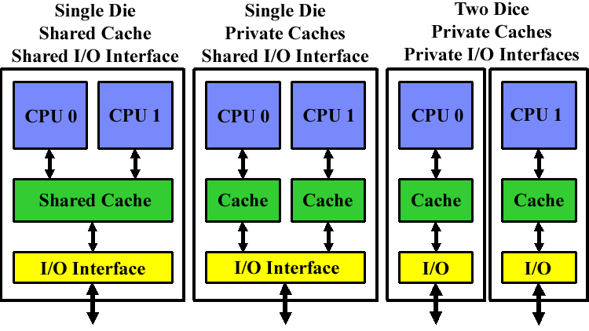

## Single-Core Computer Architecture

:::: {.columns}

::: {.column width="55%"}
- **Classical Von Neumann Model:**
  - Single central processing unit connected via system bus to memory and I/O bridge.
- **Key Internal Subsystems:**
  - **ALU:** Arithmetic & Logic computation units.
  - **Register File:** Fast, localized register storage.
  - **Bus Interface:** Coordinates transactions with external memory and peripherals.
- **I/O & Memory Interconnect:**
  - Connected to Memory Bus, Graphics Adapter, USB Controller, Disk Controller, and Expansion Slots.
:::

::: {.column width="45%"}
```{mermaid}
flowchart TB
    subgraph CPU["CPU Chip"]
        RF[Register File] <--> ALU[ALU]
        RF <--> BI[Bus Interface]
        ALU <--> BI
    end
    BI <--> SB[System Bus]
    SB <--> IOB[I/O Bridge]
    IOB <--> MB[(Main Memory)]
    IOB <--> Bus[I/O Bus]
    Bus --> USB[USB Controller]
    Bus --> GPU[Graphics Adapter]
    Bus --> Disk[Disk Controller]
```
:::

::::

---

## Chip Multi-Processing (CMP) Approaches

:::: {.columns}

::: {.column width="48%"}
{fig-align="center" width="95%"}

<div style="font-size: 0.65em; color: #666; margin-top: 4px; text-align: center; line-height: 1.3;">
<strong>Figure:</strong> Three CMP Implementations.<br>
<em>Source: David Kanter, "Chip Multi-Processing: A Method to the Madness", <a href="https://www.realworldtech.com/chip-multiprocessing/" target="_blank" style="color: #003366; text-decoration: underline;">Real World Tech</a> (2005).</em>
</div>
:::

::: {.column width="52%"}
- **Lowest Level of Integration Classification:**
  1. **Shared Cache CMP (Single Die):**
     - Cores share on-die L2/L3 cache and unified I/O interface.
     - *Advantage:* Lowest inter-core latency; dynamic cache allocation between cores; simpler socket interconnect.
     - *Examples:* IBM POWER4/5, Sun Niagara, Intel Core 2.
  2. **Shared Interface CMP (Single Die):**
     - Cores have private caches but share on-die memory controller/I/O interface (e.g., AMD Opteron, Athlon 64 X2).
  3. **Shared Package CMP (Multi-Chip Module / Two Dice):**
     - Two distinct single-core dice placed on a common substrate (e.g., Intel Pentium D / Presler).
:::

::::

---


## Parallel Execution vs. Time-Slicing

:::: {.columns}

::: {.column width="50%"}
### Hardware Parallelism (Across Cores)
- Multiple threads execute **truly in parallel** at the exact same physical clock cycle.
- **Thread 1 $\rightarrow$ Core 1**
- **Thread 2 $\rightarrow$ Core 2**
- **Thread 3 $\rightarrow$ Core 3**
- **Thread 4 $\rightarrow$ Core 4**
:::

::: {.column width="50%"}
### Time-Slicing (Within Each Core)
- Within any single core, multiple threads are **time-sliced** by the OS scheduler.
- Each individual core behaves like a classical uniprocessor for its assigned threads.
- Enables high multi-programming concurrency.
:::

::::

<br>

> **Operating System Perspective:** The OS perceives each core as a separate, distinct logical processor and schedules runnable threads/processes across available cores.

---

## Why Multi-Core? The Power & Scaling Wall

:::: {.columns}

::: {.column width="55%"}
- **Limits of Frequency Scaling:**
  - Extremely difficult to push single-core clock frequencies higher without thermal runaway.
- **Pitfalls of Deeply Pipelined Circuits:**
  - **Heat Dissipation:** Exponential power/cooling density.
  - **Speed-of-Light Delays:** Signal propagation delay across large monolithic dies.
  - **Design & Verification:** Exponential logic complexity requiring massive engineering teams.
  - **Datacenter Costs:** Server farms requiring massive cooling infrastructure.
:::

::: {.column width="45%"}
- **Application Evolution:**
  - Modern server, client, and scientific applications are inherently multi-threaded.
- **The Inevitable Trend:**
  - Modern computer architecture has shifted from extracting ILP from a single core to **maximizing chip-wide Thread-Level Parallelism (TLP)**.
:::

::::

---

## Instruction-Level vs. Thread-Level Parallelism

:::: {.columns}

::: {.column width="50%"}
### Instruction-Level Parallelism (ILP)
- Parallelism at the machine-instruction level within a **single thread**.
- **Mechanisms:**
  - Dynamic instruction re-ordering (Out-of-Order).
  - Deep pipelining & superscalar issue.
  - Aggressive branch prediction & speculative execution.
- **Diminishing Returns:** Quadratic increase in issue/renaming hardware logic area.
:::

::: {.column width="50%"}
### Thread-Level Parallelism (TLP)
- Parallelism at a **coarser granularity** across independent threads or processes.
- **Examples:**
  - Web & Database servers handling concurrent clients.
  - Video games with separate AI, physics, and rendering threads.
- **CMP Advantage:**
  - Explicitly exploits abundant TLP across multiple simple, power-efficient cores.
:::

::::

---

## General Multiprocessor Context & Memory Models

:::: {.columns}

::: {.column width="50%"}
### Multiprocessor Taxonomies
- **SIMD (Single Instruction, Multiple Data):**
  - Same instruction applied across vector data (e.g., GPUs, Vector units).
- **MIMD (Multiple Instruction, Multiple Data):**
  - Distinct cores execute different instruction streams on different data.
- **Multi-Core is a Shared-Memory MIMD:**
  - All cores reside on the same chip and share a unified physical memory address space.
:::

::: {.column width="50%"}
### Multiprocessor Memory Types
- **Shared Memory:**
  - All processors access a single, common global address space.
  - Found in Symmetric Multiprocessors (SMP) & CMP.
- **Distributed Memory:**
  - Each processor has dedicated local memory.
  - Processors communicate via explicit message-passing networks (e.g., Clusters, Supercomputers).
:::

::::

---

## Applications Benefiting from Multi-Core

:::: {.columns}

::: {.column width="50%"}
### Server & Enterprise Workloads
- **Database Servers:** Concurrently processing independent queries and transactions.
- **Web & E-Commerce Servers:** Handling thousands of simultaneous client sessions.
- **Compilers:** Parallel compilation units and link-time optimizations.
:::

::: {.column width="50%"}
### Desktop & Technical Workloads
- **Multimedia & CAD/CAM:** Video encoding, 3D mesh rendering, ray tracing.
- **Multi-Tasking Workloads:**
  - Photo editing while recording live TV streams.
  - Downloading software while running background anti-virus scanning.
:::

::::

<br>

> **Rule of Thumb:** *"Anything that can be threaded today maps efficiently to multi-core architectures."* (Though non-parallelizable sequential tasks remain Amdahl-limited).

---

## Simultaneous Multithreading (SMT)

- **The Problem in Superscalar Pipelines:**
  - Long floating-point/integer operations or off-chip memory latencies stall the pipeline.
  - Valuable execution units sit **idle and unused**.
- **SMT Solution:**
  - Permits multiple independent threads to execute **simultaneously on the SAME physical core**.
  - Threads share execution units cycle-by-cycle ("weaving" threads together).

```{mermaid}
flowchart LR
    A[Instruction Fetch / Decoder] --> B[Scheduler & Issue Queues]
    B --> INT[Integer Units: Thread 2]
    B --> FP[Floating Point Units: Thread 1]
    INT --> C[L1 Cache / D-TLB]
    FP --> C
```

---

## SMT vs. Multi-Core: Structural Difference

:::: {.columns}

::: {.column width="50%"}
### Simultaneous Multithreading (SMT)
- **Single Core, Shared Resources:**
  - Only one physical copy of execution units (ALU, FP, caches).
- **Functional Unit Contention:**
  - Two threads *cannot* simultaneously use the same functional unit (e.g., single Integer unit).
- **Performance:**
  - Not a "true" parallel processor; typically provides **up to ~20-30% throughput gain**.
:::

::: {.column width="50%"}
### Multi-Core (CMP)
- **Replicated Execution Hardware:**
  - Each core has its own dedicated integer units, FP units, and L1 caches.
- **True Concurrency:**
  - Two threads can simultaneously execute integer operations without any resource contention.
- **Linear Scaling:** Near-linear throughput scaling for thread-rich workloads.
:::

::::

---

## Combining Multi-Core and SMT

Processors can combine both CMP and SMT paradigms into a hybrid architecture:

| Architecture Combination | Description | Example |
|:---|:---|:---|
| **Single-core, non-SMT** | Standard classical uniprocessor | Pentium III, early Athlon |
| **Single-core, with SMT** | 1 physical core executing 2 threads | Pentium 4 (Hyper-Threading) |
| **Multi-core, non-SMT** | Multiple independent cores, 1 thread/core | Core 2 Duo, Core 2 Quad |
| **Multi-core, with SMT** | Multiple cores, each running multiple threads | Intel Core i7 / Xeon, AMD Zen |

<br>

- **Intel Hyper-Threading:** Intel's proprietary branding for SMT (typically 2, 4, or 8 simultaneous threads per physical core).
- **Dual-Core SMT:** 2 physical cores $\times$ 2 threads/core = **4 concurrent threads**.

---

## Memory Hierarchy in Multi-Core Systems

:::: {.columns}

::: {.column width="50%"}
### SMT-Only Systems
- All threads share the entire cache hierarchy (L1, L2) and main memory.
- High cache contention among active threads.

### Multi-Core (CMP) Systems
- **L1 Caches:** Typically **private** to each core for ultra-fast, single-cycle access.
- **L2 Caches:**
  - **Shared L2:** Facilitates inter-core communication and dynamic capacity allocation.
  - **Private L2:** Maximizes isolation and reduces cross-core cache interference.
- **Main Memory:** Always **shared** across all cores.
:::

::: {.column width="50%"}
### Common Architectural Layouts
- **Private L1 + Shared L2:**
  - Dual-Core Intel Xeon ("Fish" machines).
- **Private L1 + Private L2:**
  - AMD Opteron, AMD Athlon 64 X2, Intel Pentium D.
- **Private L1 + Private L2 + Shared L3:**
  - Intel Itanium 2, modern Core i7/i9, AMD Ryzen/EPYC.
:::

::::

---

## Trade-offs: Private vs. Shared Caches

:::: {.columns}

::: {.column width="50%"}
### Advantages of Private Caches
- **Locality & Latency:**
  - Positioned directly adjacent to the core; shorter wire delays and lower access latency.
- **Contention Elimination:**
  - Accesses from other cores do not create bandwidth bottlenecks or bank conflicts.
:::

::: {.column width="50%"}
### Advantages of Shared Caches
- **Inter-Thread Sharing:**
  - Threads running on different cores can share read-only data without duplication.
- **Dynamic Capacity Utilization:**
  - If a single high-performance thread is active, it can utilize the entire shared cache capacity.
:::

::::

<br>

> **The Resulting Challenge:** When multiple cores maintain **private caches** containing copies of shared memory addresses, we face the **Cache Coherence Problem**.

---

## The Cache Coherence Problem: Scenario

Let variable `x` initially reside in Main Memory with value `15213`:

```{mermaid}
sequenceDiagram
    autonumber
    participant C1 as Core 1 (Private Cache)
    participant C2 as Core 2 (Private Cache)
    participant MM as Main Memory (x = 15213)

    C1->>MM: Read x
    Note over C1: Cache 1: x = 15213
    C2->>MM: Read x
    Note over C2: Cache 2: x = 15213
    
    rect rgb(255, 230, 230)
    C1->>C1: Write x = 21660
    C1->>MM: Write-Through: x = 21660
    Note over C1: Cache 1: x = 21660 (Updated)
    Note over MM: Memory: x = 21660
    end

    rect rgb(255, 200, 200)
    C2->>C2: Read x
    Note over C2: Stale Read! Cache 2 still has x = 15213!
    end
```

---

## Cache Coherence: Invalidation Protocol with Snooping

:::: {.columns}

::: {.column width="50%"}
### Key Concepts
- **Snooping Mechanism:**
  - All cores continuously "snoop" (monitor) the shared **inter-core bus** for memory transactions.
- **Invalidation Principle:**
  - When Core 1 writes to `x`, it broadcasts an **Invalidation Request** across the bus.
  - All other cores seeing the request invalidate their local copy ($x = \text{INVALID}$).
:::

::: {.column width="50%"}
### Resolving Cache Misses
- When Core 2 subsequent reads `x`:
  1. Detects a local **Cache Miss** (entry is marked Invalid).
  2. Issues a read request across the inter-core bus.
  3. Fetches the updated value ($x = 21660$) from Memory / Core 1 cache.
- **Result:** Monolithic memory consistency is preserved!
:::

::::

---

## Invalidation vs. Update Protocols

:::: {.columns}

::: {.column width="50%"}
### Invalidation Protocol (Standard)
- Core writes $\rightarrow$ Broadcasts invalidation signal.
- Other copies become **Invalid**.
- **Efficiency:** Multiple repeated writes to the same cache line only generate **one invalidation** on the first write.
- **Generates significantly less bus traffic!**
:::

::: {.column width="50%"}
### Update Protocol (Alternative)
- Core writes $\rightarrow$ Broadcasts new data value over the bus.
- All other caches update their local value.
- **Drawback:** Every single write broadcasts new data, saturating inter-core bus bandwidth.
:::

::::

<br>

- **Standard Coherence State Machines:**
  - **MSI Protocol:** **M**odified, **S**hared, **I**nvalid.
  - **MESI Protocol:** **M**odified, **E**xclusive, **S**hared, **I**nvalid (avoids bus signals for private writes).

---

## Programming Multi-Core & Thread Safety

- **Parallel Workload Distribution:**
  - Programmers must divide work using **threads or processes** and write parallel algorithms.
- **Thread Safety & Race Conditions:**
  - Preemptive context switching can occur at **any time**.
  - Multi-core hardware introduces **true simultaneous concurrency**, exposing race conditions much faster than uniprocessors.

```c
int counter = 0;

void thread1() {
    int temp1 = counter;    // Read
    counter = temp1 + 1;    // Write
}

void thread2() {
    int temp2 = counter;    // Read
    counter = temp2 + 1;    // Write
}
```

- If interleaved without synchronization: both read `0`, both write `1` $\rightarrow$ final `counter = 1` (Lost Update!).
- **Synchronization primitives (mutexes, semaphores, atomics) are mandatory!**

---

## Processor Affinity: Soft vs. Hard Affinity

:::: {.columns}

::: {.column width="50%"}
### Process Migration Overhead
- When an OS migrates a thread to another core:
  - CPU execution pipeline must be drained/restarted.
  - Warm cache lines on the previous core are invalidated / missed on the new core.
- **Soft Affinity:**
  - The OS scheduler natural bias to keep a thread running on the same core to preserve cache locality.
:::

::: {.column width="50%"}
### Hard Affinity
- The programmer explicitly prescribes the set of cores a thread is allowed to run on.
- **Affinity Mask:** A bit vector where each bit corresponds to a logical CPU core.
- **When to Use Hard Affinity:**
  - **Shared Data Structures:** Pin communicating threads to the same core/socket to maximize shared cache hits.
  - **Real-Time Threads:** Pin dedicated tasks (e.g., robot controllers) to a dedicated core to eliminate context switch jitter.
:::

::::

---

## Affinity Masks & Linux Scheduler API

:::: {.columns}

::: {.column width="50%"}
### Affinity Mask Bit Vectors
- **4-Core System without SMT:**
  $$\text{Mask: } [1, 1, 0, 1] \rightarrow \text{Allowed on Cores 0, 2, 3 (Disallowed on Core 1)}$$
- **4-Core System with 2-way SMT (8 Hyper-Threads):**
  - Separate bits represent each simultaneous thread slot per core.
  - Mask `0x0F` restricts thread to Core 0 and Core 1.
:::

::: {.column width="50%"}
### Linux POSIX API (`<sched.h>`)
```c
#include <sched.h>

// Retrieve CPU affinity mask
int sched_getaffinity(pid_t pid, 
    unsigned int len, unsigned long *mask);

// Set CPU affinity mask
int sched_setaffinity(pid_t pid, 
    unsigned int len, unsigned long *mask);
```

### Command-Line Utility
```bash
# Query affinity mask of process 3935
taskset -p 3935
# Output: pid 3935's current affinity mask: f
```
:::

::::

---

## Operating System View & Licensing Models

:::: {.columns}

::: {.column width="50%"}
### OS Monitoring Tools
- **Windows Task Manager / Linux `htop`:**
  - Displays independent real-time CPU utilization graphs for each logical core / hyper-thread.
- **Workload Balancing:**
  - Default affinity mask is all `1`s (run on any core); the kernel dynamically balances skewed loads.
:::

::: {.column width="50%"}
### Software Licensing Challenges
- **Licensing Controversy:**
  - Should enterprise software vendors charge licenses **per core** or **per chip (socket)**?
- **Industry Resolution:**
  - Major OS vendors (Microsoft Windows Server, Red Hat Enterprise Linux, SUSE) transitioned to per-socket or tiered per-core licensing structures.
:::

::::

---

## Summary & Key Takeaways

1. **The Multi-Core Revolution:** Driven by the physical limits of clock frequency scaling, heat dissipation, and wire delays in wide superscalars.
2. **CMP vs. SMT:**
   - **CMP (Multi-Core):** Replicates physical cores to deliver true hardware parallelism for Thread-Level Parallelism (TLP).
   - **SMT (Hyper-Threading):** Shares single-core execution units to fill pipeline stalls during memory latencies.
3. **Memory & Coherence:**
   - Private L1 caches require hardware-enforced **Invalidation Protocols with Snooping** (MESI) to guarantee cache coherence.
4. **Software Implications:**
   - Concurrency requires explicit synchronization, thread safety, and intelligent core affinity management to maximize cache locality and throughput.

---

## References & Recommended Reading

:::: {.columns}

::: {.column width="50%"}
### Seminal Research Papers
- **The Case for a Single-Chip Multiprocessor (1996):**
  - K. Olukotun, B. A. Nayfeh, L. Hammond, K. Wilson, K. Chang. *Proc. ASPLOS-VII*, pp. 2–11, 1996.
  - *Introduced the foundational argument for CMP over wide superscalar ILP architectures.*
- **A Single-Chip Multiprocessor (1997):**
  - L. Hammond, B. A. Nayfeh, K. Olukotun. *IEEE Computer*, 30(9): 79–85, 1997.
  - *Comprehensive exploration of on-chip multiprocessors, cache hierarchies, and interconnects.*
:::

::: {.column width="50%"}
### Multithreading & Course Texts
- **Chip Multithreading: Opportunities and Challenges (2005):**
  - L. Spracklen and S. G. Abraham. *Proc. HPCA-11*, pp. 248–252, 2005.
  - *Design space and throughput tradeoffs in massive Chip Multithreading (CMT / Sun Niagara).*
- **Multi-Core Architectures Technical Notes (2007):**
  - Jernej Barbic. *15-213: Introduction to Computer Systems*, Carnegie Mellon University (CMU), 2007.
  - *Foundational lecture notes on hardware SMT vs. CMP and OS affinity masks.*
:::

::::
