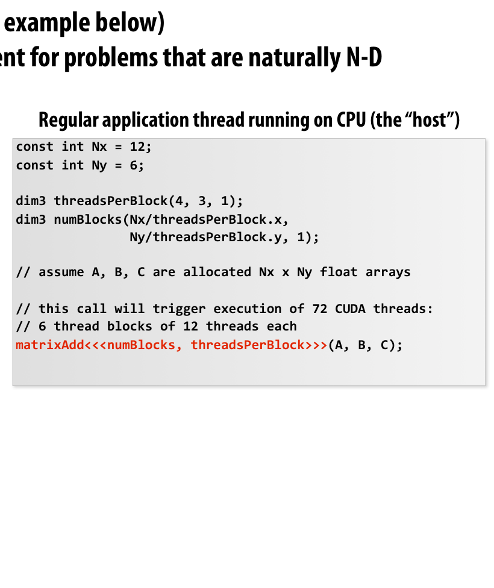
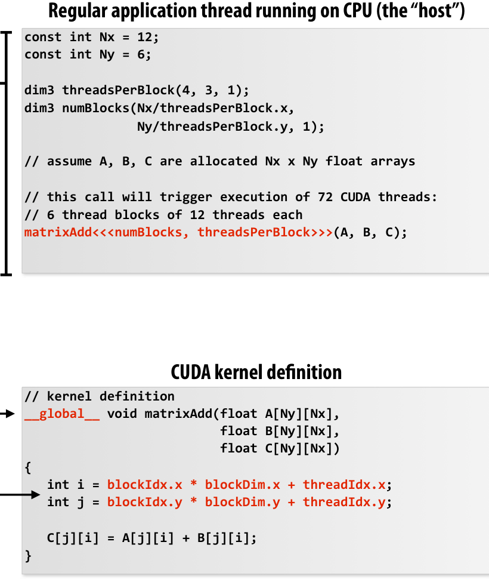
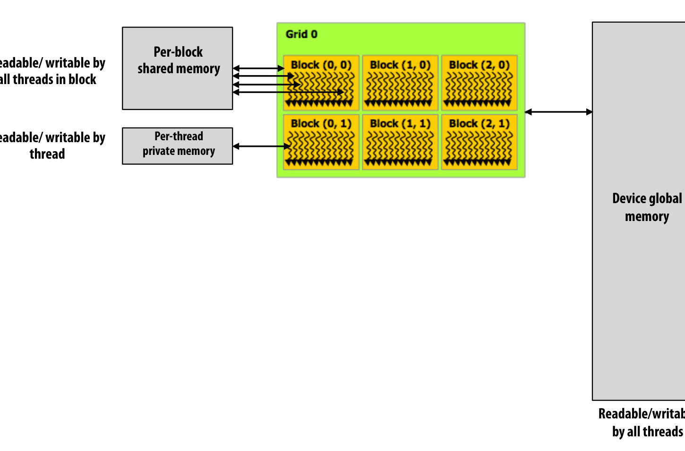
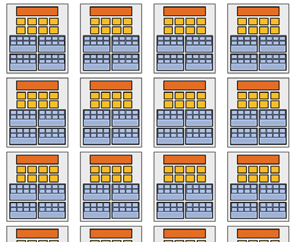
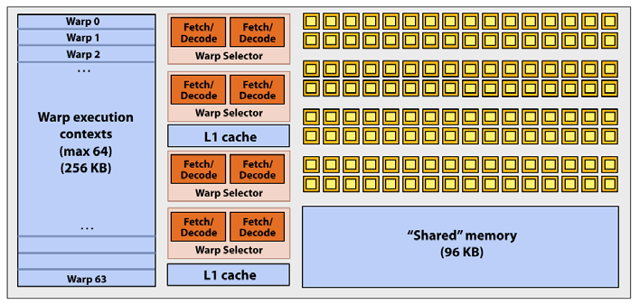

## Lecture Outline

- **GPU History & GPGPU:** Transition from specialized graphics accelerators to general throughput engines.
- **The Graphics rendering pipeline:** How graphics pipelines operate on streams (Vertices, Primitives, Fragments, Pixels).
- **CUDA Programming Abstractions:** Host vs. Device memory spaces, thread hierarchy (Grids, Blocks, Threads).
- **Cooperative Load & Shared Memory:** Staging data in shared memory to optimize global memory bandwidth.
- **GPU Architecture Implementation:** Streaming Multiprocessors (SMs), warps, SIMD execution, and latency hiding.

---

## CPU vs. GPU Design Philosophies

:::: {.columns}

::: {.column width="50%"}
### CPU (Latency Optimized)
- Focused on executing a single thread as quickly as possible.
- **Massive Caches:** To reduce memory latency.
- **Complex Control Logic:** Branch prediction, Out-of-Order execution.
- **Large ALUs:** Optimized for execution speed.
:::

::: {.column width="50%"}
### GPU (Throughput Optimized)
- Focused on executing a massive number of threads in parallel.
- **Massive ALU Arrays:** Hundreds or thousands of execution units.
- **Simple Control & Cache:** Most die area is allocated to ALUs, not caches or branch prediction.
- **Latency Hiding:** Hides memory latency via fast hardware-level context switching.
:::

::::

---

## Real-Time Graphics Pipeline: The Nouns

The pipeline abstracts rendering a 3D scene (mesh) to a 2D pixel image:

- **Vertices:** Points in 3D space with attributes (position, color, normals).
- **Primitives:** Geometric shapes formed by vertices (primarily triangles).
- **Fragments:** Candidates for pixels in the output image buffer (e.g. rasterized pixels with depth).
- **Pixels:** The final colored elements in the output image buffer.

---

## Real-Time Graphics Pipeline: The Verbs

:::: {.columns}

::: {.column width="40%"}
1. **Vertex Generation:** Creates stream of 3D vertices.
2. **Vertex Processing:** Projects vertices onto the screen.
3. **Primitive Generation:** Assembles vertices into triangles.
4. **Rasterization:** Generates fragments for pixels covered by primitives.
5. **Fragment Processing:** Computes color based on lighting/texture.
6. **Pixel Operations:** Resolves depth (closest fragment wins).
:::

::: {.column width="60%"}
{fig-align="center" width="100%"}
:::

::::

---

## Programmable Shaders & Stream Model

- Modern GPUs introduce **Programmable Shaders** to support diverse lighting and materials programmatically.
- Shaders are mini-programs executed in parallel over streams of data:
  - **Vertex Shader:** Custom code mapped to every vertex in a stream.
  - **Fragment Shader (Pixel Shader):** Custom code mapped to every rasterized fragment.

```glsl
// GLSL Fragment Shader Example
uniform sampler2D myTexture; 
uniform float3 lightDir; 
varying vec3 norm; 
varying vec2 uv; 
void myFragmentShader() { 
  vec3 kd = texture2D(myTexture, uv); 
  kd *= clamp(dot(lightDir, norm), 0.0, 1.0); 
  gl_FragColor = vec4(kd, 1.0);    
}
```

---

## The GPGPU Hack (2002 - 2003)

- **The Realization:** Programmable graphics cards were highly efficient, mass-market data-parallel processors.
- **The GPGPU Hack:** To run arbitrary scientific calculations, programmers mapped calculations into graphics pipeline primitives:
  1. Set output image buffer size to match output array size (e.g., 512x512).
  2. Draw **two screen-aligned triangles** covering the entire screen.
  3. Write computation inside the **Fragment Shader**.
  4. The GPU executes the fragment shader once per pixel, outputting the results into the image buffer (array).
- Used for ray tracing, matrix solvers, and simulations.

---

## Brook Stream Programming (2004)

- **Brook (Stanford):** A research programming language designed to abstract GPU hardware as a data-parallel stream processor.
- Eliminated OpenGL/DirectX boilerplate (textures, drawing triangles).

```cpp
// Brook Stream Kernel
kernel void scale(float amount, float a<>, out float b<>) { 
   b = amount * a; 
}
// Map kernel onto stream collections
scale(scale_amount, input_stream, output_stream);
```

- Brook compiler translated this stream code to graphics drawing calls and shaders behind the scenes.

---

## Compute Mode & NVIDIA Tesla (2007)

- In 2007, NVIDIA introduced the **Tesla Architecture (GeForce 8800)** containing a non-graphics-specific **Compute Mode** interface.

:::: {.columns}

::: {.column width="50%"}
### Prior to 2007 (Graphics Mode)
- Graphics driver interface.
- Program represented as Vertex/Fragment shader programs.
- Invocation via `drawPrimitives()`.
- Limited to graphics pipeline abstractions.
:::

::: {.column width="50%"}
### 2007+ (Compute Mode / CUDA)
- Compute-mode driver interface.
- Program represented as a single execution kernel.
- Invocation via `launch(myKernel, N)`.
- Programmer directly manages buffers and memory spaces.
:::

::::

---

## CUDA Programming Abstractions

:::: {.columns}

::: {.column width="55%"}
- **Host vs. Device:** Clear separation between CPU (Host, serial) and GPU (Device, SPMD) execution.
- **SPMD Hierarchy:**
  - **CUDA Thread:** A single logical thread of control.
  - **Thread Block:** A cooperative group of threads. Threads in a block can synchronize and share fast on-chip memory.
  - **Grid:** A collection of independent thread blocks launched together.
- Threads and blocks have multi-dimensional IDs (`threadIdx`, `blockIdx`, `blockDim`).
:::

::: {.column width="45%"}
{fig-align="center" width="100%"}
:::

::::

---

## Basic CUDA Syntax

:::: {.columns}

::: {.column width="50%"}
**Host Code (CPU):**
```cpp
const int Nx = 12; 
const int Ny = 6; 
dim3 threadsPerBlock(4, 3, 1); 
dim3 numBlocks(Nx/threadsPerBlock.x, 
               Ny/threadsPerBlock.y, 1); 

// Bulk kernel launch: 72 threads (6 blocks of 12)
matrixAdd<<<numBlocks /*grid dimension*/, threadsPerBlock/*block dimension*/>>>(A /*device pointer*/, B /*device pointer*/, C /*device pointer*/);
```

**Device Kernel (GPU):**
```cpp
__global__ void matrixAdd(float A[Ny][Nx], 
                          float B[Ny][Nx], 
                          float C[Ny][Nx]) { 
   // Index calculation formulas:
   int i = blockIdx.x * blockDim.x + threadIdx.x; 
   int j = blockIdx.y * blockDim.y + threadIdx.y; 
   
   if (i < Nx && j < Ny) 
      C[j][i] = A[j][i] + B[j][i]; 
}
```
:::

::: {.column width="50%"}
{fig-align="center" width="100%"}
:::

::::

---

## Host vs. Device Address Spaces

- Host (CPU) memory and Device (GPU) memory are physically distinct.
- The host must explicitly allocate device memory and copy data back and forth.

```cpp
float* A = new float[N]; // Host buffer
float* deviceA;
cudaMalloc(&deviceA, sizeof(float) * N); // Allocate on GPU

// Copy data: Host -> Device
cudaMemcpy(deviceA, A, sizeof(float) * N, cudaMemcpyHostToDevice);

// Run kernel on deviceA...

// Copy data: Device -> Host
cudaMemcpy(A, deviceA, sizeof(float) * N, cudaMemcpyDeviceToHost);
```

- **Note:** You cannot manipulate pointers allocated in device space directly from the host.

---

## CUDA Device Memory Model

Kernels access three distinct memory spaces:

- **Private Memory:** Per-thread local variables/stack registers.
- **Shared Memory:** On-chip, per-block read/write space visible to all threads in a block. High-bandwidth, low-latency.
- **Global Memory:** Off-chip DRAM visible to all threads. High-latency (400-800 cycles).

::: {style="text-align: center; margin-top: 1rem;"}
{fig-align="center" width="45%"}
:::

---

## 1D Convolution (Version 1: Global Memory)

Let's compute a simple 3-point average: `output[i] = (input[i] + input[i+1] + input[i+2]) / 3.f`

```cpp
#define THREADS_PER_BLK 128 
__global__ void convolve(int N, float* input, float* output) { 
   int index = blockIdx.x * blockDim.x + threadIdx.x; 
   float result = 0.0f; 
   for (int i = 0; i < 3; i++)    
     result += input[index + i]; 
   output[index] = result / 3.f; 
}
```

- **Analysis:** Each thread reads from global memory individually.
- **Redundancy:** Threads fetch overlapping inputs (e.g. `input[i+1]` is fetched by thread `i` and thread `i-1`).
- Total global memory read transactions: $3 \times N$.

---

## 1D Convolution (Version 2: Shared Memory)

Stage input data cooperatively into shared memory to reduce global reads:

```cpp
#define THREADS_PER_BLK 128 
__global__ void convolve(int N, float* input, float* output) { 
   __shared__ float support[THREADS_PER_BLK + 2]; 
   int index = blockIdx.x * blockDim.x + threadIdx.x; 
   
   // Cooperative load: 128 threads load 130 elements
   support[threadIdx.x] = input[index]; 
   if (threadIdx.x < 2) { 
      support[THREADS_PER_BLK + threadIdx.x] = input[index + THREADS_PER_BLK];  
   } 
   
   __syncthreads(); // Synchronize all threads in the block
   
   float result = 0.0f; 
   for (int i = 0; i < 3; i++)    
     result += support[threadIdx.x + i]; // Fast local shared mem reads
   output[index] = result / 3.f; 
}
```

- Total global memory reads reduced to $130$ elements per block (about $1 \times N$ overall).

---

## CUDA Synchronization Constructs

- **`__syncthreads()`:** Barrier synchronization. All threads in the block must reach this point before any are allowed to proceed.
- **Atomic Operations:** E.g., `atomicAdd()`, `atomicInc()`. Perform read-modify-write on shared or global variables atomically.
- **Implicit Grid Synchronization:** Thread blocks execute independently without dependencies. Kernel returns only after all thread blocks in the grid terminate.

---

## Thread Block Scheduler & Work Mapping

:::: {.columns}

::: {.column width="60%"}
- **Independence Assumption:** Thread blocks must be executable in any order (no dependencies between blocks).
- **Dynamic Scheduler:** A hardware scheduler dynamically maps thread blocks to Streaming Multiprocessor (SM) cores.
- **Resource Constraints:** The scheduler maps as many blocks to an SM as will fit within the SM's physical resource limits (threads, registers, shared memory).
:::

::: {.column width="40%"}
{width="100%"}
:::

::::

---

## Streaming Multiprocessors & GTX 980

An NVIDIA GPU contains a collection of Streaming Multiprocessors (SMs).

:::: {.columns}

::: {.column width="55%"}
### Maxwell GTX 980 SM Core (SMM)
- **128 SIMD ALUs:** Executes math instructions.
- **96 KB Shared Memory:** Fast scratchpad.
- **64 Warp Contexts (2048 threads):** Max concurrent threads on-core.
- **Warp Selectors:** Schedules active warps.
:::

::: {.column width="45%"}
{width="90%"}
:::

::::

---

## What is a Warp?

- **Definition:** On NVIDIA hardware, groups of 32 threads in a block are executed simultaneously using **32-wide SIMD execution**.
- **Warp is an Implementation Detail:** It does not exist in the CUDA programming model abstraction!
- **Branch Divergence:**
  - Because 32 threads share an instruction stream, if threads in a warp diverge (e.g. `if (x > 0)`), the SM must serialize execution of each path.
  - Divergent execution reduces throughput. Keep branch logic uniform across warps!

---

## Work Scheduling Simulation

Assume a core has contexts for **384 threads (12 warps)** and **1.5 KB of Shared Memory**.
A kernel requires **128 threads** and **520 bytes of Shared Memory** per block.

:::: {.carousel}

```
Initial Mapping:
Scheduler assigns Block 0 to Core 0 (uses 128 threads, 520 B shared memory).
Scheduler assigns Block 1 to Core 1 (uses 128 threads, 520 B shared memory).
Scheduler assigns Block 2 to Core 0 (uses 128 threads, 520 B shared memory).
Scheduler assigns Block 3 to Core 1 (uses 128 threads, 520 B shared memory).
```
{width="60%"}

<!-- slide -->

```
Resource Constraints Met:
Core 0 now has 2 blocks active (256 threads, 1040 B shared memory).
A 3rd block (Block 4) requires 520 B of shared memory.
Adding Block 4 would require 1560 B, which exceeds the core's 1.5 KB limit.
Block 4 must wait in the scheduler queue.
```
{width="60%"}

<!-- slide -->

```
Dynamic Re-assignment:
Block 0 finishes on Core 0. The scheduler immediately releases its resources.
Block 4 is assigned to Core 0.
```
{width="60%"}

::::

---

## Latency Hiding in GPUs

- **CPU Core Approach:** Minimizes latency for a single thread using complex, expensive caches and branch predictors.
- **GPU Core Approach:** Maximizes throughput by interleaving hundreds of active threads.
- When an active warp is stalled waiting on a memory transaction (takes 400-800 cycles), the hardware warp selector switches to another runnable warp with **zero overhead**.

$$\text{Required Active Warps} = \frac{\text{Memory Latency}}{\text{Instruction Throughput}}$$

- If there are enough active warps to execute instructions while others are stalled, the execution pipelines are kept full, hiding the latency completely!

---

## Thread Constraints & Dependencies

- Why must all threads in a block reside on the SM concurrently?
- Threads within a block have **dependencies** (e.g., `__syncthreads()`).
- If the system tried to run threads 0-127 to completion before launching 128-255, a `__syncthreads()` barrier would wait forever for the unlaunched threads, causing a **deadlock**.
- Therefore, the scheduler must guarantee that all threads in an active block are concurrently active.

---

## Persistent Threads Programming Style

```cpp
#define THREADS_PER_BLK 128 
#define BLOCKS_PER_CHIP 16 * (2048/128) // Hardware-specific block count
__device__ int workCounter = 0; 

__global__ void convolve(int N, float* input, float* output) { 
  __shared__ int startingIndex; 
  while (1) { 
     if (threadIdx.x == 0) 
        startingIndex = atomicInc(workCounter, THREADS_PER_BLK); 
     __syncthreads(); 
     if (startingIndex >= N) break; 
     
     // Perform work on startingIndex...
     __syncthreads(); 
  } 
}
```

- **Idea:** Bypasses the hardware block scheduler by launching exactly as many blocks as the GPU cores can run concurrently, implementing manual queue assignment.

---

## Lecture Summary

### CUDA Programming Abstractions
- Partitioning problem into thread blocks matches data-parallel model.
- Partitioning into Host/Device memory spaces is a distributed memory model.
- Intra-block programming is SPMD with a shared address space.

### GPU Implementation
- Thread blocks are independent, enabling hardware-level out-of-order scheduling.
- Threads in a block are grouped into **32-thread warps** executing in SIMD.
- Massive multithreading context storage allows SMs to hide memory latency.
